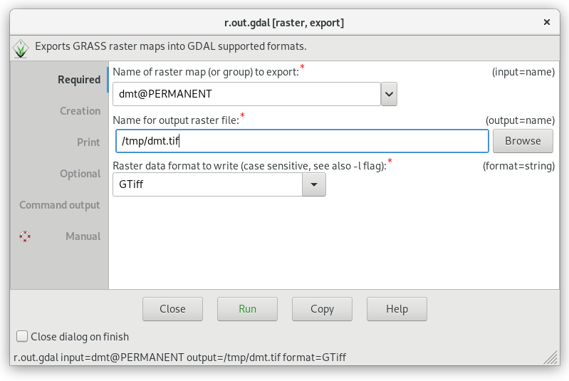
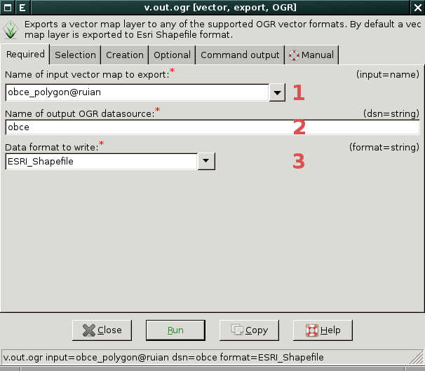

.. index::
   pair: geodata; export

Export do ostatních GIS formátů
-------------------------------

Rastrové mapy lze ze systému GRASS exportovat do externích formátů
pomocí modulu :grasscmd:`r.out.gdal`. Pro export vektorových map
slouží modul :grasscmd:`v.out.ogr`.

.. note::
   
   Výše zmíněné moduly používají pro export dat knihovnu
   :wikipedia:`GDAL`, která v režimu zápisu podporuje téměř 200
   rastrových a vektorových formátů.

.. index::
   pair: rastrová data; export
   single: r.out.gdal
   see: export; r.out.gdal

Rastrová data
=============

Modul pro export rastrových dat je dostupný z menu
:menuselection:`File --> Export raster map --> Common export formats`
anebo z~kontextového menu *správce vrstev*.

.. raw:: latex

   \newpage
         
.. figure:: images/export-raster-menu.png
	    
   Export rastrových dat z kontextového menu správce vrstev.

V následujícím dialogu zvolíme název výstupního souboru a jeho formát.

            Zvolíme rastrovou mapu pro export :fignote:`(1)`, cestu k
            výstupnímu souboru :fignote:`(2)` a formát výstupního
            souboru :fignote:`(3)`. V tomto případě se data
            vyexportují do souboru ``dmt.tif`` v aktuálním adresáři.

.. notecmd:: Export rastrové mapy do formátu GeoTIFF

   .. code-block:: bash

      r.out.gdal input=dmt output=dmt.tif format=GTiff

.. index::
   pair: vektorová data; export
   single: v.out.ogr
   see: export; v.out.ogr

Vektorová data
==============

Modul pro export vektorových dat je dostupný z menu 
:menuselection:`File --> Export vector map --> Common export formats`
anebo z~kontextového menu *správce vrstev*.

.. figure:: images/export-vector-menu.png

   Export vektorových dat z kontextového menu správce vrstev.

V následujícím dialogu zvolíme název výstupního souboru a jeho formát.

            Zvolíme vektorovou mapu pro export :fignote:`(1)`, cestu k
            výstupnímu souboru :fignote:`(2)` a formát výstupního
            souboru :fignote:`(3)`. V tomto případě se data
            vyexportují do souboru ``obce.shp`` v aktuálním adresáři.

.. notecmd:: Export vektorové mapy do formátu Esri Shapefiel

   .. code-block:: bash

      v.out.ogr input=obce_polygon dsn=obce.shp format=ESRI_Shapefile

.. index::
   pair: export; obrázek
   single: PNG

Export obsahu mapové okna do obrázku
====================================

Kromě exportu dat do GIS formátů je možné uložit obsah mapové okna do
obrazového souboru jako je např. PNG. Tato funkce je dostupná z
nástrojé lišty *mapového okna*.

.. figure:: images/map-display-image-0.png
            :class: large
	    :scale-latex: 70

	    Export obsahu mapového okna do obrázku.
	    
.. figure:: images/map-display-image-1.png
            :width: 200px
	    :scale-latex: 55

            V následující dialogu zvolíme dimenzi výstupního obrázku.

.. raw:: latex

   \newpage

.. figure:: images/map-display-image-2.png
            :class: large
	    :scale-latex: 70

            Příklad výsledku včetně legendy, měřítka a textového
            popisku (viz kapitola :ref:`mapove-elementy`).
