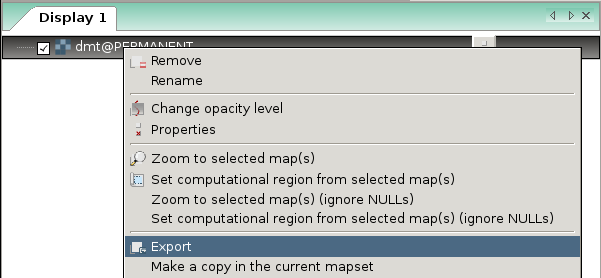
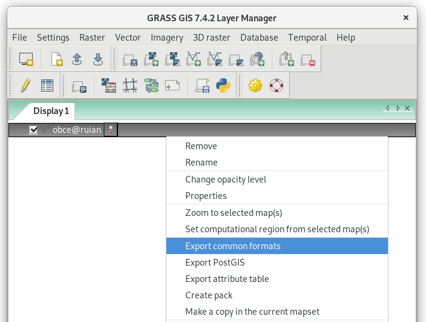
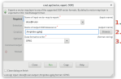
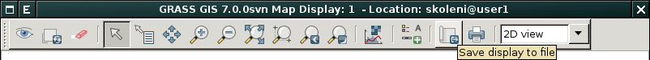
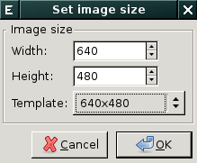

.. index::
   pair: geodata; export

Export do ostatních GIS formátů
-------------------------------

Rastrové mapy lze ze systému GRASS exportovat do externích formátů
pomocí modulu :grasscmd:`r.out.gdal`. Pro export vektorových map
slouží modul :grasscmd:`v.out.ogr`.

.. note::
   
   Výše zmíněné moduly používají pro export dat knihovnu
   :wikipedia:`GDAL`, která v režimu zápisu podporuje téměř 250
   `rastrových <https://gdal.org/formats_list.html>`__ a `vektorových
   <https://gdal.org/ogr_formats.html>`__ formátů.

.. index::
   pair: rastrová data; export
   single: r.out.gdal
   see: export; r.out.gdal

Rastrová data
=============

Modul pro export rastrových dat je dostupný z menu
:menuselection:`File --> Export raster map --> Common export formats`
anebo z kontextového menu *správce vrstev*.

.. raw:: latex

   \newpage
         

	    
   Export rastrových dat z kontextového menu správce vrstev.

V následujícím dialogu zvolíme název výstupního souboru a jeho formát.

.. figure:: images/export-raster.svg

   Zvolíme rastrovou mapu pro export :fignote:`(1)`, cestu k
   výstupnímu souboru :fignote:`(2)` a formát souboru :fignote:`(3)`.

.. notecmd:: Export rastrové mapy do formátu GeoTIFF

   .. code-block:: bash

      r.out.gdal input=dmt output=/tmp/dmt.tif format=GTiff

.. important:: Export dat je proveden z **aktuálně nastaveného
   výpočetního regionu** včetně případné masky.
   
.. tip:: Pokud exportujete rastrová data ve formátu GTiff pro potřeby
         Esri ArcGIS, tak je potřeba nastavit speciální volby, viz
         :grasscmd2:`dokumentace modulu
         <r.out.gdal.html#export-a-dcell-raster-map-in-geotiff-format-suitable-for-esri-software>`.
   
.. index::
   pair: vektorová data; export
   single: v.out.ogr
   see: export; v.out.ogr

Vektorová data
==============

Modul pro export vektorových dat je dostupný z menu
:menuselection:`File --> Export vector map --> Common export formats`
anebo z kontextového menu *správce vrstev*.

   Export vektorových dat z kontextového menu správce vrstev.

V následujícím dialogu zvolíme název výstupního souboru a jeho formát.

   Zvolíme vektorovou mapu pro export :fignote:`(1)`, cestu k
   výstupnímu souboru :fignote:`(2)` a formát výstupního souboru
   :fignote:`(3)`.

.. notecmd:: Export vektorové mapy do formátu OGC GeoPackage a Esri Shapefile

   .. code-block:: bash

      v.out.ogr input=obce@ruian dsn=/tmp/obce.gpkg format=GPKG                   
      v.out.ogr input=obce@ruian dsn=/tmp/obce.shp format=ESRI_Shapefile

.. index::
   pair: export; obrázek
   single: PNG

Export obsahu mapové okna do obrázku
====================================

Kromě exportu dat do GIS formátů je možné uložit obsah mapové okna do
obrazového souboru jako je např. PNG. Tato funkce je dostupná z
nástrojé lišty *mapového okna*.

                         
   Export obsahu mapového okna do obrázku.
	    

   V následující dialogu zvolíme dimenzi výstupního obrázku.

.. raw:: latex

   \newpage

.. figure:: images/map-display-image-2.png
   :class: middle

   Příklad výsledku včetně legendy, měřítka a textového popisku (viz
   kapitola :ref:`mapove-elementy`).
