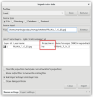
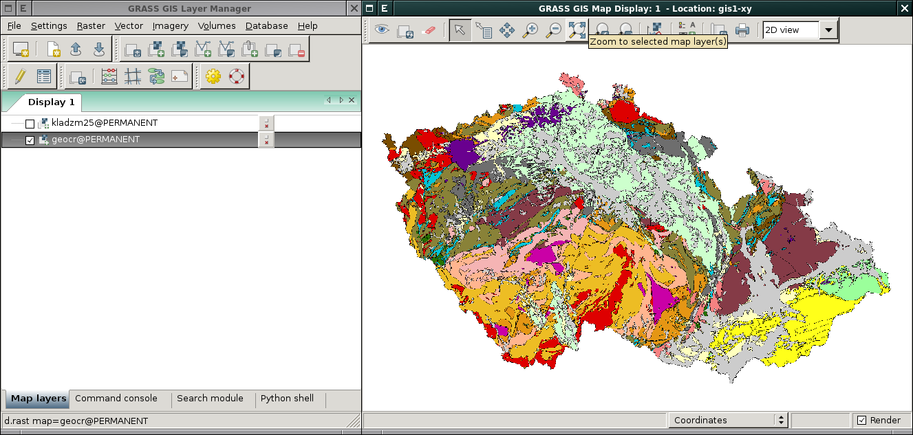
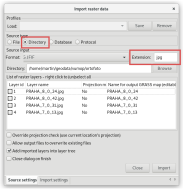
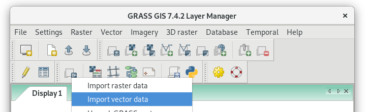
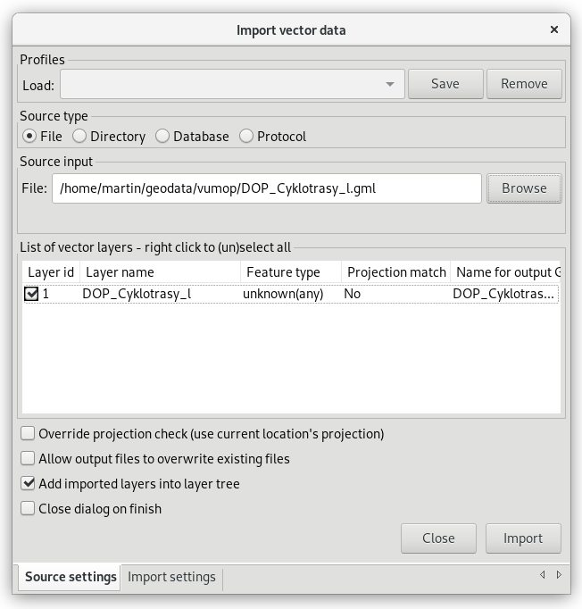
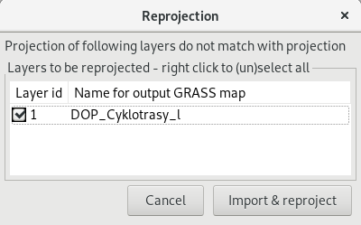
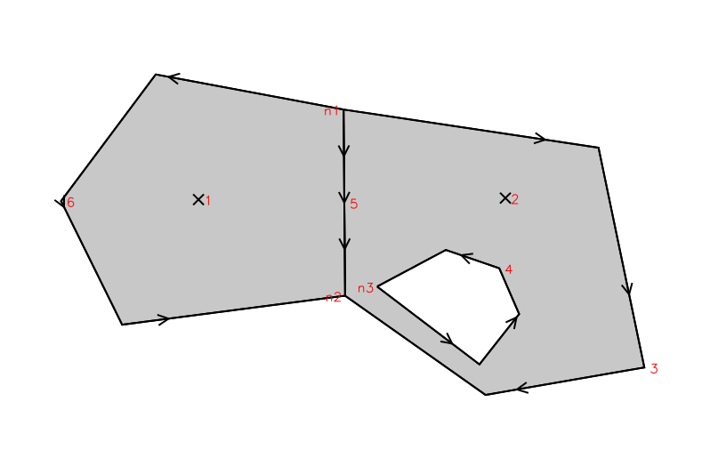
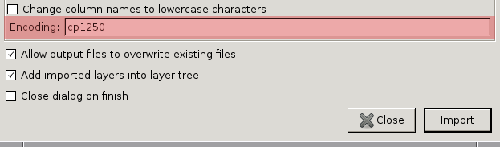
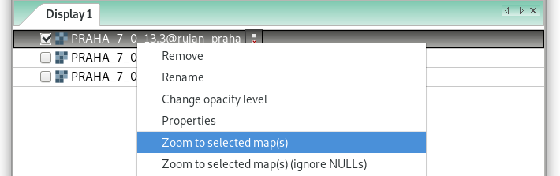
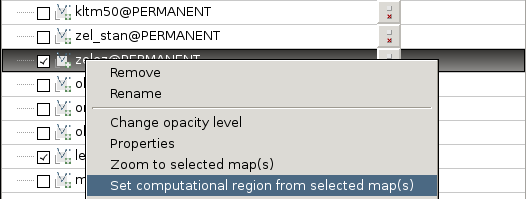

.. index::
   pair: geodata; import

.. _import:

Import geodat
-------------

..
   .. important::
   
   V této kapitole předpokládáme, že importovaná data jsou
   lokalizovaná v souřadnicovém systému odpovídající aktuální
   :ref:`lokaci <lokace>`. To, že jsou data v jiném souřadnicovém
   systému můžete zjistit z dialogu pro import dat (viz obr. níže). V
   tomto případě musíte nejprve data naimportovat do nové lokace a
   následně je transformovat do aktuální lokace (viz kapitola
   :doc:`transformace`).

   .. figure:: images/import-no-proj.png
	       :scale-latex: 50

	       Data nejsou v souřadnicovém systému lokace. Je nutné je
	       transformovat.

Většina rastrových formátů může být naimportována modulem
:grasscmd:`r.import`, pro vektorová data existuje modul
:grasscmd:`v.import`. GUI systému GRASS dále disponuje
specializovanými nástroji pro hromadný import dat.

.. index::
   pair: rastrová data; import
   single: r.import
   see: import; r.import

Rastrová data
=============

Nástroj pro import rastrových dat je dostupný z menu
:menuselection:`File --> Import raster data --> Simplified raster
import with reprojection` nebo nástrojové lišty správce vrstev.

.. note:: Pro naši potřebu použijeme `ortofoto
   <http://www.geoportalpraha.cz/cs/opendata/468E977C-DE78-480D-B3D9-43A19BF1CD77#.W-gDTaAo-V5>`__
   publikované IPR v režimu otevřených dat. Vybereme např. dlaždici
   PRAHA_7_0_13 (soubory `JPG
   <http://opendata.iprpraha.cz/CUR/ORT/ORT/S_JTSK/PRAHA_7_0_13.jpg>`__ a
   `JGW
   <http://opendata.iprpraha.cz/CUR/ORT/ORT/S_JTSK/PRAHA_7_0_13.jgw>`__).

.. figure:: images/wxgui-raster-import-menu.png
	    :scale-latex: 60

            Nástroj pro import rastrových dat dostupný z nástrojové
            lišty správce vrstev.

V dialogu vybereme soubor pro import.

            Výběr rastrového souboru (JPG) pro import.

.. important:: Položka :item:`Projection match` udává informaci o tom,
   zda se souřadnicový systém importovaných rastrových dat shoduje s
   nastavením aktuální lokace. V případě, že je souřadnicový systém
   vstupních dat a lokace rozdílný, tak bude systém GRASS vstupní data
   při importu *současně transformovat* do souřadnicového systému
   lokace. Nicméně v našem případě je situace jiná. Vstupní data jsou
   v souřadnicovém systému S-JTSK, nicméně ve datovém formátu JPG tato
   informace není uložena. Vynutíme tedy import rastrových dat tak,
   jak jsou, viz :numref:`projection-override`.

   .. _projection-override:
   
   .. figure:: images/wxgui-raster-import-1.svg
      :scale-latex: 60

      Vypnutí kontroly souřadnicového systému při importu.

.. _display-raster-after-import:

            Naimportovaná data se automaticky přidají do stromu vrstev.

.. note:: Jak je vidět na :numref:`display-raster-after-import` systém
   GRASS naimportovaný RGB snímek rozložil do třech rastrových vrstev
   a zobrazil je v odstínech šedi. RGB kompozici můžeme zobrazit
   pomocí modulu :grasscmd:`d.rgb`, viz kapitola :ref:`Zobrazení
   rastrových dat <d-rast-various>`.

   .. figure:: images/wxgui-raster-import-3.png

      Volba jednotlivých RGB vrstev pro zobrazení.
      
   .. figure:: images/wxgui-raster-import-4.png
      :class: large
                       
      Zobrazení RGB kompozice ve skutečných barvách.

.. raw:: latex

   \newpage

.. notecmd:: Import rastrových dat

   .. code-block:: bash
                                
      r.import input=PRAHA_7_0_13.1.jpg output=PRAHA_7_0_13

V případě importu více rastrových souborů z jednoho adresáře je
výhodné nastavit typ zdroje na adresář a zvolit příponu importovaných
souborů. Tímto způsobem lze naimportovat všechny soubory najednou.

   Import rastrových souboru z jedné složky. Všechny soubory lze
   označit pro import přes pravé tlačítko myši :item:`Select all`.

.. noteadvanced:: **Ukázka hromadného importu rastrových dat jako Python skript**

   .. code-block:: python

      import os
      import grass.script as gs

      for fname in os.listdir("."):
          name, ext = os.path.splitext(fname)
          if ext in ('.png', '.tif', '.jpg', '.gif'):
              gs.run_command('r.import', input=fname, output=name)

   Skriptování v jazyce Python je náplní navazujícího
   :skoleni:`školení pro pokročilé uživatele <grass-gis-pokrocily>`.

.. index::
   pair: vektorová data; import
   single: v.in.ogr
   see: import; v.in.ogr

.. _import-vector:
                                        
Vektorová data
==============

Nástroj pro import vektorových dat je dostupný z menu
:menuselection:`File --> Import vector data --> Common formats import`
nebo nástrojové lišty správce vrstev.

                 
            Nástroj pro import vektorových dat dostupný z nástrojové
            lišty správce vrstev.

V dialogu pro import vektorových dat určíme:

#. typ zdroje
#. formát dat
#. adresář s daty
#. seznam vrstev k importu
#. spustíme import

                 
            Určení vektorových dat (Esri Shapefile) z daného adresáře k importu.

            Průběh importu.

.. figure:: images/wxgui-vector-import-2.png
            :class: large
            :scale-latex: 85
                 
            Naimportovaná data se automaticky přidají do stromu vrstev.

.. notecmd:: Import vektorových dat

   .. code-block:: bash
                                
      v.in.ogr dsn=lesy.shp

.. note:: **Ukázka hromadného importu vektorových dat z aktuálního adresáře jako Python skript**

   .. code-block:: python

      import os
      import grass.script as grass

      layers = grass.read_command('v.in.ogr', flags = 'l', dsn='.').splitlines()
      for fname in layers:
          grass.run_command('v.in.ogr', dsn = '.', layer = fname) 

   Skriptování v jazyce Python je náplní navazujícího
   :skoleni:`školení pro pokročilé uživatele <grass-gis-pokrocily>`.

.. index::
   pair: import; topologie

.. _import-topologie:
                                       
Poznámky k importu vektorových dat
==================================

Při importu vektorových dat provádí :grasscmd:`v.in.ogr` konverzi
vektorových dat z reprezentace :wikipedia:`Simple Features` do
topologického formátu systému GRASS, viz kapitola :ref:`topologie`:

* v případě bodů (point) a lomených čár (linestring) nedochází ke
  změně povahy vektorového prvku, v topologickém formátu GRASS jsou
  vyjádřeny jako *points*, resp. *lines*,
* polygony jsou rozloženy na hraniční linie (*boundary*) a centroidy
  (*centroid*), externí ring polygonu je převeden na hraniční linie
  (hraniční linie sousedících polygonů je uložena pouze jednou),
* pro každý polygon je vypočten centroid, tj. reprezentativní bod
  ležící uvnitř plochy,
* polygon je vyjádřen v topologickém modelu systému GRASS jako plocha
  (*area*),
* případné díry v polygonu jsou uloženy jako plochy, které tvoří
  tzv. ostrovy (*isle*).

Například dva sousedící polygony (jeden s otvorem) jsou v topologickém
modelu systému GRASS vyjádřeny čtyřmi hraničními liniemi a dvěma
centroidy. Polygony a otvor v druhém polygonu tvoří tři plochy. Otvor
v druhém polygonu a prostor vně polygonu definuje dva ostrovy.

::

 |   Number of points:       0               Number of centroids:  2          |
 |   Number of lines:        0               Number of boundaries: 4          |
 |   Number of areas:        3               Number of islands:    2          |

   Topologická reprezentace dvou polygonů (druhý polygon s otvorem).

Modul :grasscmd:`v.in.ogr` provádí při importu operace s cílem
odstranit případné topologické chyby v datech, které při konverzi z
reprezentace simple features do topologického formátu systému GRASS
mohou vzniknout. Topologické chyby, které nemohou být z nejrůznějších
důvodů během importu odstraněny, je možné opravit pomocí modulu
:grasscmd:`v.clean`, více v kapitole :ref:`topologie`.

.. index::
   pair: kodování; atributy

Kódování atributových dat
^^^^^^^^^^^^^^^^^^^^^^^^^

Při importu dat ve formátu Esri Shapefile je nutné nastavit správné
kódování pro atributová data. Atributy obsahující diakritiku jsou
často kódována ve znakové sadě :wikipedia:`Windows-1250` (kód
``cp1250``). Hodnotu kódování lze nastavit pomocí parametru
:option:`encoding` modulu :grasscmd:`v.in.ogr`.

              
   Kódování atributů vektorových dat lze definovat přímo v importním
   dialogu GUI systému GRASS.
                    
.. notecmd:: Import vektorových dat (znaková sada Windows-1250)

   .. code-block:: bash

      v.in.ogr dsn=orp.shp encoding=cp1250

.. notegrass6::

   Vzhledem k tomu, že modul :grasscmd:`v.in.ogr` nemá ve
   verzi GRASS 6 parametr :option:`encoding`, je nutné
   znakovou sadu určit pomocí proměnné prostředí
   :envvar:`SHAPE_ENCODING`.

   .. code-block:: bash

      SHAPE_ENCODING=cp1250 v.in.ogr dsn=orp.shp

.. index::
   single: DGN

Formát DGN
^^^^^^^^^^

Formát DGN lze naimportovat pouze v případě, že je knihovna
:wikipedia:`GDAL` zkompilována s podporou pro `tento formát
<http://www.gdal.org/ogr/drv_dgn.html>`_. Bohužel knihovna GDAL
nepodporuje formát verze 8.0 a vyšší.

.. note::

   V případě formátu DGN lze doporučit jeho konverzi do formátu DXF a
   import do systému GRASS pomocí modulu :grasscmd:`v.in.dxf`.

.. index::
   pair: import; region

Importovaná data a výpočetní region
^^^^^^^^^^^^^^^^^^^^^^^^^^^^^^^^^^^

Pokud se v mapovém okně nezobrazují žádná data, je nutné nastavit
pohled na aktuálně vybranou mapu.

              
   Nastavení pohledu mapového okna na vybranou mapovou vrstvu z
   kontextového menu správce vrstev.

.. figure:: ../intro/images/map-display-full-zoom.png
   :class: middle

   Nastavení pohledu mapového okna na vybranou mapovou vrstvu.

Import dat nemá vliv na aktuální nastavení :ref:`výpočetního regionu
<region>`. Výpočetní region lze nastavit na základě naimportovaných
dat z kontextového menu správce vrstev.

   Nastavení výpočetního regionu na základě mapové vrstvy.

.. note::

   Výpočetní region lze automaticky během importu rozšířit na základě
   importovaných dat.

   .. figure:: images/wxgui-import-region.png

      Rozšíření výpočetního regionu na základě importovaných dat.
