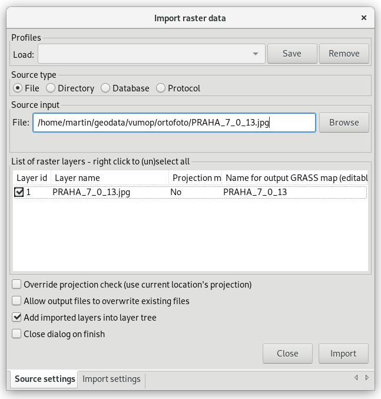
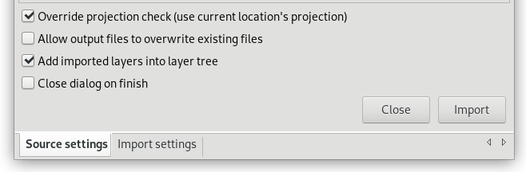

.. index::
   pair: geodata; import

.. _import:

Import geodat
-------------

.. important::

   V této kapitole předpokládáme, že importovaná data jsou
   lokalizovaná v souřadnicovém systému odpovídající aktuální
   :ref:`lokaci <lokace>`. To, že jsou data v jiném souřadnicovém
   systému můžete zjistit z dialogu pro import dat (viz obr. níže). V
   tomto případě musíte nejprve data naimportovat do nové lokace a
   následně je :ref:`transformovat <transformace>` do aktuální lokace.

   .. figure:: images/import-no-proj.png
	       :scale-latex: 35

	       Data nejsou v souřadnicovém systému lokace. Je nutné je
	       transformovat.

Většina rastrových formátů může být naimportována modulem
:grasscmd:`r.in.gdal`, pro vektorová data existuje modul
:grasscmd:`v.in.ogr`. GUI systému GRASS disponuje specializovanými
nástroji pro hromadný import dat (viz níže).

.. index::
   pair: rastrová data; import
   single: r.in.gdal
   see: import; r.in.gdal

Rastrová data
=============

Nástroj pro import rastrových dat je dostupný z menu
:menuselection:`File --> Import raster data --> Common formats import`
nebo nástrojové lišty správce vrstev.

.. figure:: images/wxgui-raster-import-menu.png
	    :scale-latex: 40

            Nástroj pro import rastrových dat dostupný z nástrojové
            lišty správce vrstev.

V dialogu pro import rastrových dat určíme:

#. typ zdroje
#. formát dat
#. adresář s daty
#. seznam vrstev k importu
#. spustíme import

            Určení rastrových dat (PNG) z daného adresáře k importu.

            Průběh importu.

.. figure:: images/wxgui-raster-import-2.png
            :class: large

            Naimportovaná data se automaticky přidají do stromu vrstev.

.. notecmd:: Import rastrových dat

                .. code-block:: bash
                                
                   r.in.gdal input=dmt.tif output=dmt

.. raw:: latex

   \newpage

.. admonition:: Ukázka hromadného importu rastrových dat jako Python skript

   .. code-block:: python

      import os
      import grass.script as grass

      for fname in os.listdir("."):
          name, ext = os.path.splitext(fname)
          if ext in ('.png', '.tif', '.jpg', '.gif'):
              grass.run_command('r.in.gdal', input = fname, output = name)

   Skriptování v jazyce Python je náplní navazujícího
   `školení pro pokročilé uživatele
   <http://www.gismentors.eu/skoleni/grass-gis.html#pokrocily>`_.

.. index::
   pair: vektorová data; import
   single: v.in.ogr
   see: import; v.in.ogr

.. _import-vector:
                                        
Vektorová data
==============

Nástroj pro import vektorových dat je dostupný z menu
:menuselection:`File --> Import vector data --> Common formats import`
nebo nástrojové lišty správce vrstev.

.. figure:: images/wxgui-vector-import-menu.png

            Nástroj pro import vektorových dat dostupný z nástrojové
            lišty správce vrstev.

.. raw:: latex

   \newpage

V dialogu pro import vektorových dat určíme:

#. typ zdroje
#. formát dat
#. adresář s daty
#. seznam vrstev k importu
#. spustíme import

.. figure:: images/wxgui-vector-import-0.png

            Určení vektorových dat (Esri Shapefile) z daného adresáře k importu.

.. figure:: images/wxgui-vector-import-1.png
	    :scale-latex: 60

            Průběh importu.

.. figure:: images/wxgui-vector-import-2.png
            :class: large

            Naimportovaná data se automaticky přidají do stromu vrstev.

.. admonition:: Import vektorových dat z příkazové řádky

                .. code-block:: bash
                                
                                v.in.ogr dsn=lesy.shp

.. raw:: latex

   \newpage

.. admonition:: Ukázka hromadného importu vektorových dat jako Python skript

   .. code-block:: python

      import os
      import grass.script as grass

      layers = grass.read_command('v.in.ogr', flags = 'l', dsn='.').splitlines()
      for fname in layers:
          grass.run_command('v.in.ogr', dsn = '.', layer = fname) 

   Skriptování v jazyce Python je náplní navazujícího
   `školení pro pokročilé uživatele
   <http://www.gismentors.eu/skoleni/grass-gis.html#pokrocily>`_.

.. index::
   pair: import; topologie

.. _import-topologie:
                                       
Poznámky k importu vektorových dat
==================================

Při importu vektorových dat provádí :grasscmd:`v.in.ogr` konverzi
vektorových dat z reprezentace :wikipedia:`Simple Features` do
:ref:`topologického formátu <topologie>` systému GRASS:

* pro body (point) a lomené čáry (linestring) nedochází ke změně
  povahy vektorového prvku, v topologickém formátu GRASS jsou
  vyjádřeny jako *points* a *lines*,
* polygony jsou rozloženy na hraniční linie (*boundary*) a centroidy
  (*centroid*), externí ring polygonu je převeden na hraniční linie
  (hraniční linie sousedících polygonů je uložena pouze jednou),
* pro každý polygon je vypočten centroid, tj. bod ležící uvnitř plochy,
* polygon je vyjádřen v topologickém modelu systému GRASS jako plocha
  (*area*),
* případné díry v polygonu jsou uloženy jako plochy, které tvoří
  tzv. ostrovy (*isle*).

Například dva sousedící polygony (jeden s otvorem) jsou v topologickém
modulu systému GRASS vyjádřeny čtyřmi hraničními liniemi a dvěma
centroidy. Polygony a otvor v druhém polygonu tvoří tři plochy. Otvor
v druhém polygonu a prostor vně polygonu definuje dva ostrovy.

::

 |   Number of points:       0               Number of centroids:  2          |
 |   Number of lines:        0               Number of boundaries: 4          |
 |   Number of areas:        3               Number of islands:    2          |

.. figure:: images/polygon-topo.png
   :class: middle
   :scale-latex: 55

   Topologická reprezentace dvou polygonů (druhý polygon s otvorem).

Modul :grasscmd:`v.in.ogr` provádí při importu operace, které by měly
odstranit případné topologické chyby v datech, které při konverzi z
reprezentace simple features do topologického formátu systému GRASS
mohou vzniknout. Případné topologické chyby, které nemohou být z
nejrůznějších důvodů během importu odstraněny, je možné opravit
pomocí modulu :grasscmd:`v.clean`, více v sekci :ref:`topologie
<topologie>`.

.. index::
   pair: kodování; atributy

Kódování atributových dat
^^^^^^^^^^^^^^^^^^^^^^^^^

Při importu dat ve formátu Esri Shapefile je nutné nastavit správné
kódování pro atributová data. Atributy obsahující diakritiku jsou
často kódována ve znakové sadě :wikipedia:`Windows-1250` (kód
``cp1250``). Hodnotu kódování lze nastavit pomocí parametru
:option:`encoding` modulu :grasscmd:`v.in.ogr`.

.. notecmd:: Import vektorových dat (znaková sada Windows-1250)

   .. code-block:: bash

      v.in.ogr dsn=orp.shp encoding=cp1250

.. notegrass6::

   Vzhledem k tomu, že modul :grasscmd:`v.in.ogr` nemá ve
   verzi GRASS 6 parametr :option:`encoding`, je nutné
   znakovou sadu určit pomocí proměnné prostředí
   :envvar:`SHAPE_ENCODING`.

   .. code-block:: bash

      SHAPE_ENCODING=cp1250 v.in.ogr dsn=orp.shp

.. index::
   single: DGN

Formát DGN
^^^^^^^^^^

Formát DGN lze naimportovat pouze v případě, že je knihovna
:wikipedia:`GDAL` zkompilována s podporou pro `tento formát
<http://www.gdal.org/ogr/drv_dgn.html>`_. Bohužel knihovna GDAL
nepodporuje formát verze 8.0 a vyšší.

.. note::

   V případě formátu DGN lze doporučit jeho konverzi do formátu DXF a
   import do systému GRASS pomocí modulu :grasscmd:`v.in.dxf`.

.. index::
   pair: import; region

Importovaná data a výpočetní region
^^^^^^^^^^^^^^^^^^^^^^^^^^^^^^^^^^^

Pokud se v mapovém okně nezobrazují žádná data, je nutné nastavit
pohled na aktuálně vybranou mapu.

.. figure:: images/wxgui-zoom-to-map-menu.png

            Nastavení pohledu mapového okna na vybranou mapovou vrstvu z kontextového menu správce vrstev.

.. figure:: ../intro/images/map-display-full-zoom.png
            :class: middle

            Nastavení pohledu mapového okna na vybranou mapovou vrstvu.

Import dat nemá vliv na nastavení :ref:`výpočetního regionu
<region>`. Výpočetní region lze nastavit na základě naimportovaných
dat z kontextového menu správce vrstev.

.. figure:: images/wxgui-set-region-menu.png

            Nastavení výpočetního regionu na základě mapové vrstvy.

.. note::

   Výpočetní region lze automaticky během importu rozšířit na základě
   importovaných dat.

   .. figure:: images/wxgui-import-region.png

               Rozšíření výpočetního regionu na základě importovaných dat

