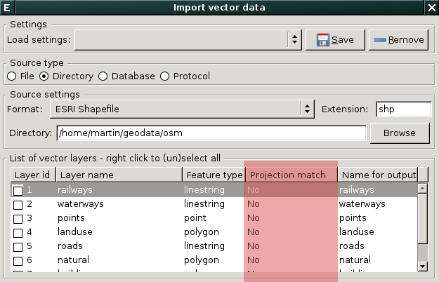
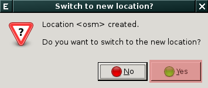
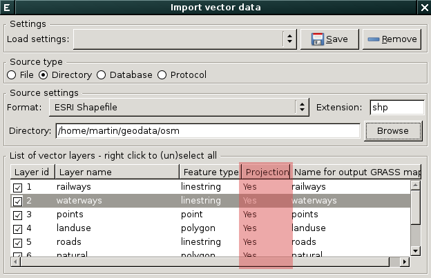
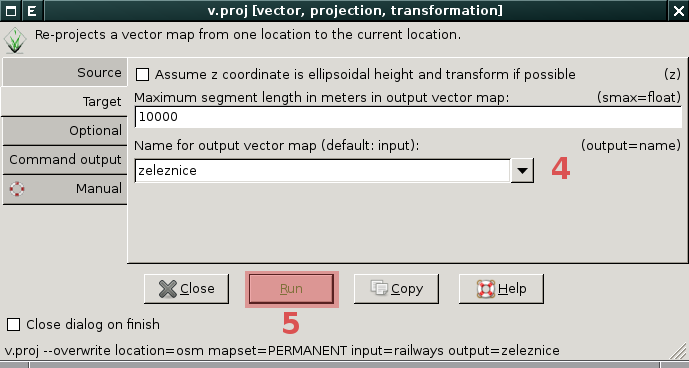

.. index::
   pair: geodata; transformace
   single: souřadnicové systémy
   single: r.proj
   single: v.proj

.. _transformace:

Geodata v různých souřadnicových systémech
------------------------------------------

.. important:: **Tento postup se od verze GRASS 7.0.2 výrazně
   zjednodušuje**. GRASS od této verze poskytuje nástroj, který
   nejen vstupní geodata naimportuje do aktuálního mapsetu, ale také
   provede jejich transformaci v případě, že se souřadnicové systémy
   vstupních geodat a dané lokace liší. Jedna se moduly
   :grasscmd:`r.import` a :grasscmd:`v.import`.

   .. figure:: images/v-import-0.png
               :class: middle
               :scale-latex: 70
                    
   .. figure:: images/v-import-1.png
               :class: middle
               :scale-latex: 70
                    
V případě, že se souřadnicový systém vstupních geodat a dané lokace
liší (viz :item:`Projection match` na :numref:`import-no-proj`)
nelze import provést přímo. Postup vyžaduje hned několik kroků.

.. _import-no-proj:

   
   Vstupní data nejsou v souřadnicovém systému lokace. Je nutné je
   transformovat.

Postup
======
   
#. :ref:`Vytvořit novou lokaci <transformace-lokace>` se souřadnicovým
   systémem vstupních geodat.
#. Do této nové lokaci se přepnout a geodata tam :ref:`naimportovat
   <transformace-import>`.
#. Dále se vrátit opět do původní lokace a do této naimportovaná
   geodata :ref:`transformovat <transformace-data>`.

.. _transformace-lokace:
   
Vytvoření nové lokace
^^^^^^^^^^^^^^^^^^^^^

Z menu :menuselection:`Settings --> GRASS working environment -->
Create new location` spusťte průvodce tvorby lokace, novou lokaci
můžete :ref:`vytvořit více způsoby <tvorba-lokace>`, nejrychlejší je v
tomto případě :ref:`tvorba na základě vstupních geodat
<lokace-srtm>`. Po vytvoření nové lokace se objeví dialog, který
umožňuje se do této lokace přepnout.

           
	    Přepnutí do nově vytvořené lokace.

.. figure:: images/new-loc-switch-confirm.png
            :class: small

	    Potvrzení aktuální lokace.
	    
.. _transformace-import:
                    
Import geodat do nové lokace
^^^^^^^^^^^^^^^^^^^^^^^^^^^^

Geodata do nově vytvořené lokace :ref:`naimportuje standardní cestou
<import-vector>`, položka :item:`Projection match` by měla obsahovat
již hodnotu ``Yes``.

   Souřadnicový systém dat a lokace se shoduje.

.. _loc-switch:
            
Po importu dat se vrátíme do původní lokace :menuselection:`Settings
--> GRASS working environment --> Change location and mapset`.

.. figure:: images/change-loc-map.png
            :class: small

	    Dialog změny lokace a mapsetu.

Aktuální nastavení lokace můžeme volitelně uložit do souboru s
projektem (tzv. *workspace file*).

.. figure:: images/loc-switch-save.png
            :class: small

	    Dialog pro uložení projektu (workspace).

Poté se objeví dialog, který potvrzuje, že aktuální lokace je opět ta
cílová.

.. figure:: images/loc-switch-back.png
            :class: small

	    Dialog potvrzující přepnutí do původní lokace a mapsetu.

.. _transformace-data:
                    
Transformace dat do cílové lokace
^^^^^^^^^^^^^^^^^^^^^^^^^^^^^^^^^

Transformovat *rastrová data* umožňuje modul :grasscmd:`r.proj`
dostupný z menu :menuselection:`Raster --> Develop raster map -->
Reproject raster map from different GRASS location`, podobně pro
*vektorová data* existuje :grasscmd:`v.proj` (:menuselection:`Vector
--> Develop vector map --> Reproject vector map from different GRASS
location`).

Následuje příklad pro transformaci vektorových dat.

.. figure:: images/v-proj-0.png
   
            V záložce :item:`Source` vybereme lokaci :fignote:`(1)` a
            mapset :fignote:`(2)`, který obsahuje vstupní data, dále
            vstupní vektorovou mapu :fignote:`(3)`. Pokud by lokace
            byla umístěna v jiném adresáři, tak je potřeba jej
            definonat pomocí parametru :option:`dbase`.

            Případně můžeme v záložce :item:`Target` zvolit název pro
            výstupní mapu :fignote:`(4)`. Transformaci spustíme
            :fignote:`(5)`.

Po úspěšné transformaci se vytvořená vrstva automaticky přidá do
*správce vrstev* a zobrazí v mapovém okně.

..
  .. figure:: images/proj-result.png
     :class: large
     :scale-latex: 80

     Výsledek transformace dat do aktuální lokace a mapsetu.
