.. index::
   single: lokace
   see: lokace; struktura dat

.. _tvorba-lokace:
      
Vytvoření vlastní lokace
------------------------

Novou lokaci lze vytvořit pomocí průvodce, který je dostupný z uvítací
obrazovky systému GRASS. Spustíme GRASS a sekci *Select GRASS
Location* stiskneme tlačítko :item:`New`.

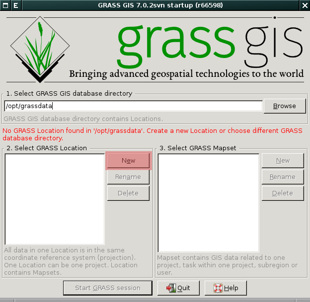

            Spuštění průvodce tvorbou lokace.

Průvodce tvorbou lokace je možné spustit i z běžící seance a to z menu
:menuselection:`Settings --> GRASS working environment --> Create new
location`.

.. figure:: images/wxgui-loc-menu.png

            Spuštění průvodce tvorbou lokace z menu *správce vrstev*.

Lokaci lze vytvořit několika různými postupy:

#. pomocí :wikipedia:`EPSG` kódu
#. na základě georeferencovaných dat
#. na základě :wikipedia-en:`WKT <Simple_Features#Well-known_text>` či
   :wikipedia:`PRJ <Shapefile#Dopl.C5.88kov.C3.A9_soubory>` souboru
#. výběrem kartografického zobrazení, referenčního elipsoidu
#. definicí parametrů pro knihovnu :wikipedia-en:`PROJ.4`
#. bez zadaní parametrů (pro negeoreferencovaná data)

Většinou bude stačit vytvořit novou lokaci na základě EPSG kódu (viz
tabulka níže) anebo ze vstupních geodat, pokud je máme k dispozici.

.. _epsg_cr:

.. only:: latex
          
   .. tabularcolumns:: |p{2cm}|p{6cm}|
                       
.. only:: html
                                 
   .. cssclass:: border

+----------------+--------------------------------------+
| EPSG           | Souřadnicivý systém                  |
+================+======================================+
| :epsg:`5514`   | S-JTSK                               |
+----------------+--------------------------------------+
| :epsg:`4328`   | WGS-84                               |
+----------------+--------------------------------------+
| :epsg:`3857`   | Web Mercator                         |
+----------------+--------------------------------------+
| :epsg:`32632`  | UTM (zóna 32)                        |
+----------------+--------------------------------------+
| :epsg:`32633`  | UTM (zóna 33)                        |
+----------------+--------------------------------------+
| :epsg:`3835`   | S-42                                 |
+----------------+--------------------------------------+
| :epsg:`4258`   | ETRS-89                              |
+----------------+--------------------------------------+

..
  .. figure:: images/wxgui-new-loc-methods.png
              :class: middle
                      
                      Metody tvorby lokace

Níže uvedené postupy ukazující tři nejpoužívanější metody vytvoření
lokace.

* :ref:`S-JTSK na základě EPSG kódu <lokace-sjtsk>`
* :ref:`Pro data SRTM na základě geodat <lokace-srtm>`
* :ref:`Lokace pro souřadnicově nepřípojená data (XY) <lokace-xy>`

..
   * :ref:`UTM na základě manuální definice <lokace-utm>`
   * :ref:`S-42 na základě manuální definice <lokace-s-42>`
   * :ref:`ETRS-89 na základě EPSG kódu <lokace-etrs89>`

.. index::
   single: S-JTSK

.. _lokace-sjtsk:

Příklad vytvoření lokace pro data v souřadnicovém systému S-JTSK
^^^^^^^^^^^^^^^^^^^^^^^^^^^^^^^^^^^^^^^^^^^^^^^^^^^^^^^^^^^^^^^^

Na úvodní stránce průvodce vyplníme název lokace (*Project Location*) a
volitelně i krátký popisek (*Optional Location Title*).

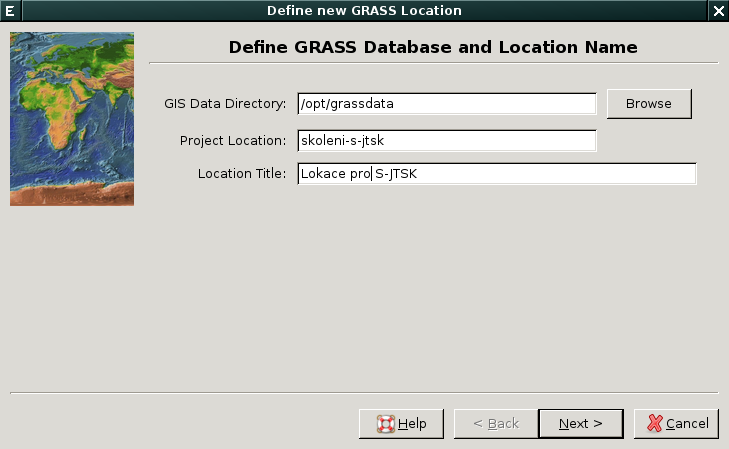
            
            Vytvoření lokace pro S-JTSK (krok 1).

Na další stránce vybereme způsob vytvoření lokace. 

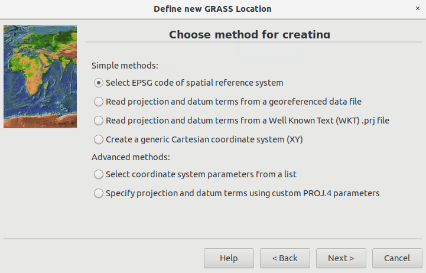

            Vytvoření lokace pro S-JTSK (krok 2).

V našem případě vytvoříme lokaci na základě EPSG kódu, pro
souřadnicový systém S-JTSK :epsg:`5514`.

.. note::

   :epsg:`5514` podporuje systém GRASS pouze pokud používate verzi
   knihovny :wikipedia-en:`PROJ.4` 4.9 a vyšší (tuto informaci získáte
   z menu :menuselection:`Help --> About system`). V~opačném případě
   musíte přidat parametry pro S-JTSK do konfiguračního souboru ručně:
   na začátek souboru s definicí kódů EPSG (v případě OS GNU/Linux
   bývá umístěn v :file:`/usr/share/proj/epsg`, u MS Windows
   :file:`c:\\OSGeo4W\\share\\proj\\epsg`), přidáme následující 2
   řádky::

        # Krovak S-JTSK
        <5514> +proj=krovak +lat_0=49.5 +lon_0=42.5 +alpha=30.28813972222222 +k=0.9999 \
	+x_0=-0 +y_0=-0 +ellps=bessel +pm=ferro +to_meter=-1 +no_defs \
	+towgs84=570.8,85.7,462.8,4.998,1.587,5.261,3.56
   
   Soubor uložte, zavřete a případně restartujte *GRASS Location Wizard*, aby
   došlo ke znovu načtení databáze kódů EPSG.
   
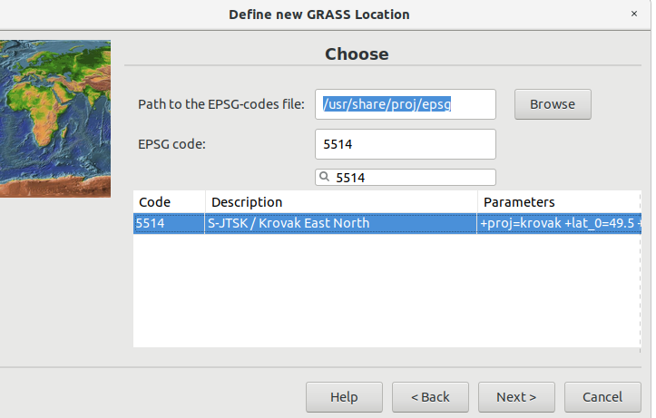

            Vytvoření lokace pro S-JTSK (krok 3).

.. figure:: images/wxgui-loc-s-jtsk-4.png
            :class: small
	    :scale-latex: 45

            Vytvoření lokace pro S-JTSK (krok 4). Po zadání EPSG kódu
            se objeví dialog pro volbu transformačních parametrů.

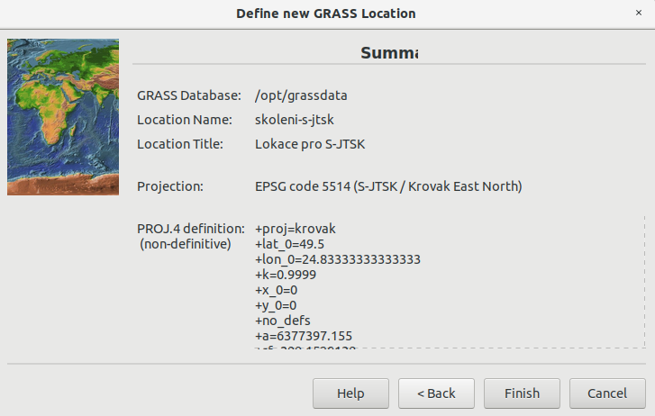
	    
            Vytvoření lokace pro S-JTSK (krok 5). Po zadání EPSG kódu
            se objeví dialog pro volbu transformačních parametrů.

.. figure:: images/wxgui-loc-s-jtsk-6.png
            :class: small
	    :scale-latex: 55

            Vytvoření lokace pro S-JTSK (krok 6). Nastavení výchozího
	    výpočetního regionu přeskočíme. Výchozí region nastavíme později po
	    importu dat.

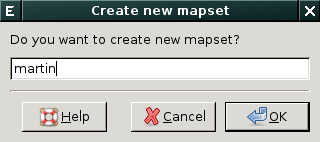

	    Vytvoření lokace pro S-JTSK (krok 7). Případně ještě
	    můžeme vytvořit vlastní mapset (mapset *PERMANENT* je vytvořen vždy).

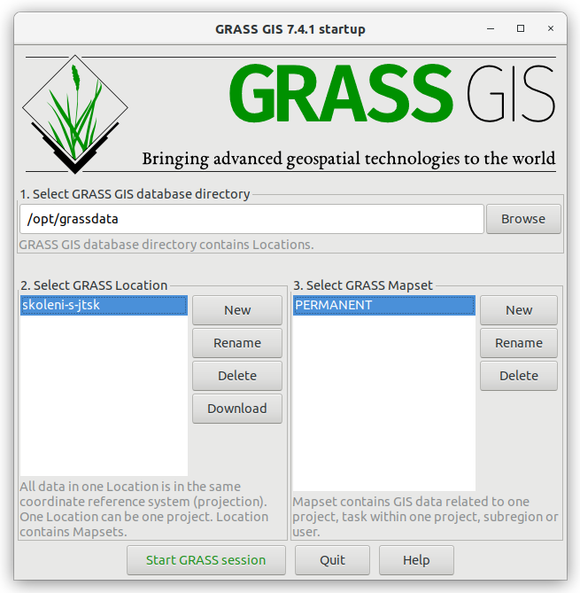

	    Poté se spustí systém GRASS s právě vytvořenou lokací.

.. raw:: latex

   \newpage

.. notecmd:: Vytvoření lokace
                
   .. code-block:: bash

      grass70 -c EPSG:5514:3 /opt/grassdata/skoleni-s-jstk

..
 .. index::
     single: UTM

  .. _lokace-utm:

  Vytvoření lokace pro data v souřadnicovém systému UTM
  ^^^^^^^^^^^^^^^^^^^^^^^^^^^^^^^^^^^^^^^^^^^^^^^^^^^^^
  .. figure:: images/wxgui-loc-utm-0.png

              Vytvoření lokace pro UTM (krok 1).

  V tomto případě nepoužijeme EPSG kód, nýbrž souřadnicový systém
  definujeme manuálně.

  .. note::

     Pokud bysme chtěli použít EPSG kód, tak jde o :epsg:`32633` (33N).

  .. figure:: images/wxgui-loc-utm-1.png

              Vytvoření lokace pro UTM (krok 2).

  .. figure:: images/wxgui-loc-utm-2.png

              Vytvoření lokace pro UTM (krok 3).

  .. figure:: images/wxgui-loc-utm-3.png

              Vytvoření lokace pro UTM (krok 4). Zadáme 33. zónu,
              severní polokoule.

  .. raw:: latex

     \clearpage

  .. figure:: images/wxgui-loc-utm-4.png

              Vytvoření lokace pro UTM (krok 5). Geodetické datum
              uvedeme 'WGS-84'.

  .. figure:: images/wxgui-loc-utm-5.png

              Vytvoření lokace pro UTM (krok 6).

  .. index::
     single: S-42

  .. _lokace-s-42:

  Vytvoření lokace pro data v souřadnicovém systému S-42
  ^^^^^^^^^^^^^^^^^^^^^^^^^^^^^^^^^^^^^^^^^^^^^^^^^^^^^^
  .. figure:: images/wxgui-loc-s42-0.png

              Vytvoření lokace pro S-42 (krok 1).

  .. figure:: images/wxgui-loc-utm-1.png

              Vytvoření lokace pro S-42 (krok 2).

  .. raw:: latex

     \newpage

  .. note::

     Pokud bysme chtěli použít EPSG kód, tak jde o :epsg:`3835`.

  .. figure:: images/wxgui-loc-s42-2.png

              Vytvoření lokace pro S-42 (krok 3).

  .. figure:: images/wxgui-loc-s42-3.png

              Vytvoření lokace pro S-42 (krok 4).

  .. figure:: images/wxgui-loc-s42-4.png

              Vytvoření lokace pro S-42 (krok 5).

  .. figure:: images/wxgui-loc-s42-5.png
              :class: small
              :scale-latex: 50

              Vytvoření lokace pro S-42 (krok 6).

  .. figure:: images/wxgui-loc-s42-6.png

              Vytvoření lokace pro S-42 (krok 7).

  .. raw:: latex

     \clearpage

.. _lokace-srtm:

Vytvoření lokace na základě geodat
^^^^^^^^^^^^^^^^^^^^^^^^^^^^^^^^^^
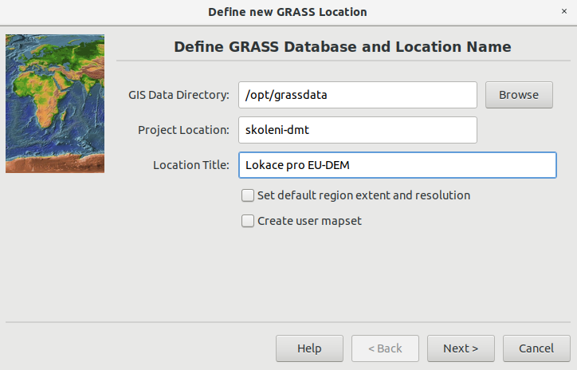

            Vytvoření lokace pro data SRTM (krok 1).

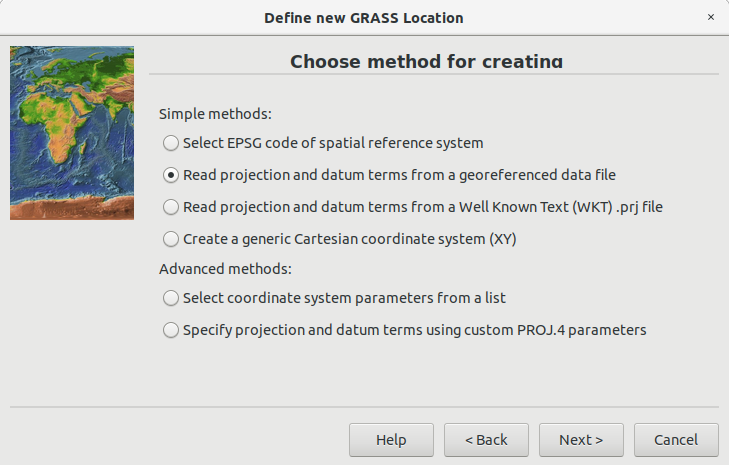

            Vytvoření lokace pro data SRTM (krok 2).

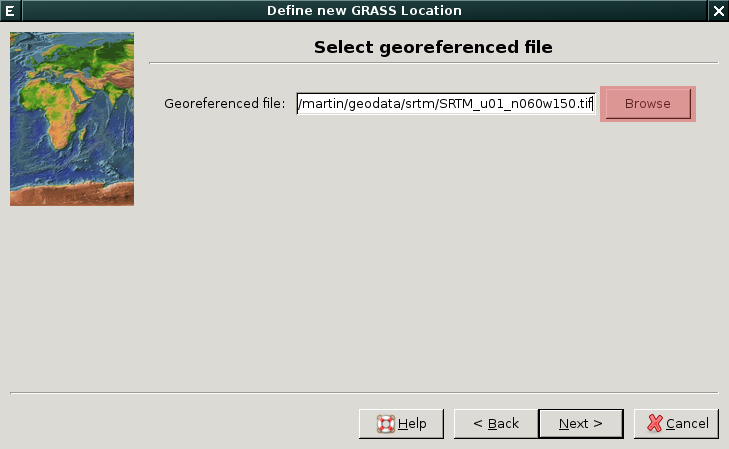

            Vytvoření lokace pro data SRTM (krok 3).

.. figure:: images/wxgui-loc-srtm-3.png

            Vytvoření lokace pro data SRTM (krok 4).

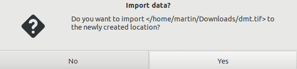

            Vytvoření lokace pro data SRTM (import dat, krok
	    1). Volitelně můžeme data, na základě kterých byla lokace vytvořena, i
	    naimportovat (do mapsetu *PERMANENT*).

.. figure:: images/wxgui-loc-srtm-5.png
	    :class: small
	    :scale-latex: 50

            Vytvoření lokace pro data SRTM (import dat, krok 2).

..
  .. index::
     single: EPSG

  .. _lokace-etrs89:

  Vytvoření lokace na základě EPSG kódu
  ^^^^^^^^^^^^^^^^^^^^^^^^^^^^^^^^^^^^^

  .. figure:: images/wxgui-loc-epsg-0.png

              Vytvoření lokace na základě EPSG kódu (krok 1).

  .. figure:: images/wxgui-loc-epsg-1.png

              Vytvoření lokace na základě EPSG kódu (krok 2).

  .. figure:: images/wxgui-loc-epsg-2.png

              Vytvoření lokace na základě EPSG kódu (krok 3).

  .. figure:: images/wxgui-loc-epsg-3.png

              Vytvoření lokace na základě EPSG kódu (krok 4).

  .. raw:: latex

     \newpage

  .. notecmd:: Vytvoření lokace pří startu systému GRASS

     .. code-block:: bash

                     grass70 -c EPSG:3035 /opt/grassdata/eu-dem
      
.. _lokace-xy:

Vytvoření lokace pro souřadnicově nepřipojená data
^^^^^^^^^^^^^^^^^^^^^^^^^^^^^^^^^^^^^^^^^^^^^^^^^^

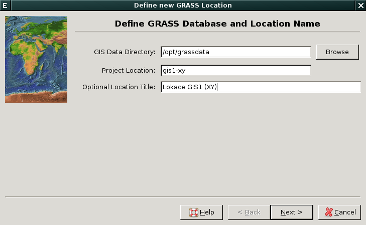

            Vytvoření lokace pro XY (krok 1).

            Vytvoření lokace pro XY (krok 2).

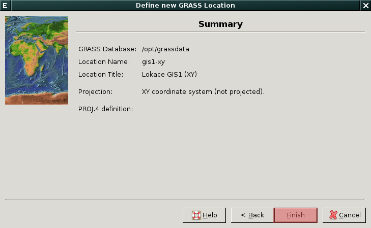

            Vytvoření lokace pro XY (krok 3).

.. index::
   single: g.mapset

Vytvoření nového mapsetu v rámci lokace
=======================================

Nový mapset v rámci již existující lokace můžeme vytvořit dvěma
způsoby:

* z uvítací obrazovky systému GRASS anebo

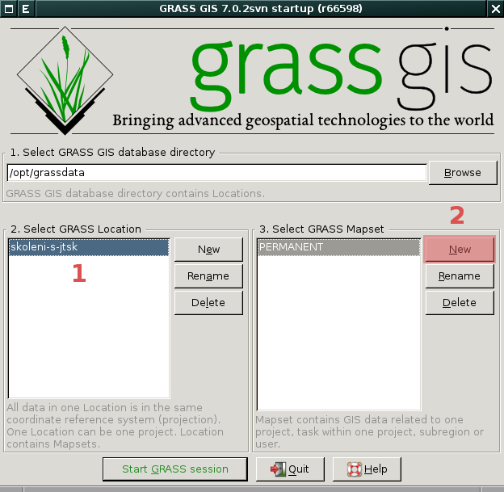

            Vytvoření nového mapsetu :fignote:`(2)` v rámci vybrané
            lokace :fignote:`(1)`.

* z menu *Správce vrstev* :menuselection:`Settings --> GRASS working
  environment --> Create new mapset`.

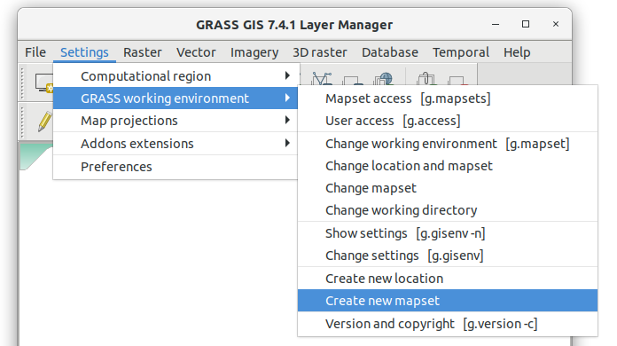

            Vytvoření nového mapsetu v rámci aktuální lokace z menu
            *správce vrstev*.

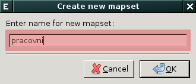

	    V následující dialogu zvolíme jeho název.

..
   .. figure:: images/wxgui-new-mapset-dialog-1.png
      :class: small
      :scale-latex: 55

Po vytvoření nového mapsetu se do něj systém GRASS automaticky přepne.

