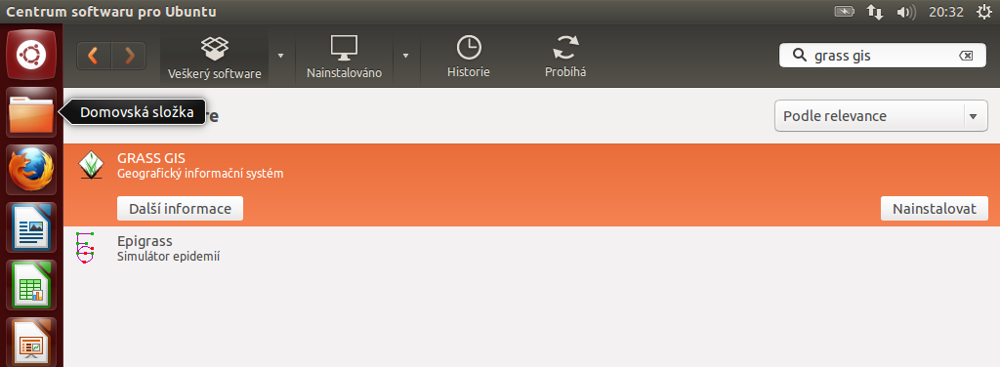
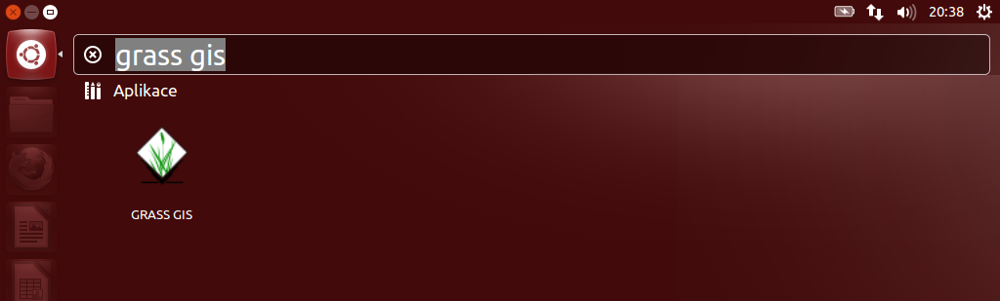

.. _label: instalace-linux

GNU Linux
---------

Systém GRASS je dostupný ve většině rozšířených Linuxových distribucí
jako tzv. balíček. Pokud balíčkovací systém dané linuxové distribuce
neobsahuje GRASS nebo nabízí jeho zastaralou verzi lze systém GRASS
poměrně jednoduše :ref:`zkompilovat <kompilace>` vlastními silami.

Postup instalace pro Debian GNU/Linux
=====================================

* `balíčky GRASS
  <http://packages.debian.org/search?keywords=grass&searchon=names&suite=all&section=all>`_
  dostupné pro `Debian GNU/Linux <http://www.debian.org>`_ (viz
  projekt `DebianGIS <http://wiki.debian.org/DebianGis>`_).

.. code-block:: bash

   sudo apt-get install grass grass-gui grass-doc

Postup instalace pro Ubuntu
===========================

* `balíčky GRASS
  <http://packages.ubuntu.com/search?keywords=grass&searchon=names&suite=all&section=all>`_
  dostupné pro :wikipedia:`Ubuntu` (viz projekt `UbuntuGIS
  <https://wiki.ubuntu.com/UbuntuGIS>`_).

            Instalace systému GRASS pod Ubuntu 12.10

            Spuštění systému GRASS v Ubuntu 12.10
