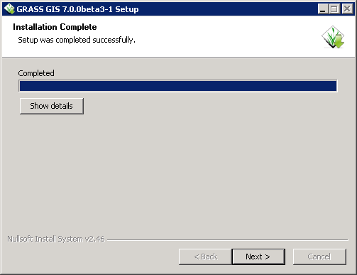
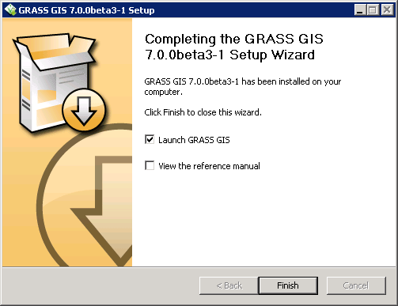
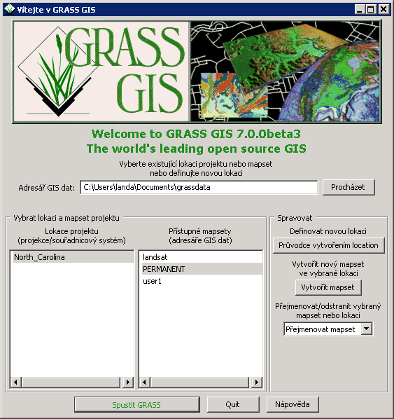
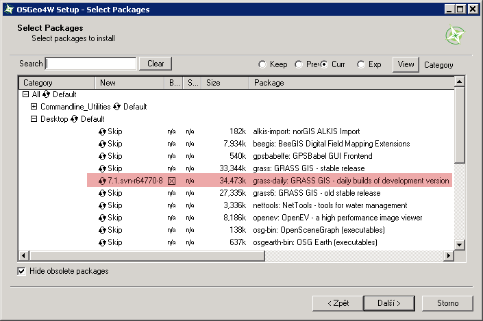
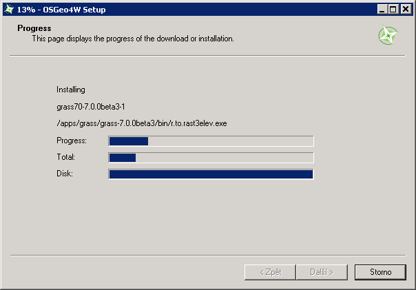
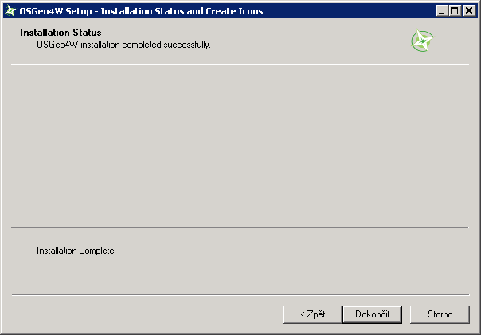
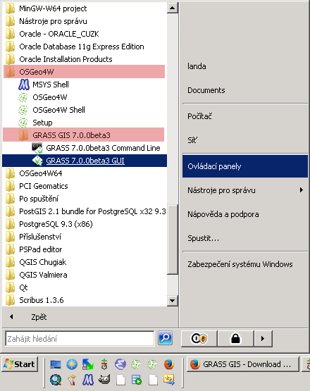
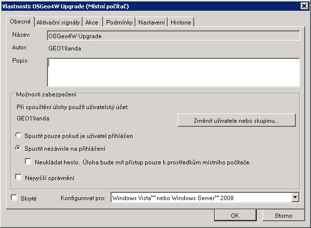
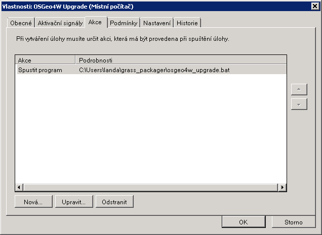

MS Windows
----------

Systém GRASS je možné pod MS Windows nainstalovat *dvěma způsoby*:

#. pomocí :ref:`nativního instalátoru<nativni-instalator>`

   * *pro začátečníky*
   * nepředpokládáme častou aktualizaci softwaru

#. v rámci :ref:`OSGeo4W frameworku <osgeo4w-instalator>`

   * *pro pokročilejší uživatele*
   * komplexnější řešení umožňující instalaci dalšího softwaru distribuovaného pod hlavičkou `OSGeo <http://www.osgeo.org/>`_
   * vhodné při předpokladu :ref:`časté aktualizace softwaru <osgeo4w-aktualizace>` 

.. _nativni-instalator:

Nativní instalátor
==================

*Nativní (standalone) instalátor* pro GRASS 7.0 je dostupný na adrese

* http://grass.osgeo.org/grass70/binary/mswindows/native/

.. admonition:: Poznámka pro pokročilé uživatele

   V případě nutnosti aktuálnější verze či testování
   nových vlastností je možné využít denní snapshoty
   instalátoru dostupných na adrese
   http://wingrass.fsv.cvut.cz/grass70.

.. figure:: images/wingrass-0.png

.. figure:: images/wingrass-1.png

.. figure:: images/wingrass-2.png

	    Zvolíme adresář, kam se má GRASS nainstalovat.

.. figure:: images/wingrass-3.png

	    Při první instalaci doporučuje nainstalovat také
	    "Important Microsoft Runtime Libraries" a ukázkovou
	    geografickou datovou sadu pro GRASS "North Carolina".

.. figure:: images/wingrass-4.png

.. figure:: images/wingrass-5.png

	    GRASS můžeme automaticky spusit ...

            ... anebo vybrat z nabídky Start.

.. figure:: images/wingrass-9.png

	    Uvodní obrazovka systému GRASS pro výběr tzv. lokace a mapsetu.

.. _osgeo4w-instalator:

OSGeo4W
=======

*Instalátor frameworku OSGeo4W* je ke stažení na adrese

* http://download.osgeo.org/osgeo4w/osgeo4w-setup.exe.

.. figure:: images/osgeo4w-0.png

	    Pro instalaci GRASS 7 zvolíme ``Advanced Install``.

.. figure:: images/osgeo4w-1.png

.. figure:: images/osgeo4w-2.png

	    Zvolíme adresář, kam se má GRASS nainstalovat.

.. figure:: images/osgeo4w-3.png

.. figure:: images/osgeo4w-4.png

.. figure:: images/osgeo4w-5.png

.. figure:: images/osgeo4w-6.png

	    Ze sekce ``Desktop`` vybereme balíček ``grass70``.

.. figure:: images/osgeo4w-7.png

	    Nutné závislosti (jako např. knihovna GDAL či Python) se
	    nainstalují automaticky.

	    Součástí instalace je i proprietární součast knihovny GDAL
	    ``szip``, kterou potvrdíme.

	    GRASS spustíme z nabídky Start ``OSGeo4W``.

.. admonition:: Poznámka pro pokročilé uživatele

   V rámci OSGeo4W frameworku je možné nainstalovat i *denní
   snapshoty* systému GRASS. To se hodí v případě, že potřebujete
   otestovat např. novou funkcionalitu, která není součastí stabilní
   verze.

   .. figure:: images/osgeo4w-12.png

	       Ze sekce ``Desktop`` vybereme balíček ``grass70``.

..  _osgeo4w-aktualizace:

Automatická aktualizace (pro pokročilé uživatele)
^^^^^^^^^^^^^^^^^^^^^^^^^^^^^^^^^^^^^^^^^^^^^^^^^
Aktualizovat instalaci OSGeo4W (včetně instalace systému GRASS) lze provádět automaticky v rámci plánovače úloh OS MS Windows.

Stačí umístit do zvoleného adresáře níže uvedený skript s příponou
:wikipedia-en:`bat <Batch file>` (předpokládejme, že je framework
OSGeo4W nainstalován v adrešáři ``C:\OSGeo4W``):

.. code-block:: bat

                @echo off

                set PATH=C:\OSGeo4W\bin;%PATH%
                call o4w_env.bat

                apt update
                apt upgrade

a nastavit spuštění skriptu jako úlohu.

.. figure:: images/osgeo4w-cronjob-1.png

	    Příklad pro spuštění aktualizace OSGeo4W každý den v 8h ráno.

