.. index::
   single: MS Windows
   see: MS Windows; Instalace

MS Windows
----------

Systém GRASS je možné pod MS Windows nainstalovat *dvěma způsoby*:

#. pomocí :ref:`nativního instalátoru<nativni-instalator>`

   * *pro začátečníky*
   * nepředpokládáme častou aktualizaci softwaru

#. v rámci :ref:`OSGeo4W frameworku <osgeo4w-instalator>`

   * *pro pokročilejší uživatele*
   * komplexnější řešení umožňující instalaci dalšího softwaru
     distribuovaného pod hlavičkou `OSGeo <http://www.osgeo.org/>`_
     (jako je např. `QGIS <http://qgis.org>`_, `MapServer <http://mapserver.org>`_ a další)
   * vhodné při předpokladu :ref:`časté aktualizace softwaru <osgeo4w-aktualizace>` 

.. _nativni-instalator:

Nativní instalátor
==================

*Nativní (standalone) instalátor* pro GRASS 7.0 je dostupný na adrese:

* http://grass.osgeo.org/grass70/binary/mswindows/native/

..
   .. noteadvanced:: 

      V případě nutnosti aktuálnější verze či testování
      nových vlastností je možné využít denní snapshoty
      instalátoru dostupných na adrese
      http://wingrass.fsv.cvut.cz/grass70.

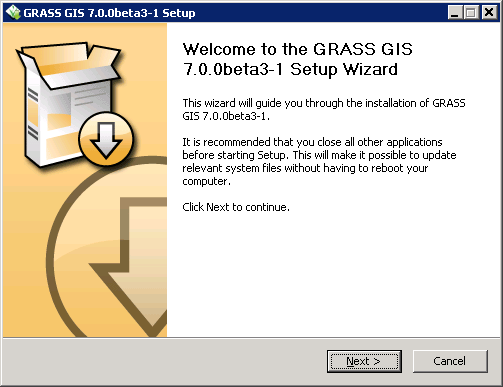

            Spustíme instalátor.
   
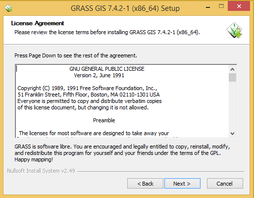

            Potvrdíme licenci.
   
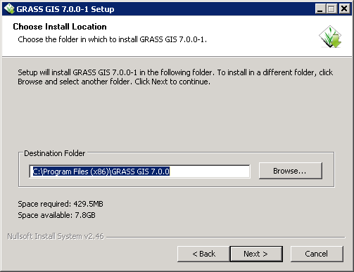
   
            Zvolíme adresář, kam se má GRASS nainstalovat.

.. _nativni-instalator-data:

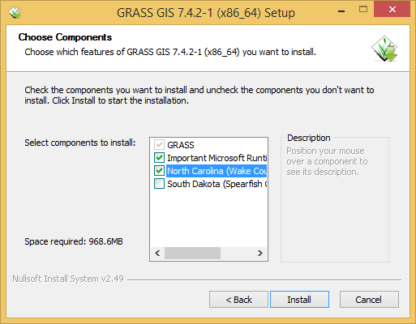
           
	    Důrazně doporučujeme (vyhnete se problémům při spuštení
	    systému GRASS v případě chybějících knihoven MS Windows)
	    nainstalovat také "Important Microsoft Runtime Libraries"
	    a pokud nemáte vlastní data tak i ukázkovou geografickou
	    datovou sadu pro GRASS "North Carolina".

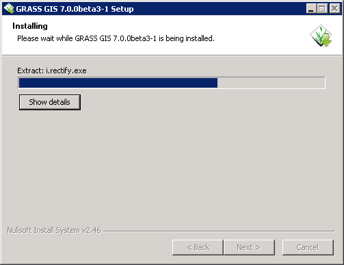
            
            GRASS můžeme spustit z nabídky Start.
            
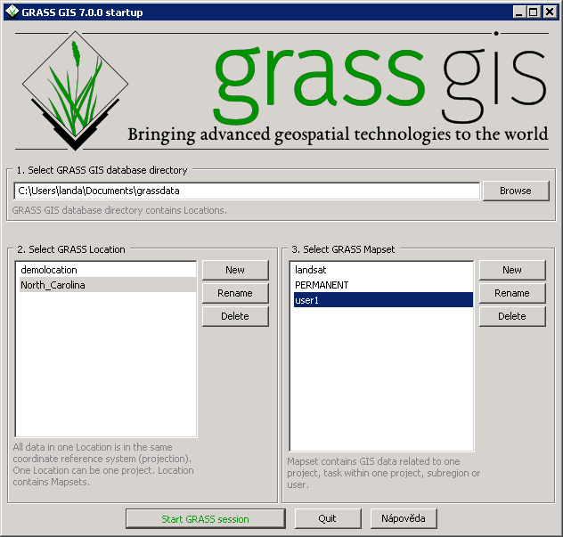
            
            Po startu se objeví úvodní obrazovka systému GRASS pro
	    výběr tzv. :ref:`lokace a mapsetu <struktura-dat>`.

.. raw:: latex

   \clearpage

.. index::
   single: OSGeo4W
   see: OSGeo4W; Instalace

.. _osgeo4w-instalator:

OSGeo4W
=======

*Instalátor frameworku OSGeo4W* je ke stažení na adrese:

* http://download.osgeo.org/osgeo4w/

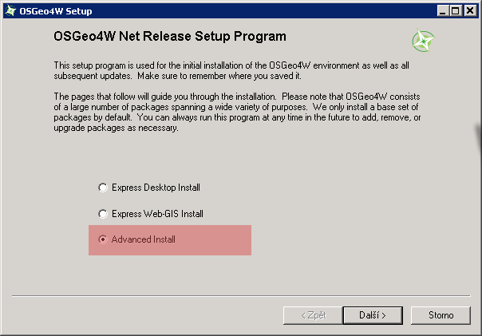
                 
	    GRASS 7 nainstalujeme ze sekce ``Advanced Install``.

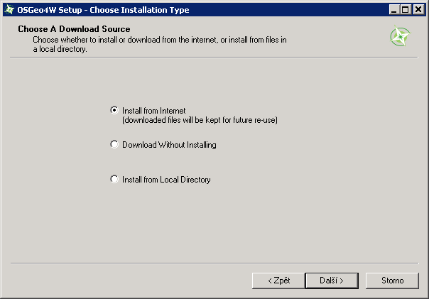

            Vybereme instalaci z Internetu.
   
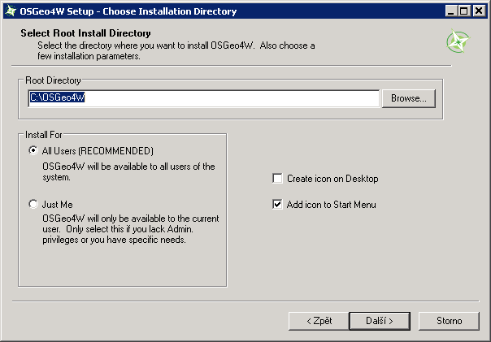
            
	    Zvolíme adresář, kam se má GRASS nainstalovat.

.. raw:: latex

   \clearpage

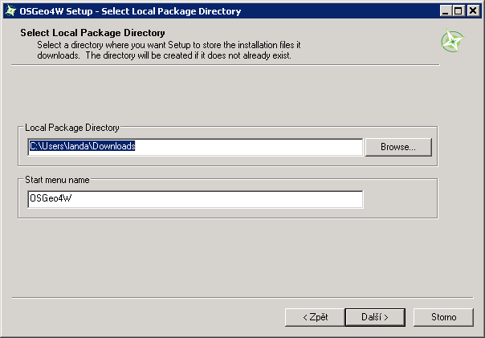

            Nastavíme cestu k adresáři, kam se budou stahovat data instalátoru.

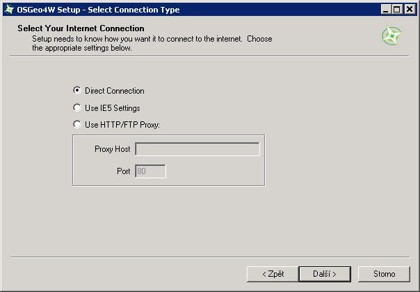
            
	    Ze sekce ``Desktop`` vybereme balíček ``grass``.

.. figure:: images/osgeo4w-5.png
            :scale-latex: 50
            
	    Nutné závislosti (jako např. knihovna GDAL, Python či
	    wxPython) se nainstalují automaticky.

.. raw:: latex

   \clearpage

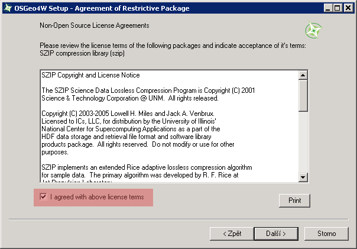
            
	    Součástí instalace je i proprietární součást knihovny GDAL
	    ``szip``, kterou potvrdíme.
            
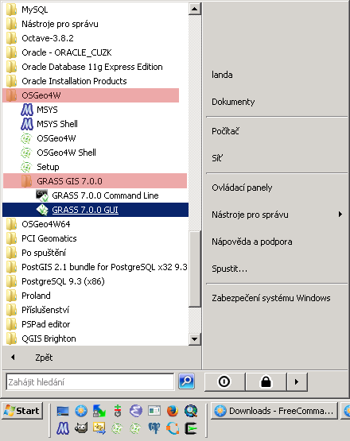
            
	    GRASS spustíme z nabídky Start ``OSGeo4W``.

.. noteadvanced::

   V rámci frameworku OSGeo4W je možné nainstalovat i *denní
   snapshoty* vývojové verze systému GRASS. To se hodí v případě, že
   potřebujete otestovat např. novou funkcionalitu, která není
   součástí stabilní verze.

   .. figure:: images/osgeo4w-8.png
      :scale-latex: 50
               
      Ze sekce ``Desktop`` vybereme balíček ``grass-daily``
      (denní snapshoty aktuální vývojové verze systému GRASS).

.. raw:: latex

   \newpage

Poznámky
^^^^^^^^

Nastavení velikosti fontu terminálu
~~~~~~~~~~~~~~~~~~~~~~~~~~~~~~~~~~~

V novějších verzích Windows bývá výchozí velikost fontu terminálu
příliš malá.

.. figure:: images/winterminal-small.png
   :class: small

Velikost fontu můžete změnit ve vlastnostech okna (pravé tlačítko myši
nad titulkem okna, :menuselection:`Vlastnosti`).

.. figure:: images/winterminal-font.png
   :class: small

..  _osgeo4w-aktualizace:

Automatická aktualizace (pro velmi pokročilé uživatele)
~~~~~~~~~~~~~~~~~~~~~~~~~~~~~~~~~~~~~~~~~~~~~~~~~~~~~~~

Aktualizovat instalaci OSGeo4W (včetně instalace systému GRASS) lze
provádět automaticky v rámci plánovače úloh MS Windows.

Stačí umístit do zvoleného adresáře níže uvedený skript s příponou
:wikipedia-en:`bat <Batch file>` (předpokládejme, že je framework
OSGeo4W nainstalován v adresáři ``C:\OSGeo4W``):

.. code-block:: bat

                @echo off

                set PATH=C:\OSGeo4W\bin;%PATH%
                call o4w_env.bat

                apt update
                apt upgrade

a nastavit spuštění skriptu jako úlohu.

..   
   .. figure:: images/osgeo4w-cronjob-0.png
      :scale-latex: 50
            
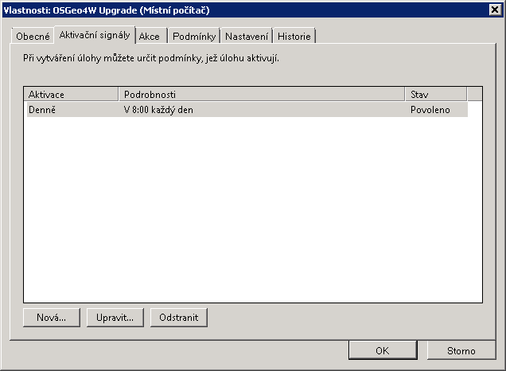
            
	    Příklad pro spuštění aktualizace OSGeo4W každý den v 8h ráno.

..            
   .. figure:: images/osgeo4w-cronjob-2.png
               :scale-latex: 50
