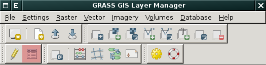
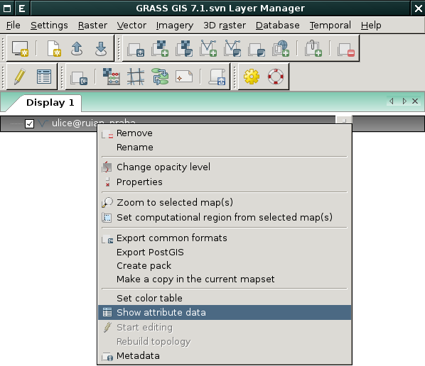
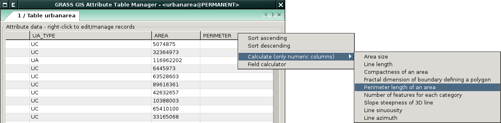
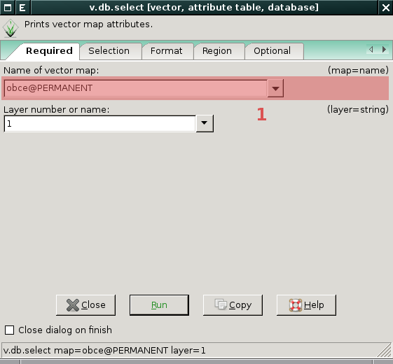
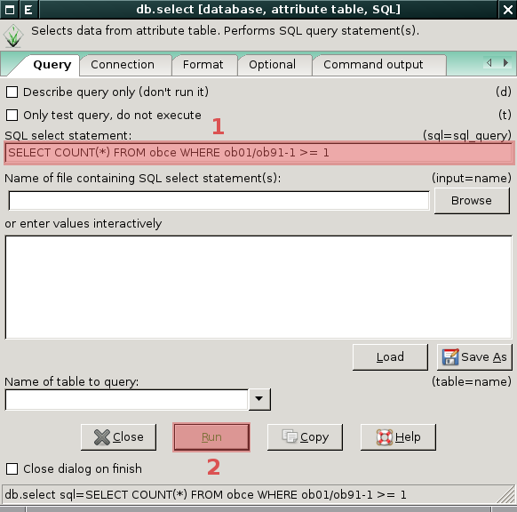
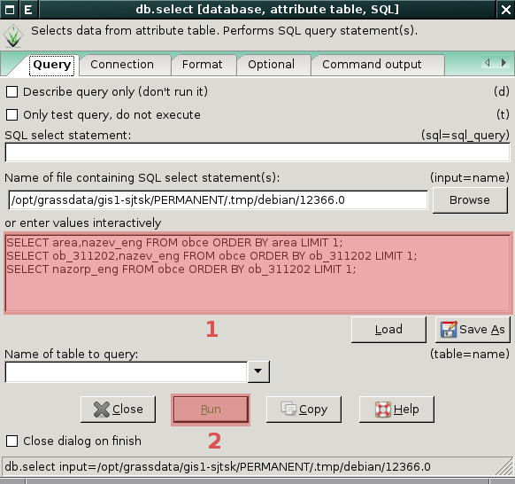

.. _atributove-dotazy:

Atributové dotazy
-----------------

Atributové dotazy, tj. výběr geoprvků na základě jejich popisných
vlastností, lze provádět pomocí :abbr:`GUI (Grafické uživatelské
rozhraní)` :ref:`správce atributových dat <wxgui-dbmgr>`. Pokročilejší
uživatelé mohou využít :ref:`specializované moduly <db-select>`
dostupné z :abbr:`GUI (Grafické uživatelské rozhraní)` anebo z
příkazové řádky systému GRASS.

.. _wxgui-dbmgr:

Správce atributových dat
========================

:grasscmd:`Správce atributových dat <wxGUI.dbmgr>` (*Attribute Table
Manager*) je základním nástrojem pro práci s atributovými daty v
:abbr:`GUI (Grafické uživatelské rozhraní)` systému GRASS. Lze jej
spustit několika způsoby:

* z nástrojové lišty *správce vrstev*

            Spuštění správce atributových dat z nástrojové lišty

* z kontextového menu *správce vrstev*

            Spuštění správce atributových dat z kontextového menu

* z příkazové řádky jako modul :grasscmd:`g.gui.dbmgr`

.. code-block:: bash

               g.gui.dbmgr map=obce

Dialog správce atributových dat má **tři záložky**:

.. figure:: images/wxgui-dbmgr-tabs.png
            :class: middle

            Záložky správce atributových dat

:item:`Browse data`
      Prohlížení, dotazování a editace atributových dat (záznamů v tabulce)

:item:`Manage tables`
      Přidání, přejmenování, odebraní sloupce v atributové tabulce

:item:`Manage layers`
      Správa atributových tabulek připojených k vektorové mapě

Dotazování
^^^^^^^^^^

Dotazovat se na atributová data je možné v záložce :item:`Browse data`
a to buď v základním (*simple*) anebo pokročilém (*advanced*) módu,
viz :ref:`sql-builder`.

*Základní mód* umožňuje definovat jednoduchou `where` podmínku typu
``sloupec <op> hodnota``.

.. figure:: images/wxgui-dbmgr-simple-0.png

            Jednoduchý atributový doraz (krok 1 - výběr sloupce pro where podmínku)

.. figure:: images/wxgui-dbmgr-simple-1.png

            Jednoduchý atributový doraz (krok 2 - výběr operátoru pro where podmínku)

.. figure:: images/wxgui-dbmgr-simple-2.png

            Jednoduchý atributový doraz (krok 3 - určení hodnoty pro where podmínku)

.. figure:: images/wxgui-dbmgr-simple-3.png

            Jednoduchý atributový doraz - zobrazení výsledku

Zvýraznění výběru v mapovém okně
^^^^^^^^^^^^^^^^^^^^^^^^^^^^^^^^

Výsledek atributové dotazu lze vizualizovat přímo v mapovém okně a to
pomocí volby :menuselection:`Highlight selected features`.

.. figure:: images/wxgui-dbmgr-highlight-features.png

            Zvýraznění korespondujících geoprvků v mapovém okně

.. youtube:: ITHLtQRsbEY

             Zvýraznění vektorových prvků jako výsledek atributového dotazu

.. _sql-builder:

SQL Builder
^^^^^^^^^^^

*Pokročilý* (advanced) mód umožňuje zadat :abbr:`SQL (Structured Query
Language)` SELECT dotazy přímo do dialogu *správce atributových dat*.

.. figure:: images/wxgui-dbmgr-adv-edit.png

            Pokročilé dotazování, :abbr:`SQL (Structured Query
            Language)` SELECT dotaz (výběr se provede pro stisknutí
            klávesy :kbd:`Enter`)

:abbr:`SQL (Structured Query Language)` dotaz lze sestavit pohodlně
pomocí *SQL builderu*, tlačítko :kbd:`SQL Builder`.

.. figure:: images/wxgui-dbmgr-sq-0.png

            Spuštění SQL builderu ze správce atributových dat

.. figure:: images/wxgui-dbmgr-sq-1.png
            :class: large

            Správce atributových dat a SQL builder

.. youtube:: PByk8pipCz4

             wxGUI SQL Builder - jednoduchá podmínka 'where'

.. youtube:: qD7ourfheJo

             wxGUI SQL Builder - výčet sloupců a jednoduchá podmínka 'where'

Editace atributových dat
^^^^^^^^^^^^^^^^^^^^^^^^

Správce atributových dat umožňuje kromě dotazování i atributová data
**modifikovat**.

.. youtube:: UZswOcIyaX8

             Editace záznamů v atributové tabulce

.. notecmd:: editace atributových dat

               Nabízejí se dva moduly:

             * :grasscmd:`db.execute` který umožňuje spustit jakýkoliv
               :abbr:`SQL (Structured Query Language)` příkaz typu
               ``UPDATE``, ``ALTER`` či ``DELETE``

               .. code-block:: bash
                               
                               db.execute sql="update urbanarea set UA_TYPE = 'UA (edited)' WHERE cat = 3"

             * anebo :grasscmd:`v.db.update` jako frontend pro vektorové mapy

               .. code-block:: bash
               
                               v.db.update map=urbanarea column=UA_TYPE value="UA (edited)" where="cat = 3"

Správce atributových dat umožňuje **přidávat** do atributové tabulky nové záznamy.

.. youtube:: mmPvMRBDxLg

             Přidání nového záznamu do atributové tabulky

.. notecmd:: vložení nového záznamu do atributové tabulky

                .. code-block:: bash

                                db.execute sql="insert into urbanarea values (109, 109, 29306, 'Farmville', 'UA')"

Vybrané záznamy lze z atributové tabulky **odstranit**.

.. figure:: images/wxgui-dbmgr-delete.png

            Odstranění záznamů z atributové tabulky

.. notecmd:: odstranění záznamů s atributové tabulky

                .. code-block:: bash

                                db.execute sql="delete from urbanarea where cat = 109"

.. warning::

   Při odstranění či přidání záznamů do atributové tabulky dochází k
   modifikaci pouze popisné složky geoprvků. Např. při odstranění
   záznamu z atributové tabulky zůstává asociovaná geometrická složka
   popisu geoprvku ve vektorové mapě zachována.

Numerické atributy mohou být také *vypočítány* na základě zvolené funkce.

            Funkce pro výpočet numerických atributů

Příklad přidání nového sloupce s výměrou a její výpočet (ve
čtverečních mapových jednotkách).

.. youtube:: qkXgQXF1QkA

             Přidání nového sloupce do atributové tabulky a výpočet plochy

.. notecmd:: výpočtu hodnoty atributu

             .. code-block:: bash

                             v.to.db map=urbanarea option=area columns=AREA

Field Calculator
^^^^^^^^^^^^^^^^

*Field Calculator* je nástroj, který umožňuje sestavit :abbr:`SQL
(Structured Query Language)` UPDATE příkaz a pomocí něho modifikovat
data. 

.. youtube:: 44KmtnBJtgo

             Výpočet poměru obvodu a výměry plochy pomocí Field Calculatoru

.. _db-select:

Pokročilé dotazování
====================

Atributové dotazy na geoprvky umožňují dva moduly :ref:`v.db.select
<modul-v-db-select>` a :ref:`db.select <modul-db-select>`.

.. _modul-v-db-select:

Modul v.db.select
^^^^^^^^^^^^^^^^^

Modul :grasscmd:`v.db.select` umožňuje provádět dotazy pouze nad
atributovými daty připojenými k dané vektorové mapě. Je dostupný z
menu :menuselection:`Database --> Query --> Query vector attribute
data``. Pokud není zadána :option:`where` podmínka, tak modul vypíše
všechny záznamy z atributové tabulky.

            Atributový dotaz pomocí modulu :grasscmd:`v.db.select`
            (zadání vektorové mapy)

.. figure:: images/v-db-select-1.png

            Atributový dotaz pomocí modulu :grasscmd:`v.db.select`
            (volitelně zadání 'where' podmínky)

.. _modul-db-select:

Modul db.select
^^^^^^^^^^^^^^^

Modul :grasscmd:`db.select` umožňuje provádět :abbr:`SQL (Structured
Query Language)` dotazy (SELECT) nad *libovolnými* atributovými daty
dostupnými pomocí daného databazového ovladače. :abbr:`SQL (Structured
Query Language)` dotazy mohou být uloženy v souboru (parametr
:option:`input`) anebo definovány jako parametr :option:`sql`. Tento
modul je dostupný z menu :menuselection:`Database --> Query --> Query
any table`.

            
            Atributový dotaz pomocí modulu :grasscmd:`db.select`
            (zadání :abbr:`SQL (Structured Query Language)` dotazu)

.. figure:: images/db-select-1-single.png

            Atributový dotaz pomocí modulu :grasscmd:`db.select`
            (výsledek :abbr:`SQL (Structured Query Language)` dotazu)

.. notecmd:: jednoduchého atributové dotazu

             .. code-block:: bash

                             db.select sql="SELECT COUNT(*) FROM obce WHERE ob01/ob91-1 >= 1"

            Vícenásobný atributový dotaz pomocí modulu
            :grasscmd:`db.select` (zadání :abbr:`SQL (Structured Query
            Language)` dotazů)

.. figure:: images/db-select-1-multi.png

            Vícenásobný atributový dotaz pomocí modulu
            :grasscmd:`db.select` (výsledek :abbr:`SQL (Structured
            Query Language)` dotazů)

.. note::

   Pro ostatní :abbr:`SQL (Structured Query Language)` příkazy
   (``INSERT``, ``UPDATE``, ``DELETE``, ``ALTER`` a další) je určen
   modul :grasscmd:`db.execute`.
