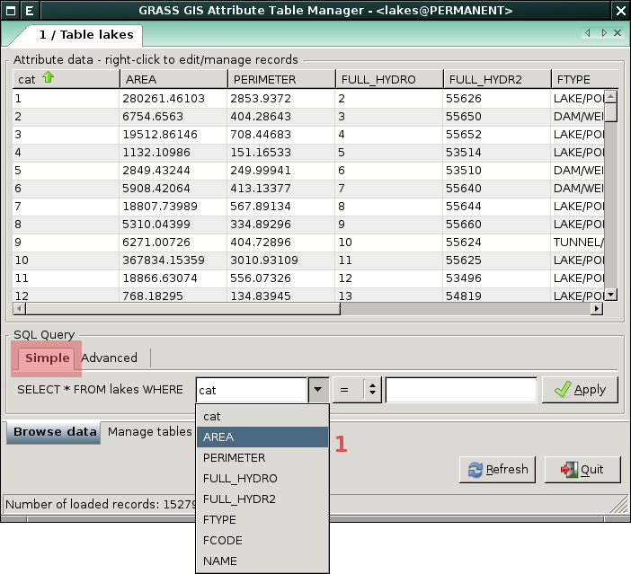
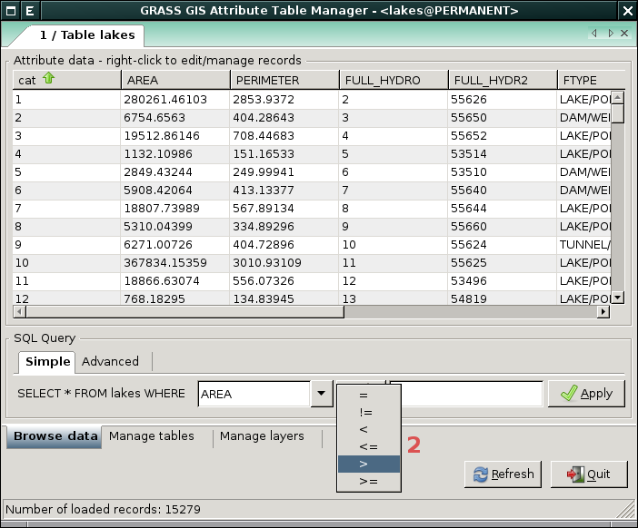
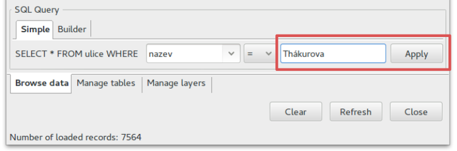
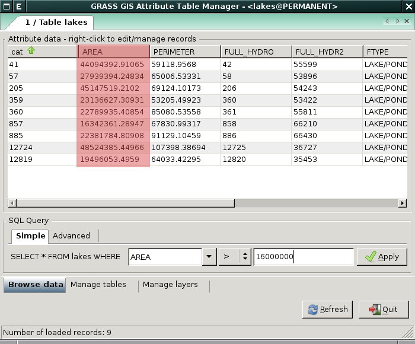
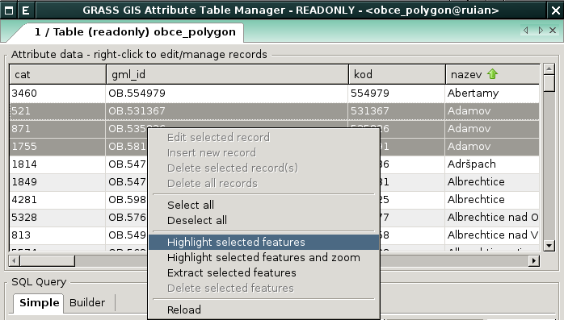
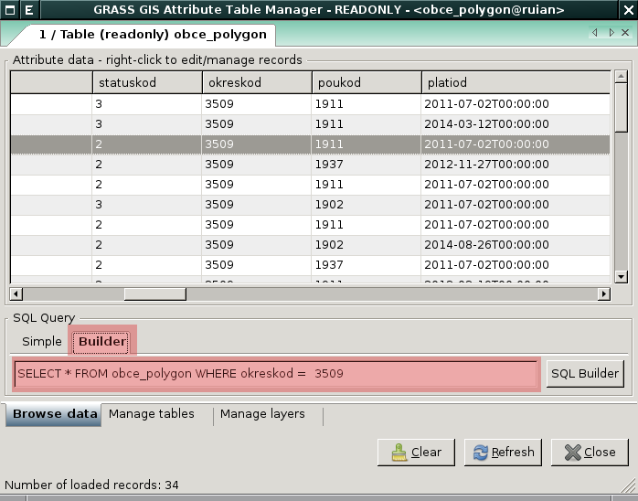
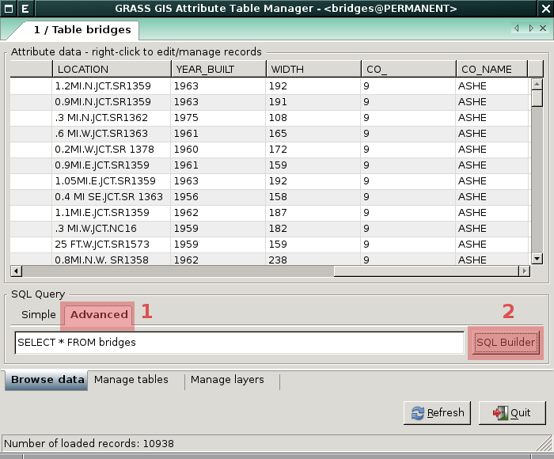
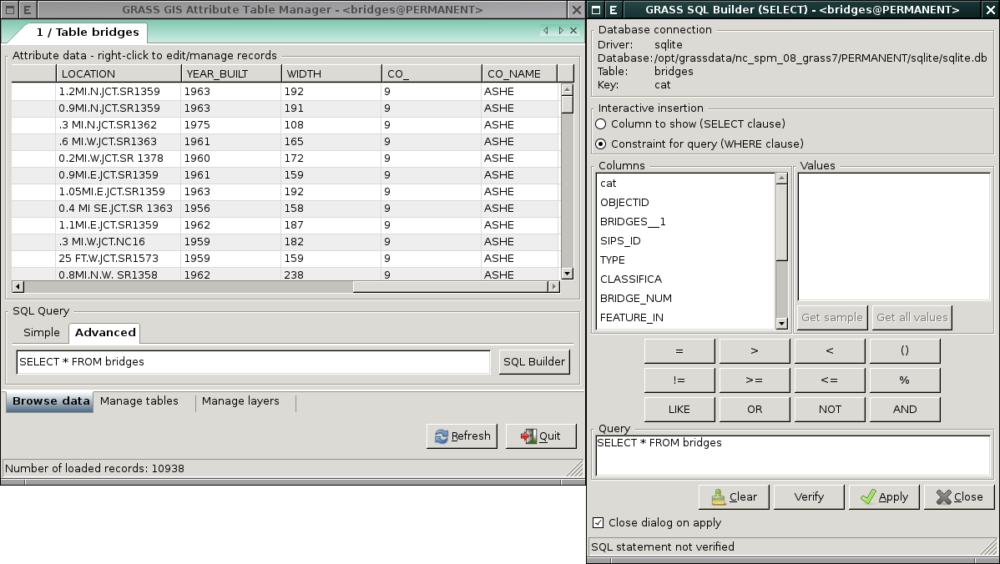

.. index::
   pair: dotazování; atributové dotazy
   see: atributové dotazy; atributy
   single: g.gui.dbmgr
   single: SQL builder
   single: SQL

.. _atributove-dotazy:

Atributové dotazy
-----------------

Atributové dotazy, tj. výběr geoprvků na základě jejich popisných
vlastností, lze provádět pomocí `správce atributových dat`.

.. noteadvanced::
   
   Pokročilejší uživatelé mohou ve svých skriptech využít
   specializované moduly ze skupiny ``db.*``, viz kapitola
   :ref:`db-select`.

.. _wxgui-dbmgr:

:grasscmd:`Správce atributových dat <wxGUI.dbmgr>` (*Attribute Table
Manager*) je základním nástrojem pro práci s atributovými daty v
:abbr:`GUI (Grafické uživatelské rozhraní)` systému GRASS. Lze jej
spustit několika způsoby:

#. z nástrojové lišty správce vrstev

   .. figure:: images/wxgui-dbmgr-toolbar.png

               Spuštění správce atributových dat z nástrojové lišty.

#. z kontextového menu správce vrstev

   .. figure:: images/wxgui-dbmgr-menu.png

               Spuštění správce atributových dat z kontextového menu.

#. z příkazové řádky jako modul :grasscmd:`g.gui.dbmgr`

   .. code-block:: bash

                   g.gui.dbmgr map=ulice

Dialog správce atributových dat má *tři záložky*:

:item:`Browse data`
      Prohlížení, dotazování a :ref:`editace <editace-atributovych-dat>` atributových dat (záznamů v tabulce)

:item:`Manage tables`
      Přidání, přejmenování, odebraní sloupce v atributové tabulce

:item:`Manage layers` Správa atributových tabulek připojených k
      vektorové mapě. Tato problematika je ale nad rámec tohoto
      školení a je probírána v navazující :skoleni:`školení pro
      pokročilé uživatele <grass-gis-pokrocily>`.

Dotazování
^^^^^^^^^^

Dotazovat se na atributová data je možné v záložce :item:`Browse data`
a to buď v základním (*Simple*) anebo interaktivním (*Builder*) módu,
viz kapitola :ref:`sql-builder`.

*Základní mód* umožňuje definovat jednoduchou `where` podmínku typu
``sloupec <op> hodnota``.

            Jednoduchý atributový doraz (krok 1 - výběr sloupce pro where podmínku).

            Jednoduchý atributový doraz (krok 2 - výběr operátoru pro where podmínku).

            Jednoduchý atributový doraz (krok 3 - určení hodnoty pro where podmínku).

.. raw:: latex

   \clearpage

            Jednoduchý atributový doraz - zobrazení výsledku.

.. note:: Vybírat vektorové geoprvky na základě jejich atributů lze i
          pomocí modulu :grasscmd:`v.extract`, více informací v
          kapitole :ref:`v-extract`.

Zvýraznění výběru v mapovém okně
^^^^^^^^^^^^^^^^^^^^^^^^^^^^^^^^

Výsledek atributové dotazu lze vizualizovat přímo v mapovém okně a to
pomocí volby :menuselection:`Highlight selected features`.

            Zvýraznění korespondujících geoprvků v mapovém okně.

.. youtube:: ITHLtQRsbEY

             Zvýraznění vektorových prvků jako výsledek atributového dotazu

.. _sql-builder:

SQL Builder
^^^^^^^^^^^

*Interaktivní* (Builder) mód umožňuje zadat :abbr:`SQL (Structured Query
Language)` SELECT dotazy přímo do dialogu *správce atributových dat*.

            Pokročilé dotazování, :abbr:`SQL (Structured Query
            Language)` SELECT dotaz (výběr se provede pro stisknutí
            klávesy :kbd:`Enter`).

:abbr:`SQL (Structured Query Language)` dotaz lze sestavit pohodlně
pomocí *SQL Builderu*, tlačítko :kbd:`SQL Builder`.

            Spuštění SQL Builderu ze správce atributových dat.

                 
            Správce atributových dat a sestavení SQL SELECT dotazu v
            okně SQL Builderu.

.. raw:: latex

   \newpage

.. youtube:: PByk8pipCz4

             SQL Builder - jednoduchá podmínka 'where'

.. youtube:: qD7ourfheJo

             SQL Builder - výčet sloupců a jednoduchá podmínka 'where'
