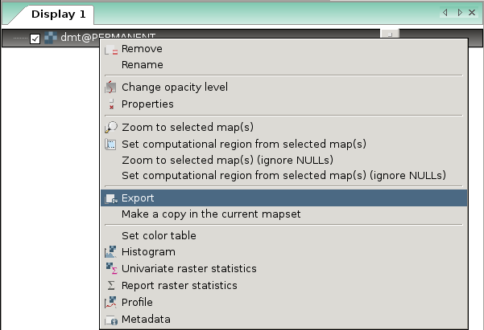
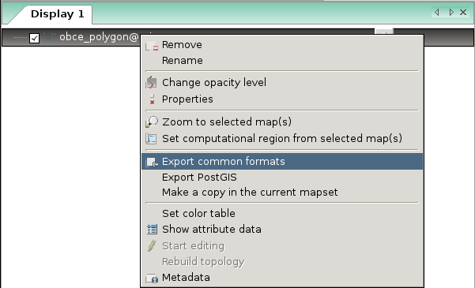

Export do externích formátů
---------------------------

Rastrové mapy lze ze systému GRASS exportovat do externích formátů
pomocí modulu :grasscmd:`r.out.gdal`. Pro export vektorových map
slouží modul :grasscmd:`v.out.ogr`.

Výše zmíněné moduly používají pro export dat knihovnu
:wikipedia:`GDAL`, která v režimu zápisu podporuje více než 100
rastrových a vektorových formátů.

Rastrová data
=============

Modul pro export rastrových dat je dostupný z menu
:menuselection:`File --> Export raster map --> Common export formats`
anebo z kontextového menu *správce vrstev*.

V následujícím dialogu zvolíme název výstupního souboru a jeho formát.

.. figure:: images/export-raster.png

            Zvolíme rastrovou mapu pro export :fignote:`(1)`, cestu k
            výstupnímu souboru :fignote:`(2)` a formát výstupního
            souboru :fignote:`(3)`. V tomto případě se data
            vyexportují do souboru ``dmt.tif`` v aktuálním adresáři.

.. raw:: latex

   \newpage

.. notecmd:: Export rastrové mapy do formátu GeoTIFF

   .. code-block:: bash

      r.out.gdal input=dmt output=dmt.tif format=GTiff
                   

Vektorová data
==============

Modul pro export vektorových dat je dostupný z menu 
:menuselection:`File --> Export vector map --> Common export formats`
anebo z kontextového menu *správce vrstev*.

V následujícím dialogu zvolíme název výstupního souboru a jeho formát.

.. figure:: images/export-vector.png

            Zvolíme vektorovou mapu pro export :fignote:`(1)`, cestu k
            výstupnímu souboru :fignote:`(2)` a formát výstupního
            souboru :fignote:`(3)`. V tomto případě se data
            vyexportují do souboru ``obce.shp`` v aktuálním adresáři.

.. notecmd:: Export vektorové mapy do formátu Esri Shapefiel

   .. code-block:: bash

      v.out.ogr input=obce_polygon dsn=obce.shp format=ESRI_Shapefile

Export obsahu mapové okna do obrázku
====================================

Kromě exportu do GIS formátu je možné uložit i obsah mapové okna do
obrazového souboru jako je např. PNG. Tato funkce je dostupná z
nástrojé lišty *mapového okna*.

.. figure:: images/map-display-image-0.png
            :class: large
	    :scale-latex: 70

.. figure:: images/map-display-image-1.png
            :class: small
	    :scale-latex: 45

            V následující dialogu zvolíme dimenzi výstupního obrázku

.. figure:: images/map-display-image-2.png
            :class: large
	    :scale-latex: 85

            Příklad výsledku včetně :ref:`legendy, měřítka a textového
            popisku <mapove-elementy>`
