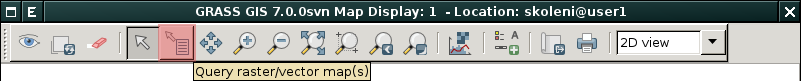
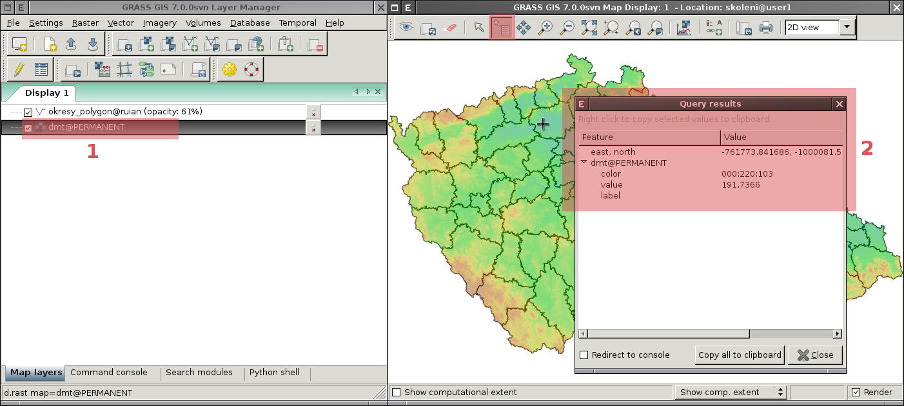
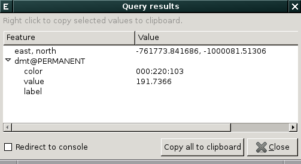
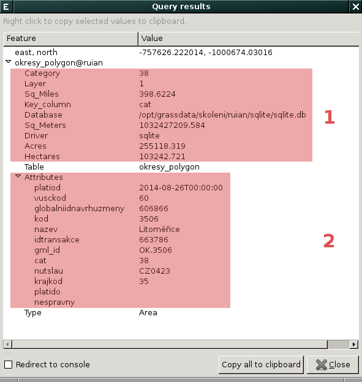

Interaktivní dotazování
-----------------------

Funkcionalita interaktivního dotazování je dostupná z nástrojové lišty
*mapového okna*.

      
   Podle typu aktuálně zvolené mapy ve *správci vrstev* :fignote:`(1)`
   se zobrazí informace rastrového :fignote:`(2)` či vektorového
   charakteru.

Rastrová data
=============

Výstup pro rastrová data obsahuje:

* souřadnice dotazu
* barevnou hodnotu přiřazenou na základě :ref:`tabulky barev
  <raster-color-table>`
* hodnotu rastrové buňky a
* připadně popisek dané hodnoty

                        
Vektorová data
==============

Výstup pro rastrová data obsahuje:

* souřadnice dotazu
* kategorii prvku, geometrické vlastnosti a informace o připojení
  vektorových dat :fignote:`(1)`
* výpis připojených atributů :fignote:`(2)`

