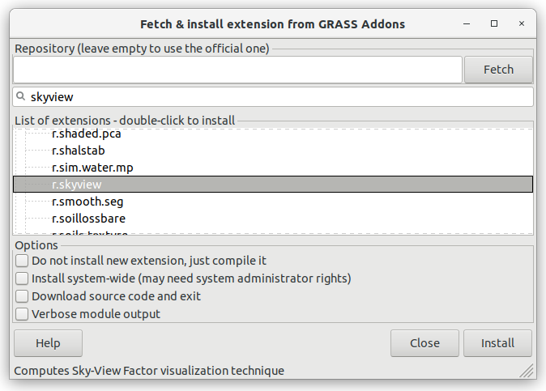

Příkazy systému GRASS
---------------------

.. index::
   single: moduly

GRASS GIS je *modulární systém*, který disponuje rozsáhlou množinou
malých, ale výkonných programů (v terminologii systému *modulů*).

.. note::
   
   To odpovídá koncepci :wikipedia:`Unixu <Unix>` jako takového. Daný
   program má za úkol vyřešit dílčí problém, měl by být co nejmenší a
   poměrně jednoduchý.

Jednotlivé příkazy systému GRASS - moduly - mají konzistentní syntaxi,
jejich názvy se skládají z prefixu označujícího skupinu příkazů a
krátkého názvu napovídajícího účel modulu (viz tabulka níže). Například
modul :grasscmd:`v.buffer` patří do skupiny "vector" a je určen pro
vytvoření obalové zóny (tzv. bufferu) nad vektorovými daty.

.. only:: latex
          
   .. tabularcolumns:: |p{1.5cm}|p{2cm}|p{8cm}|
                       
.. only:: html
                                 
   .. cssclass:: border

+----------+--------------------------------+-----------------------------------------------+
| prefix   | skupina                        | popis                                         |
+==========+================================+===============================================+
| ``db.``  | :grasscmd:`database`           | práce s atributovými daty a tabulkami         |
+----------+--------------------------------+-----------------------------------------------+
| ``d.``   | :grasscmd:`display`            | grafické výstupy a vizuální dotazy            |
+----------+--------------------------------+-----------------------------------------------+
| ``g.``   | :grasscmd:`general`            | obecné příkazy pro manipulaci s daty          |
+----------+--------------------------------+-----------------------------------------------+
| ``i.``   | :grasscmd:`imagery`            | zpracování obrazových dat                     |
+----------+--------------------------------+-----------------------------------------------+
| ``ps.``  | :grasscmd:`postscript`         | tvorba mapových výstupů ve formátu PostScript |
+----------+--------------------------------+-----------------------------------------------+
| ``r.``   | :grasscmd:`raster`             | zpracování (2D) rastrových dat                |
+----------+--------------------------------+-----------------------------------------------+
| ``r3.``  | :grasscmd:`raster3D`           | zpracování 3D rastrových dat (voxels)         |
+----------+--------------------------------+-----------------------------------------------+
| ``t.``   | :grasscmd:`temporal`           | zpracování časoprostorových dat               |
+----------+--------------------------------+-----------------------------------------------+
| ``v.``   | :grasscmd:`vector`             | zpracování 2D/3D vektorových dat              |
+----------+--------------------------------+-----------------------------------------------+

Příkazy systému GRASS lze spouštět několika způsoby (příklad pro
:grasscmd:`v.buffer`):

#. z menu správce vrstev

   .. _wxgui-menu-v-buffer:

   .. figure:: images/wxgui-menu-v-buffer.png

      Vyhledání modulu :grasscmd:`v.buffer` v menu správce vrstev.

#. ze záložky :item:`Modules` správce vrstev

   .. _wxgui-search-v-buffer:
   
   .. figure:: images/wxgui-search-v-buffer.png
               
      Vyhledání modulu :grasscmd:`v.buffer` v záložce správce vrstev
      :item:`Modules`.

#. z příkazové řádky správce vrstev

   .. _wxgui-console-v-buffer:

   .. figure:: images/wxgui-console-v-buffer.png
      :scale-latex: 45

      Vyhledání modulu :grasscmd:`v.buffer` z příkazové řádky správce
      vrstev.

   Po vybrání modulu se objeví GUI dialog umožňující zadat vstupní,
   výstupní parametry a nástroj spustit (:item:`Run`).

   .. figure:: images/wxgui-dialog-v-buffer.png

      Spuštění modulu :grasscmd:`v.buffer`.
      
   .. tip:: Pokud jsou v příkazové řádce (:item:`Console`) zadány
            všechny povinné parametry (v případě modulu
            :grasscmd:`v.buffer` jde o parametry :option:`input`,
            :option:`output` a :option:`distance`), tak se modul spustí
            přímo.

   .. _wxgui-console-v-buffer-launch:
      
   .. figure:: images/wxgui-console-v-buffer-launch.png

      Spuštění modulu :grasscmd:`v.buffer` včetně zadání parametrů.

   Příkazové řádka má historii, lze tedy moduly spouštět opakovaně
   např. s mírnou obměnou parametrů.

#. z :doc:`grafického modeleru <../ruzne/graficky-modeler>`

.. raw:: latex

     \clearpage

.. index::
   pair: moduly; nápověda
   single: g.manual

Nápověda k modulům
==================

Nápověda systému GRASS je dostupná z menu :menuselection:`Help -->
GRASS help`.

.. figure:: images/grass-help.png
   :class: large
   :scale-latex: 80
              
   Nápověda systému GRASS v okně webového prohlížeče.

Návověda k jednotlivým modulům je dostupná přímo z dialogového okna:
   
.. figure:: images/v-buffer-help.png
   :scale-latex: 50

   Nápověda modulu :grasscmd:`v.buffer`.

.. tip::
      
   .. notecmd:: Zobrazení nápovědy

      Nápovědu lze zobrazit pomocí modulu :grasscmd:`g.manual`:

      .. code-block:: bash

         g.manual -i

      .. code-block:: bash
                
         g.manual v.buffer

.. _addons-install:

Addons
======

Součástí základní instalace systému je více než :grasscmd2:`500
nástrojů <full_index.html>` (modulů). Další moduly si může uživatel
stáhnout v rámci tzv. Addons. Jde o moduly vytvořené uživateli systému
GRASS. Jejich kvalita a stabilita tak může být různorodá.

Addons moduly lze nainstalovat jednoduše z menu
:menuselection:`Settings --> Addons extensions --> Install extensions
from addons`.

             
   Instalace nástroje :grasscmdaddons:`r.skyview`.
