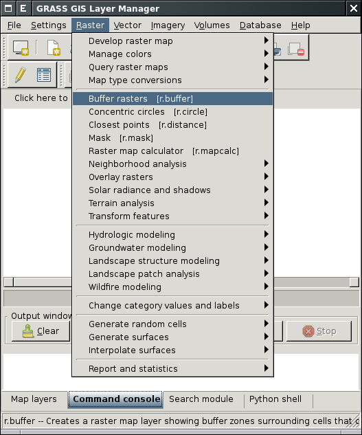
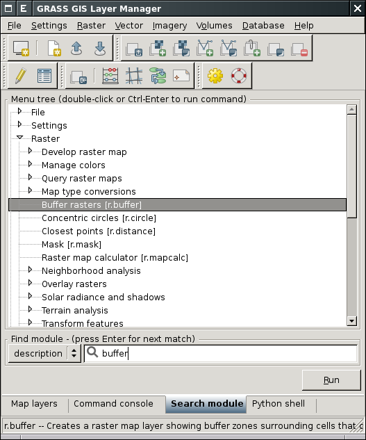
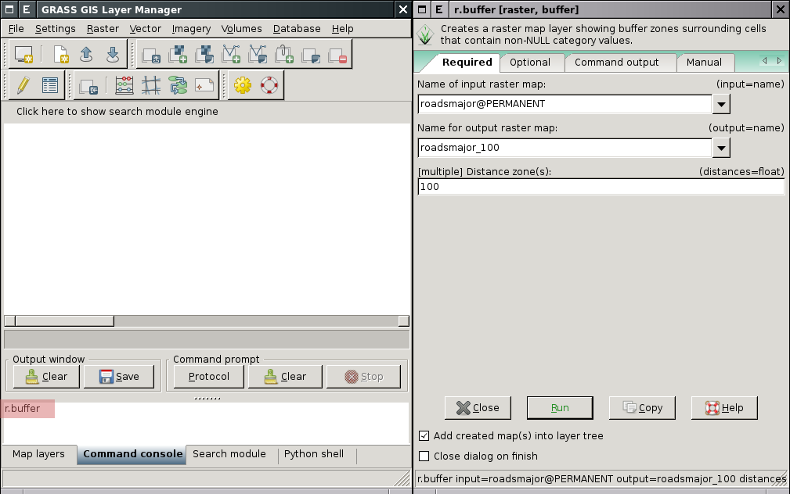
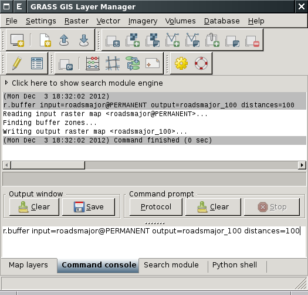

Příkazy systému GRASS
---------------------

GRASS GIS je *modulární systém*, který disponuje poměrně rozsáhlou
množinou malých, ale výkonných programů (v terminologii systému GRASS
*modulů*).

.. note::
   
   To odpovídá koncepci :wikipedia:`Unixu <Unix>` jako
   takového. Daný program má za úkol vyřešit dílčí problém, měl by být co
   nejmenší a poměrně jednoduchý.

Jednotlivé příkazy - moduly - mají konzistentní syntaxi, jejich
názvy se skládají z předpony označující skupinu příkazů a krátkého
názvu napovídající účel modulu (viz tabulka níže). Například modul
:grasscmd:`v.buffer` patří do skupiny *vector* a je určen pro vytvoření
obalové zóny (tzv. bufferu) nad vektorovými daty.

.. table::
   :class: border

   +----------+--------------------------------+-----------------------------------------------+
   | prefix   | skupina                        | popis                                         |
   +==========+================================+===============================================+
   | ``db.``  | :grasscmd:`database`           | podpora externích databázových systémů        |
   +----------+--------------------------------+-----------------------------------------------+
   | ``d.``   | :grasscmd:`display`            | grafické výstupy a vizuální dotazy            |
   +----------+--------------------------------+-----------------------------------------------+
   | ``g.``   | :grasscmd:`general`            | obecné příkazy pro manipulaci s daty          |
   +----------+--------------------------------+-----------------------------------------------+
   | ``i.``   | :grasscmd:`imagery`            | zpracování obrazových dat                     |
   +----------+--------------------------------+-----------------------------------------------+
   | ``ps.``  | :grasscmd:`postscript`         | tvorba mapových výstupů ve formátu PostScript |
   +----------+--------------------------------+-----------------------------------------------+
   | ``r.``   | :grasscmd:`raster`             | zpracování (2D) rastrových dat                |
   +----------+--------------------------------+-----------------------------------------------+
   | ``r3.``  | :grasscmd:`raster3D`           | zpracování 3D rastrových dat (voxels)         |
   +----------+--------------------------------+-----------------------------------------------+
   | ``v.``   | :grasscmd:`vector`             | zpracování 2D/3D vektorových dat              |
   +----------+--------------------------------+-----------------------------------------------+

Příkazy (tj. moduly) systému GRASS lze spouštět několika způsoby
(příklad pro :grasscmd:`r.buffer`):

* z menu správce vrstev

            Spuštění modulu :grasscmd:`r.buffer` z menu správce vrstev

* z nástroje :item:`Search module` správce vrstev

            Spuštění modulu :grasscmd:`r.buffer` pomocí nástroje :item:`Search module`

* z příkazové řádky správce vrstev

            Spuštění modulu :grasscmd:`r.buffer` s příkazové řádky správce vrstev

Pokud jsou zadány všechny povinné parametry (v případě modulu
:grasscmd:`r.buffer` jde o :option:`input`, :option:`output` a
:option:`distances`), tak se modul spustí přímo. Pokud tato podmínka
není splněna, zobrazí se dialog nástroje.

            Spuštění modulu :grasscmd:`r.buffer` včetně zadání parametrů

* z :doc:`grafického modeleru <../misc/graficky-modeler>`

Nápověda k modulům
==================

Nápověda systému GRASS je dostupná z menu :menuselection:`Help --> GRASS help`.

.. figure:: images/grass-help.png
   :class: large

   Nápověda systému GRASS v okně webového prohlížeče

.. notecmd:: Zobrazení nápovědy

   Nápovědu lze spustit pomocí modulu :grasscmd:`g.manual`:

   .. code-block:: bash

      g.manual -i

   .. code-block:: bash
                
      g.manual r.buffer
                   
.. figure:: images/r-buffer-help.png
                  
   Nápověda k jednotlivým modulům je dostupná i z dialogového okna

