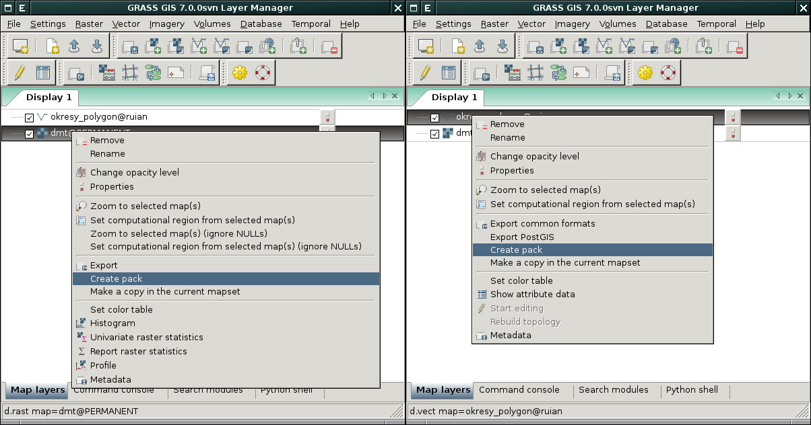
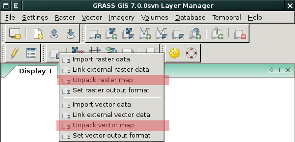

Přenost dat
-----------

GRASS disponuje vlastním formátem pro přenost dat. Zabalit rastrovou
mapu do tohoto formátu umožňuje modul :grasscmd:`r.pack`
(:menuselection:`File --> Export raster map --> Pack raster map`), pro
vektorová data je k dispozici modul :grasscmd:`v.pack`
(:menuselection:`File --> Export vector map --> Pack vector
map`). Rozbalit takto vytvořený soubor (tzv. `pack`) umožňují modulu
:grasscmd:`r.unpack` (:menuselection:`File --> Import raster map -->
Unpack raster map`) a :grasscmd:`v.unpack` (:menuselection:`File -->
Import vector map --> Unpack vector map`).

           
   Zabalení rastrové a vektorové mapy z GUI systému GRASS.

        
   Funkce rozbalení rastrové či vektorové mapy je dostupné z
   nástrojové lišty správce vrstev

.. important::

   Takto zabalenou rastrovou či vektorovou mapu lze rozbalit pouze v
   lokaci se stejnými souřadnicovým systémem. Pokud tato podmínka není
   splněna, tak rozbalení skončí chybou, viz obr. níže.

   .. figure:: images/r-unpack-proj-match.png

Ṕřenos mapsetů či lokací
========================   
