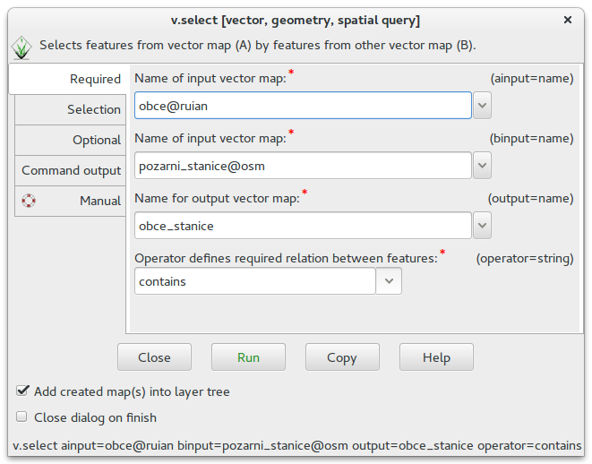
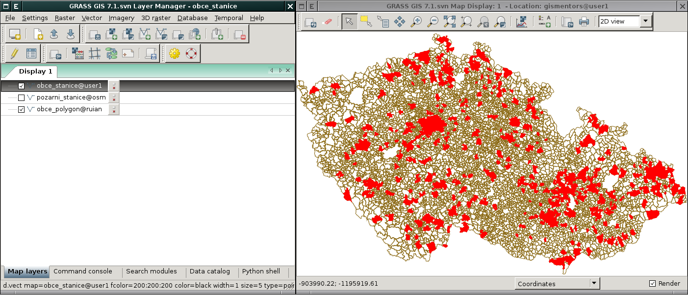

.. index::
   pair: dotazování; prostorové dotazy
   single: v.select

Prostorové dotazy
-----------------

Prostorové dotazy, tj. výběr geoprvků na základě jejich prostorových
vztahů, zajišťuje modul :grasscmd:`v.select` dostupný z
:menuselection:`Vector --> Feature selection --> Select by another
map`. Systém GRASS podporuje standardní prostorové operátory:
                    
* *equals* - geoprvky jsou totožné
* *disjoint* - geoprvky jsou prostorově různé 
* *intersects* - geoprvky se prostorově protínají
* *touches* - geoprvky se prostorově dotýkají
* *crosses* - geoprvky se kříží
* *within* - geoprvek je prostorově lokalizován uvnitř jiného geoprvku
* *contains* - geoprvek je prostorově obsažen v jiném geoprvku
* *overlaps* - geoprvky se prostorově překrývají
* *relate* - obecný prostorový vztah definovaný jako vztahová matice

.. tip:: Podrobný popis prostorových operátorů je k nalezení v
   :wikipedia:`OGC` specifikaci `Simple Features Access
   <http://www.opengeospatial.org/standards/sfa>`_ více informací
   specifikaci `zde <http://geo.fsv.cvut.cz/~gin/uzpd/uzpd.pdf#page=18>`_.

.. noteadvanced::

   Nativně :grasscmd:`v.select` podporuje pouze jeden prostorový
   operátor: *overlap* - geoprvky se částečně či úplně
   překrývají. Ostatní výše zmíněné operátory jsou implementovány v
   knihovně `GEOS <http://trac.osgeo.org/geos>`_, kterou systém GRASS používá.

.. rubric:: :secnotoc:`Příklad`

Výběr obcí (vektorová mapa :map:`obce@ruian`), ve kterých je umístěna
alespoň jedna (použijeme prostorový operátor *contains*) požární
stanice (vektorová mapa :map:`pozarni_stanice@osm`). Výsledek dotazu
uložíme do nové vektorové mapy :map:`obce_stanice`.

   Spuštění modulu :grasscmd:`v.select`.

.. noteadvanced::
      
   .. notecmd:: Spuštění

      .. code-block:: bash
                   
         v.select ainput=obce_polygon binput=pozarni_stanice output=obce_stanice operator=contains

.. raw:: latex

   \newpage

   
   Výsledek prostorového dotazu.

.. youtube:: teA-x-vmXYc

   Příklad dalšího prostorového dotazu - výběr komunikací, které kříží železnice (https://youtube.com/watch?v=teA-x-vmXYc).
