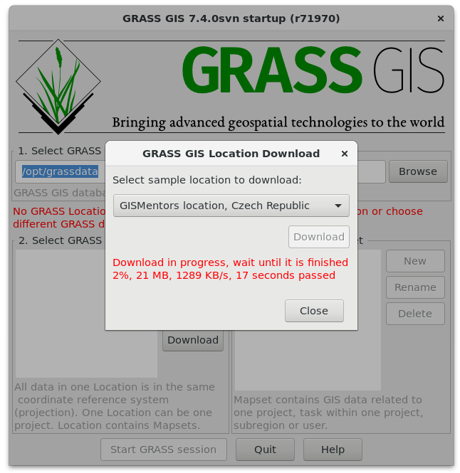
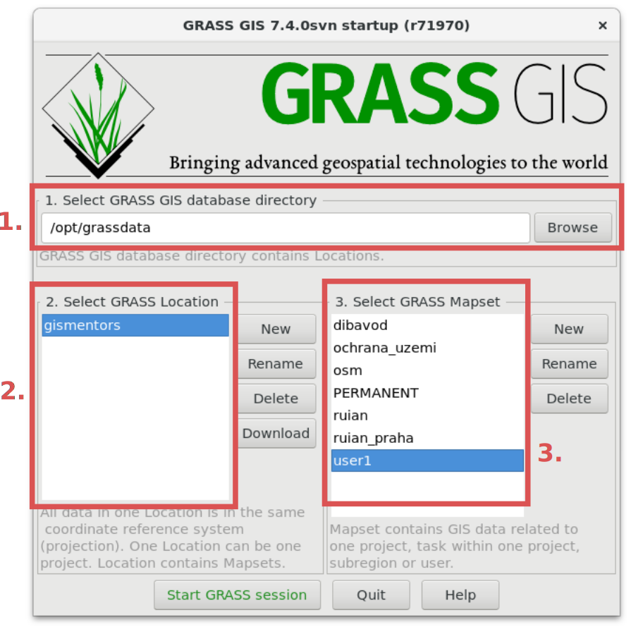

Úvod do systému GRASS
---------------------

Systém GRASS vyžaduje spravovat geodata *v pevně definované
struktuře*, v konceptu tzv. *lokací a mapsetů*, viz kapitola
:doc:`../intro/struktura-dat`. To bývá pro začínajícího uživatele
kritickým bodem, proto doporučujeme začít pracovat s předpřipravenými
datovými sadami (viz poznámka níže) a teprve po pochopení tohoto
konceptu importovat do systému GRASS svoje vlastní data, viz kapitola
:doc:`../data/import`.

.. tip::

   Na webových stránkách projektu GRASS jsou volně ke stažení
   `testovací a edukační datasety
   <http://grass.osgeo.org/download/sample-data/>`_. Jde především o
   datovou sadu *North Carolina*, která je ke stažení jako `zip archiv
   <http://grass.osgeo.org/sampledata/north_carolina/nc_spm_08_grass7.zip>`_. Tato
   data lze pod MS Windows stáhnout i pomocí :ref:`nativního
   instalátoru <nativni-instalator-data>`, v tomto případě budou
   umístěna v adresáři ``%USERPROFILE%\Documents\grassdata``.

Spuštění systému GRASS
======================

V případě, že je GRASS nainstalován běžným způsobem, měl by být
dostupný z hlavní nabídky vašeho operačního systému.

.. figure:: ../instalace/images/grass-ubuntu-launch.png
   :class: middle
   :scale-latex: 60
                 
   Spuštění systému GRASS v Ubuntu.

.. figure:: ../instalace/images/wingrass-4.png
   :scale-latex: 40
                 
   Spuštění systému GRASS z nabídky *Start* v MS Windows.

.. raw:: latex
                     
   \newpage

Ve výchozím nastavení systém GRASS nastartuje v grafickém módu. Úvodní
dialog umožňuje nastavit adresář s geodaty, lokaci a mapset, viz
kapitola :doc:`../intro/struktura-dat`, což je nutný krok pro samotné
spuštění systému (:item:`Start GRASS session`).

.. figure:: images/startup-0.svg

   Uvítací obrazovka systému GRASS.

Novou lokaci můžete vytvořit, pro začátek bude ale snadnější použít
předpřipravený dataset GISMentors. Lokaci GISMentors lze stáhnout
pomocí tlačítka :item:`Download` :fignote:`(2b.)`.

.. note:: Funkcionalita stažení vzorových lokací je dostupná od verze
          GRASS GIS 7.4.0.

   Stažení lokace GISMentors.
   
.. _spusteni-grass:

   Úvodní dialog systému GRASS pro výběr adresáře s geodaty
   :fignote:`(1.)`, lokace :fignote:`(2.)` a mapsetu
   :fignote:`(3.)`.

.. noteadvanced::
   
   **Příklady spuštění systému GRASS z příkazové řádky**

   * GRASS v textovém rozhraní, adresář s geodaty nastaven na
     ``/opt/grassdata``, lokace
     ``gismentors`` a mapset ``user1``:

     .. code-block:: bash
        
        grass -text /opt/grassdata/gismentors/user1

   * GRASS v grafickém rozhraní, adresář s geodaty, lokace a
     mapset nastavena z předchozího spuštění:

     .. code-block:: bash
                     
        grass -gui

   * GRASS v grafickém rozhraní, vytvořit novou lokace
     ``skoleni`` (souřadnicový systém S-JTSK :epsg:`5514`
     s~transformačními parametry pro území ČR - kód
     ``3``):

     .. code-block:: bash
                     
        grass -gui -c EPSG:5514:3 /opt/grassdata/skoleni
