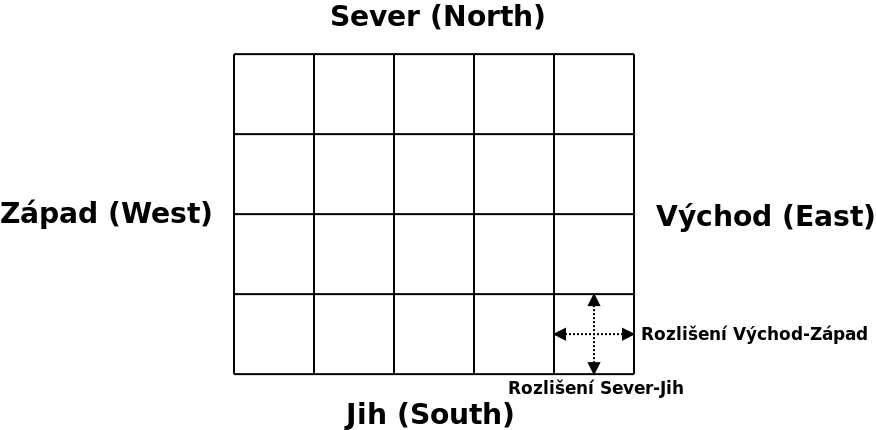
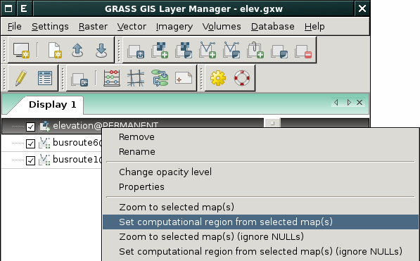
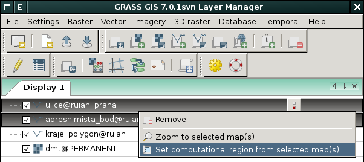
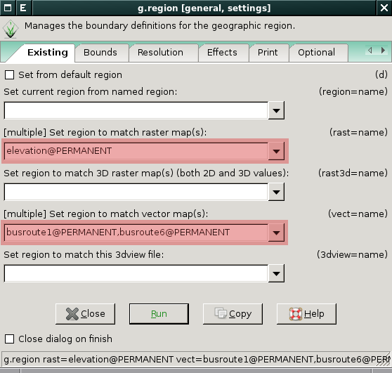
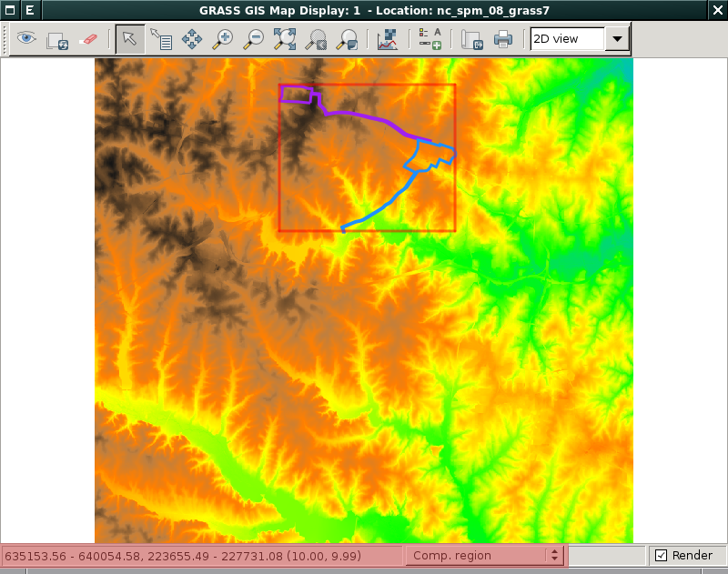
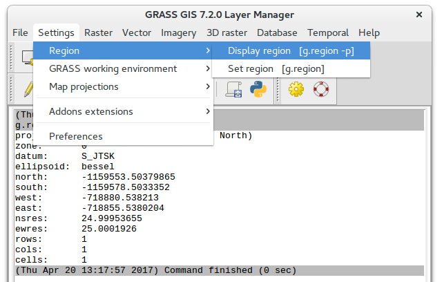
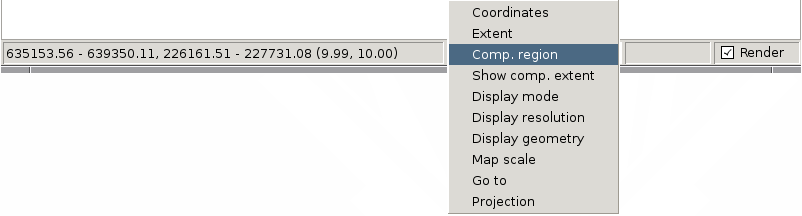
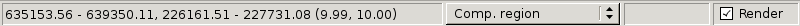
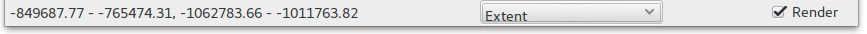

.. _region:

Výpočetní region
----------------

Výpočetní region je dán *hraničními souřadnicemi* (sever, jih, východ,
západ) a *prostorovým rozlišením* ve směru sever-jih, východ-západ. Pro
3D data jsou definovány hraniční souřadnice a prostorové rozlišení
navíc ve vertikálním směru (top-bottom). Vzniká tak pravidelná mřížka
jejiž buňky mají čtvercový (prostorové rozlišení ve směru sever-jih a
východ-západ totožnou hodnotu) nebo obdélníkový tvar, viz obrázek
níže.

   Mřížka výpočetního regionu pro 2D data

.. important:: Veškeré rastrové operace jsou prováděny vždy a pouze v
   rámci aktuálně nastaveného výpočetního regionu! Pouze několik málo
   nástrojů pro zpracování rastrových dat (tj. moduly s prefixem
   ``r.*``) výpočetní region ignorují. Například 
   modul :grassCmd:`r.in.gdal` pro import rastrových dat. Drtivá většina
   nástrojů pro zpracování vektorových dat (``v.*``) ignoruje
   nastavení výpočetního regionu zcela.

.. note:: V případě, že se hraniční souřadnice a rozlišení vstupních
          rastrových dat liší od nastavení výpočetního regionu, jsou
          vstupní rastrová data před výpočtem *převzorkována*
          metodou :wikipedia:`nejbližšího souseda<Nearest-neighbor
          interpolation>`. Mřížka výstupních rastrových dat vždy
          odpovídají aktuálně nastavenému regionu.

Nastavení výpočetního regionu
=============================

Ve většině případů stačí nastavit výpočetní region na základě rastrové
či vektorové mapy. Toto nastavení je dostupné z kontextového menu
správce vrstev.

   Nastavení výpočetního regionu na základě rastrové mapy

.. admonition:: Nastavení regionu na základě rastrové mapy z příkazové
          řádky
   :class: cmd
   
   :grassCmd:`g.region` rast=elevation

Zároveň je možné vybrat pro nastavení výpočetního regionu i více
rastrových či vektorových map najednou.

   Nastavení výpočetního regionu na základě více vybraných mapových vrstev

.. admonition:: Nastavení regionu na základě vektorových map z příkazové řádky
   :class: cmd

   :grassCmd:`g.region` vect=busroute1,busroute6

.. note:: Prostorové rozlišení může být nastaveno pouze explicitně
   (``res``) nebo na základě rastrových map (``rast``). Pro vektorové
   mapy nehraje prostorové rozlišení žádnou roli a tudíž pro ně není
   ani definováno.

Pokročilé nastavení výpočetního regionu
^^^^^^^^^^^^^^^^^^^^^^^^^^^^^^^^^^^^^^^

Pro manipulaci s výpočetním regionem je určen modul :grassCmd:`g.region`. 

.. figure:: images/wxgui-g-region-menu.png

   Nastavení výpočetního regionu z menu správce vrstev

Modul :grassCmd:`g.region` umožňuje nastavit region na základě
existujících rastrových, vektorových map či již dříve uloženého
nastavení (parametr :param:`save`). V níže uvedeném případě nastavíme
výpočetní region tak, aby pokrýval rastrovou mapu :map:`elevation` a
vektorové mapy :map:`busroute1` a :map:`busroute6`. Prostorové
rozlišení je určeno z rastrové mapy :map:`elevation`.

   Nastavení regionu na základě existujících dat

   
   Kontrola nastavení výpočetního regionu v mapovém okně

Dále je možno nastavit hraniční souřadnice explicitně, např. severní
souřadnici na '1000' (v mapových jednotkách) anebo jako offset
's+1000' (aktuálně nastavená jižní souřadnice + 1000 mapových
jednotek).

.. figure:: images/wxgui-g.region-bounds.png

   Explicitní nastavení hraničních souřadnic

Podobně je možné explicitně definovat hodnoty prostorového rozlišení
ve směru sever-jih (počet řádků) a východ-západ (počet sloupců). Pro
3D region ještě prostorové rozlišení ve směru Z-ové osy.

.. figure:: images/wxgui-g.region-res.png

   Explicitní nastavení prostorového rozlišení

.. admonition:: Prostorové rozlišení na základě rastrové mapy elevation, hraniční souřadnice s offsetem 1000 mapových jednotek od hranic polygonu města (vektorová mapa mesto)
   :class: cmd

   :grassCmd:`g.region` rast=dem vect=mesto n=n+1000 s=s-1000 w=w-1000 e=e+1000

Kontrola výpočetního regionu
============================

Aktuální nastavení výpočetního regionu lze vytisknout pomocí modulu
:grassCmd:`g.region` s přepínačem :param:`-p`.

.. figure:: images/wxgui-display-region-menu.png

   Zobrazení aktuálního výpočetního regionu z menu správce vrstev

   Aktuálně nastavený výpočetní region

.. admonition:: Zobrazení aktuálně nastaveného regionu
   :class: cmd
           
   :grassCmd:`g.region` -p

Aktuální nastavení výpočetního regionu lze zobrazit i v stavové liště
mapového okna (volba "Comp. region").

           
   Volby stavové lišty mapového okna

Formát::

 hraniční souřadnice západ - východ, jih - sever (prostorové rozlišení západ-východ, jih-sever)

   Zobrazení výpočetního regionu ve stavové liště mapového okna

.. note:: Změna pohledu v mapovém okně nemá na nastavení regionu
          žádný vliv. Aktuální rozsah území zobrazené v mapovém okně
          je dostupné ze stavové lišty jako volba 'Extent'

   Rozsah zobrazeného území

.. note:: Minimální ohraničující obdélník výpočetního regionu lze v
          mapovém okně i zobrazit. Hraniční souřadnice budou zobrazeny
          linie červené barvy, pokud je výpočetní region celou plochou
          uvnitř aktuálního pohledu. V opačném případě budou hranice
          výpočetního regionu zobrazeny modrou barvou.

.. figure:: images/wxgui-mapdisp-show-reg-0.png
   :class: middle

   Zobrazení hraničních souřadnic výpočetního regionu v mapovém okně (krok 1)

   Zobrazení hraničních souřadnic výpočetního regionu v mapovém okně (krok 2)

.. figure:: images/wxgui-mapdisp-show-reg-2.png
   :class: middle
                    
   Zobrazení hraničních souřadnic výpočetního regionu v mapovém okně

