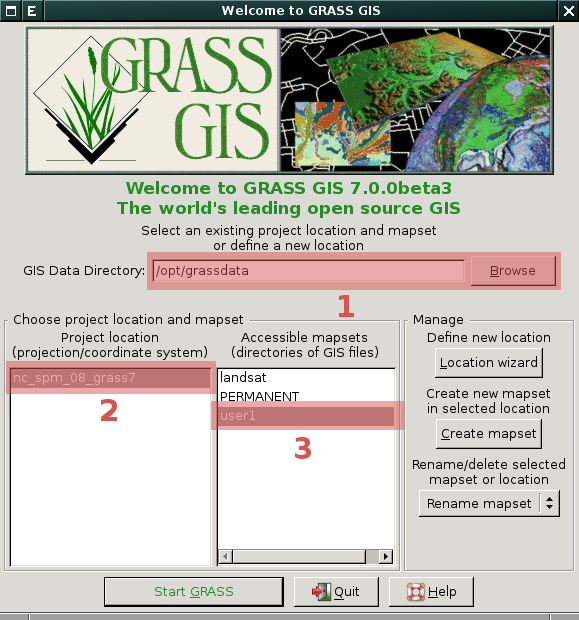

==========================================
 Struktura dat - koncept lokací a mapsetů
==========================================

Data, ke kterým GRASS přistupuje, musí mít pevně danou strukturu. Při
spuštění systému GRASS uživatel volí *tři* níže uvedené elementy v
daném pořadí, viz obrázek níže.

**1. Adresář s geodaty (DataBase)**

   Jde o adresář umístěný na lokálním či síťovém disku,
   např. :file:`/opt/grassdata` nebo :file:`C:\\grassdata` v případě
   MS Windows. V tomto adresáři jsou uložena veškerá data, ke kterým
   GRASS přistupuje (tedy rastrové a vektorové mapy v nativním formátu
   GRASS, atributové tabulky ve formátu SQLite či DBF, různá nastavení
   apod.). Výjimku představují atributová (popisná) data skladovaná v
   databázových systémech jako je např. :wikipedia:`PostgreSQL` či
   :wikipedia:`MySQL`.

.. index::
   pair: lokace; struktura dat
   see: lokace; mapsety
   see: lokace; LOCATION_NAME

.. _lokace:
   
**2. Lokace (Location)**

   Lokace je adresář umístěný v GRASS DataBase (adresáři s
   geodaty). Lokace obsahuje data, která souvisejí s daným
   *projektem*. Lokace je definována *souřadnicovým systémem*
   (referenční elipsoid, kartografické zobrazení, mapové jednotky) a
   výchozí velikostí zájmového území.

.. index::
   pair: mapsety; struktura dat
   see: mapsety; lokace
   see: mapsety; MAPSET

**3. Mapset**

   Mapset je souborem map, které tvoří logický celek v rámci lokace
   (projektu). Může např. odpovídat jednotlivým uživatelům nebo
   uceleným analýzám (studium vegetace, záplavová území, apod.). Každá
   lokace musí obsahovat mapset s unikátním názvem *PERMANENT*. Ten
   většinou obsahuje základní datové vrstvy a ostatní mapsety jsou
   brány jako pracovní (zpracování vstupních dat, jejich analýza
   apod.).

.. figure:: images/help_loc_struct.png
            :class: middle
            :scale-latex: 72
      
            Struktura adresáře s geodaty, vztah lokace a mapsetů,
            umístění souborů s daty pro různé typy map (zdroj:
            :grasscmd2:`manuál systému GRASS <helptext.html>`).

.. noteadvanced:: 
   
   GRASS DataBase je definovaná proměnnou prostředí
   :envvar:`GISDBASE`, lokace :envvar:`LOCATION_NAME` a mapset
   proměnnou :envvar:`MAPSET`, viz modul :grasscmd:`g.gisenv`.

.. note:: **Obvyklé umístění adresáře s geodaty**
      
      Adresář s geodaty je většinou umístěn v domovském adresáři
      uživatele pod názvem :file:`grassdata`. V případě MS Windows to
      může být :file:`%USERPROFILE%\\Documents\\grassdata`, u
      UNIXových operačních systémů jako je GNU/Linux či Mac OS X potom
      :file:`$HOME/grassdata`.

.. index::
   pair: vyhledávací cesta; struktura dat
   single: g.mapsets

.. _g-mapsets:
      
Vyhledávací cesta
=================

Vyhledávací cesta definuje viditelné mapsety v rámci aktuální
lokace. Ve výchozím nastavení je ve vyhledávací cestě vždy umístěn
aktuální mapset a mapset `PERMANENT`.

.. figure:: images/d-rast-user1.png
   :scale-latex: 55
              
   Přidání nové rastrové mapy do mapového okna, viditelné
   jsou pouze dva mapsety - aktuální (`user1`) a~mapset `PERMANENT`.

Vyhledávací cestu lze modifikovat z menu :menuselection:`Settings -->
GRASS working environment --> Mapset access`.

.. figure:: images/mapset-access.png
   :class: small
   :scale-latex: 45

   Přidání mapsetu "ruian" do vyhledávací cesty.

.. notecmd:: Přidání mapsetu do vyhledávací cesty

   .. code-block:: bash

                   g.mapsets mapset=ruian operation=add

.. figure:: images/d-rast-user1-ruian.png

   Přidání nové rastrové mapy do mapového okna, kromě aktuálního
   mapsetu a mapset `PERMANENT` je viditelný i mapset "ruian".
