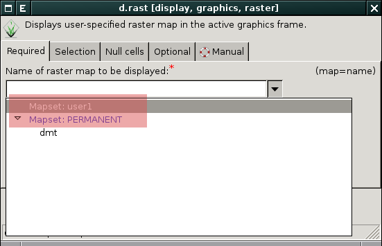
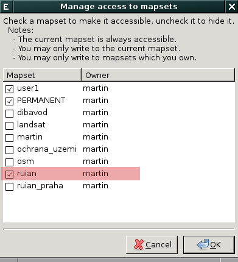
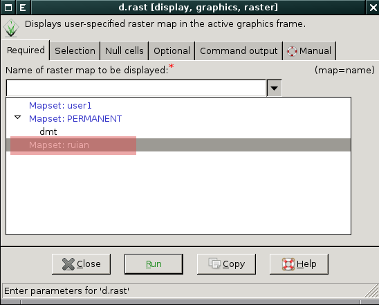

.. _struktura-dat:

Struktura dat - koncept lokací a mapsetů
----------------------------------------

Data, ke kterým GRASS přistupuje, mají pevně danou strukturu. Při
:ref:`spuštění systému GRASS <spusteni-grass>` musí uživatel zvolit
*tři* níže uvedené elementy v daném pořadí:

**Adresář s geodaty (DataBase)**

   Jde o adresář umístěný na lokálním či síťovém disku,
   např. :file:`/opt/grassdata` nebo :file:`C:\\grassdata` v případě
   MS Windows. V tomto adresáři jsou uložena veškerá data, ke kterým
   GRASS přistupuje (tedy rastrové a vektorové mapy v nativním formátu
   GRASS, atributové tabulky ve formátu SQLite či DBF, různá nastavení
   apod.). Výjimku představují atributová (popisná) data skladovaná v
   některém z externích databázových systémů
   (např. :wikipedia:`PostgreSQL` či :wikipedia:`MySQL`).

.. _lokace:
   
**Lokace (Location)**

   Lokace je adresář umístěný v GRASS databance. Tento adresář
   obsahuje data, která souvisejí s daným projektem. Lokace je
   definována *souřadnicovým systémem* (referenční elipsoid,
   kartografické zobrazení, mapové jednotky) a výchozí velikostí zájmového
   území.

**Mapset**

   Mapset je souborem map, které tvoří jakýsi logický celek v rámci
   lokace (tj. projektu). Může např. odpovídat jednotlivým uživatelům
   nebo uceleným analýzám (studium vegetace, záplavová území,
   apod.). Každá lokace musí obsahovat alespoň jeden mapset s
   unikátním názvem *PERMANENT*. Ten většinou obsahuje
   základní datové vrstvy a ostatní mapsety jsou brány jako pracovní
   (zpracování vstupních dat, jejich analýza apod.).

.. figure:: images/help_loc_struct.png
            :class: middle
            
            Struktura GRASS DataBase, vztah lokace a mapsetů, umístění
            souborů s daty pro různé typy map (zdroj: `manuál systému
            GRASS
            <http://grass.osgeo.org/grass70/manuals/helptext.html>`_)

.. noteadvanced:: 
   
   GRASS databanka je definovaná proměnnou prostředí
   :envvar:`GISDBASE`, lokace :envvar:`LOCATION_NAME` a mapset
   proměnnou :envvar:`MAPSET`, viz modul :grasscmd:`g.gisenv`.

.. raw:: latex

   \newpage

.. note:: **Obvyklé umístění adresáře s geodaty**
      
      Adresář s geodaty je většinou umístěn v domovském adresáři pod
      názvem :file:`grassdata`. Pod :wikipedia:`MS Windows` to je
      :file:`%USERPROFILE%\\Documents\\grassdata`, v případě UNIXových
      operačních systémů jako je :wikipedia:`GNU/Linux` či :wikipedia:`Mac
      OS X` :file:`$HOME/grassdata`.

.. _g-mapsets:
      
Vyhledávací cesta
=================

Vyhledávací cesta definuje viditelné mapsety v rámci aktuální
lokace. Ve výchozím nastavení je ve vyhledávací cestě vždy umístěn
aktuální mapset a mapset `PERMANENT`.

   Přidání nové rastrové mapy do mapového okna, viditelné
   jsou pouze dva mapsety - aktuální a mapset `PERMANENT`

Vyhledávací cestu lze modifikovat z menu :menuselection:`Settings -->
GRASS working environment --> Mapset access`.

   Přidání mapsetu `ruian` do vyhledávací cesty

.. notecmd:: Přidání mapsetu do vyhledávací cesty

   .. code-block:: bash

                   g.mapsets mapset=ruian op=add

   Přidání nové rastrové mapy do mapového okna, kromě aktuálního
   mapsetu a mapset `PERMANENT` je viditelný i mapset `ruian`
