Struktura dat - koncept lokací a mapsetů
----------------------------------------

Data, ke kterým GRASS přistupuje, mají pevně danou strukturu. Při
:ref:`spuštění systému GRASS <spusteni-grass>` musí uživatel zvolit
*tři* níže uvedené elementy v daném pořadí:

**Adresář s geodaty (DataBase)**

   Jde o adresář umístěný na lokálním či síťovém disku,
   např. :file:`/opt/grassdata` nebo :file:`C:\\grassdata` v případě
   MS Windows. V tomto adresáři jsou uložena veškerá data, ke kterým
   GRASS přistupuje (tedy rastrové a vektorové mapy v nativním formátu
   GRASS, atributové tabulky ve formátu SQLite či DBF, různá nastavení
   apod.). Výjimku představují atributová (popisná) data skladovaná v
   některém z externích databázových systémů
   (např. :wikipedia:`PostgreSQL` či :wikipedia:`MySQL`).

**Lokace (Location)**

   Lokace je adresář umístěný v GRASS databance. Tento adresář
   obsahuje data, která souvisejí s daným projektem. Lokace je
   definována souřadnicovým systémem (referenční elipsoid,
   kartografické zobrazení, mapové jednotky) a velikostí zájmového
   území.

**Mapset**

   Mapset je souborem map, které tvoří jakýsi logický celek v rámci
   lokace (tj. projektu). Může např. odpovídat jednotlivým uživatelům
   nebo uceleným analýzám (studium vegetace, záplavová území,
   apod.). Každá lokace musí obsahovat alespoň jeden mapset s
   unikátním názvem *PERMANENT*. Ten většinou obsahuje
   základní datové vrstvy a ostatní mapsety jsou brány jako pracovní
   (zpracování vstupních dat, jejich analýza apod.).

.. admonition:: Poznámka pro pokročilé uživatele
   
   GRASS databanka je definovaná proměnnou prostředí
   :envvar:`GISDBASE`, lokace :envvar:`LOCATION_NAME` a mapset
   proměnnou :envvar:`MAPSET`, viz :grasscmd:`g.gisenv`.

.. admonition:: Obvyklé umístění adresáře s geodaty 
      
      Adresář s geodaty je většinou umístěn v domovském adresáři pod
      názvem :file:`grassdata`. Pod :wikipedia:`MS Windows` to je
      :file:`%USERPROFILE%\\Documents\\grassdata`, v případě UNIXových
      operačních systémů jako je :wikipedia:`GNU/Linux` či :wikipedia:`Mac
      OS X` :file:`$HOME/grassdata`.

Vytvoření vlastní lokace
========================

Novou lokaci lze vytvořit pomocí průvodce, který je dostupný z uvítací
obrazovky systému GRASS. Spustíme GRASS a v rámci uvítací obrazovky
vybereme :item:`Location wizard` (průvodce tvorbou lokace).

.. figure:: images/wxgui-loc-s-jtsk-0.png

            Spuštění průvodce tvorbou lokace

Průvodce tvorbou lokace je možné spustit i z běžící seance a to z menu
:menuselection:`Settings --> GRASS working environment --> Create new
location`.

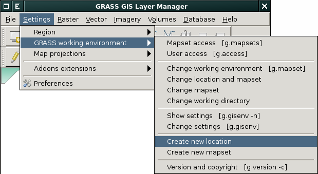

            Spuštění průvodce tvorbou lokace z menu wxGUI

Lokaci lze vytvořit několika různými postupy:

* výběrem kartografické projekce, referenčního elipsoidu ze seznamu
* pomocí :wikipedia:`EPSG` kódu
* na základě georeferencovaných dat
* na základě :wikipedia-en:`WKT <Simple_Features#Well-known_text>` či
  :wikipedia:`PRJ <Shapefile#Dopl.C5.88kov.C3.A9_soubory>` souboru
* definicí parametrů pro knihovnu :wikipedia-en:`PROJ.4`
* bez zadaní parametrů (pro negeoreferencovaná data)

..
  .. figure:: images/wxgui-new-loc-methods.png
              :class: middle
                      
                      Metody tvorby lokace

Níže uvedené postupy kombinují různé postupy tvorby lokace.

* :ref:`S-JTSK na základě EPSG kódu <lokace-sjtsk>`
* :ref:`UTM na základě manuální definice <lokace-utm>`
* :ref:`S-42 na základě manuální definice <lokace-s-42>`
* :ref:`Pro data SRTM na základě geodat <lokace-srtm>`
* :ref:`ETRS-89 na základě EPSG kódu <lokace-etrs89>`
* :ref:`Lokace pro souřadnicově nepřípojená data (XY) <lokace-xy>`

.. _lokace-sjtsk:

Vytvoření lokace pro data v souřadnicovém systému S-JTSK
^^^^^^^^^^^^^^^^^^^^^^^^^^^^^^^^^^^^^^^^^^^^^^^^^^^^^^^^

Na úvodní stránce průvodce vyplníme název lokace (*Project Location*) a
volitelně i krátký popisek (*Optional Location Title*).

.. figure:: images/wxgui-loc-s-jtsk-1.png
            
            Vytvoření lokace pro S-JTSK (krok 1)

Na další stránce vybereme způsob vytvoření lokace. 

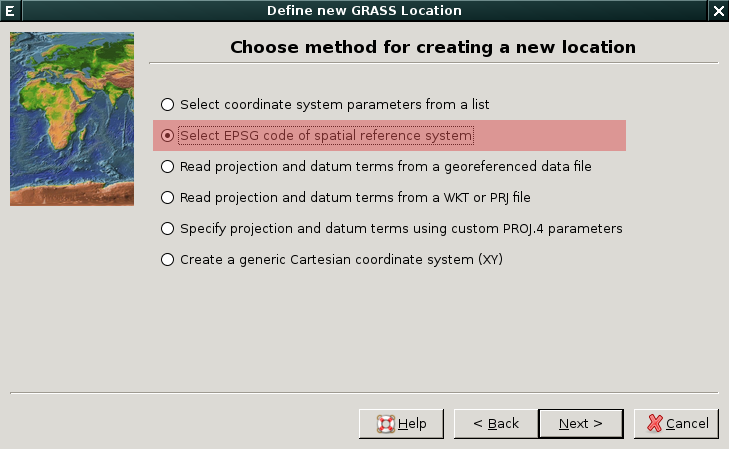

            Vytvoření lokace pro S-JTSK (krok 2)

V našem případě vytvoříme lokaci na základě EPSG kódu, pro
souřadnicový systém S-JTSK to je :epsg:`5514`.

.. note::

   :epsg:`5514` podporuje systém GRASS pouze pokud používate verzi
   knihovny :wikipedia-en:`PROJ.4` 4.9 a vyšší. V opačném případě doporučujeme
   použít :epsg:`2065`.

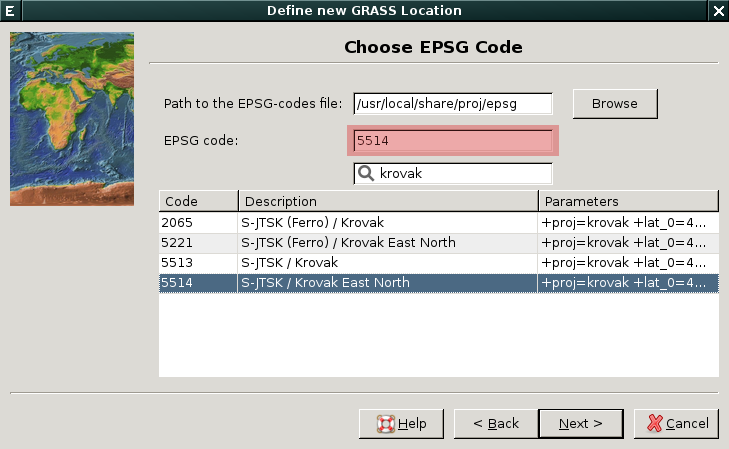

            Vytvoření lokace pro S-JTSK (krok 3)

Po zadání EPSG kódu se objeví dialog pro volbu transformačních parametrů.

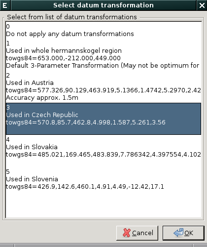

            Vytvoření lokace pro S-JTSK (krok 4)

Na posledním dialogu průvodce potvrdíme vytvoření lokace.

.. figure:: images/wxgui-loc-s-jtsk-5.png

            Vytvoření lokace pro S-JTSK (krok 5)

Nastavení výchozího výpočetního regionu přeskočíme. Výchozí region
nastavíme později po importu dat.

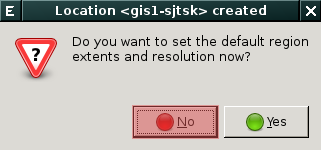

            Vytvoření lokace pro S-JTSK (krok 6)

Případně ještě můžeme vytvořit vlastní mapset (mapset *PERMANENT* je
vytvořen vždy).

.. figure:: images/wxgui-loc-s-jtsk-7.png
            :class: small

            Vytvoření lokace pro S-JTSK (krok 7)

Poté se spustí systém GRASS s právě vytvořenou lokací.

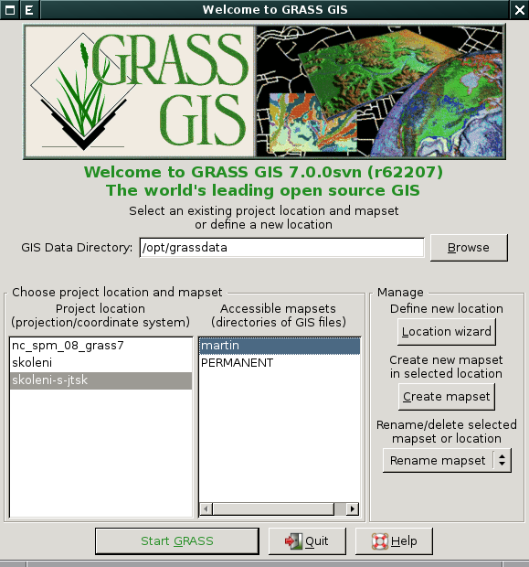

.. admonition:: Vytvoření lokace z příkazové řádky
                
   .. code-block:: bash

      grass70 -c EPSG:5514 /opt/grassdata/skoleni-s-jstk

.. _lokace-utm:

Vytvoření lokace pro data v souřadnicovém systému UTM
^^^^^^^^^^^^^^^^^^^^^^^^^^^^^^^^^^^^^^^^^^^^^^^^^^^^^
.. figure:: images/wxgui-loc-utm-0.png

            Vytvoření lokace pro UTM (krok 1)

V tomto případě nepoužijeme EPSG kód, nýbrž souřadnicový systém
definujeme manuálně.

.. note::

   Pokud bysme chtěli použít EPSG kód, tak to je :epsg:`32633`.

.. figure:: images/wxgui-loc-utm-1.png

            Vytvoření lokace pro UTM (krok 2)

.. figure:: images/wxgui-loc-utm-2.png

            Vytvoření lokace pro UTM (krok 3)

Zadáme 33. zónu, severní polokoule.

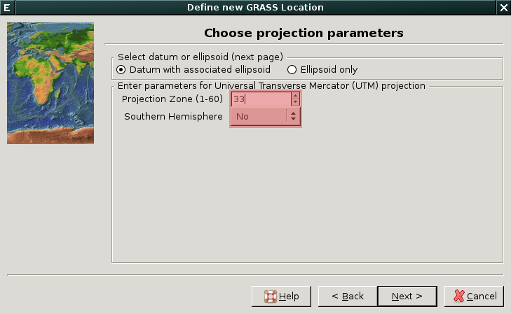
            
            Vytvoření lokace pro UTM (krok 4)

Geodetické datum uvedeme 'WGS-84'.

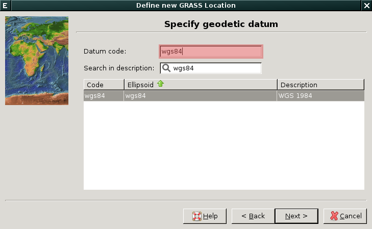

            Vytvoření lokace pro UTM (krok 5)

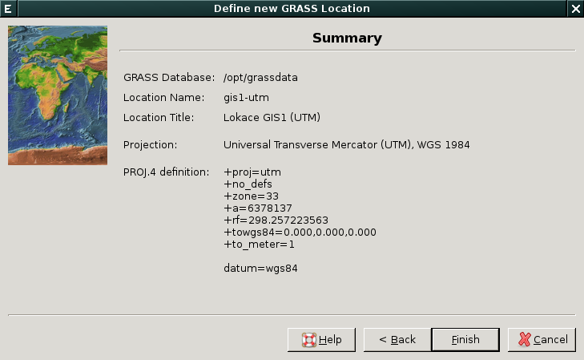

            Vytvoření lokace pro UTM (krok 6)

.. _lokace-s-42:

Vytvoření lokace pro data v souřadnicovém systému S-42
^^^^^^^^^^^^^^^^^^^^^^^^^^^^^^^^^^^^^^^^^^^^^^^^^^^^^^

            Vytvoření lokace pro S-42 (krok 1)

.. figure:: images/wxgui-loc-utm-1.png

            Vytvoření lokace pro S-42 (krok 2)

.. note::

   Pokud bysme chtěli použít EPSG kód, tak to je :epsg:`3835`.

.. figure:: images/wxgui-loc-s42-2.png

            Vytvoření lokace pro S-42 (krok 3)

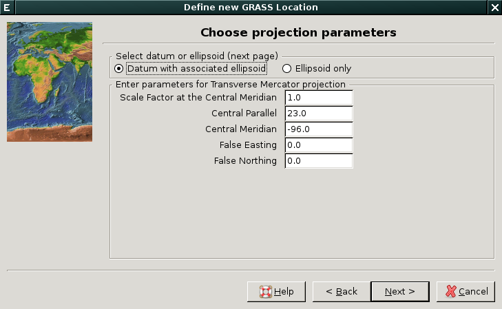

            Vytvoření lokace pro S-42 (krok 4)

.. figure:: images/wxgui-loc-s42-4.png

            Vytvoření lokace pro S-42 (krok 5)

.. figure:: images/wxgui-loc-s42-5.png
            :class: small
            
            Vytvoření lokace pro S-42 (krok 6)

.. figure:: images/wxgui-loc-s42-6.png

            Vytvoření lokace pro S-42 (krok 7)

.. _lokace-srtm:

Vytvoření lokace na základě geodat
^^^^^^^^^^^^^^^^^^^^^^^^^^^^^^^^^^
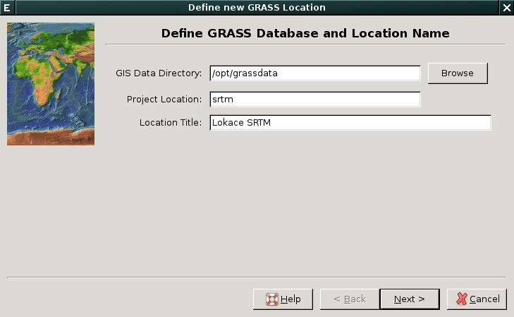

            Vytvoření lokace pro data SRTM (krok 1)

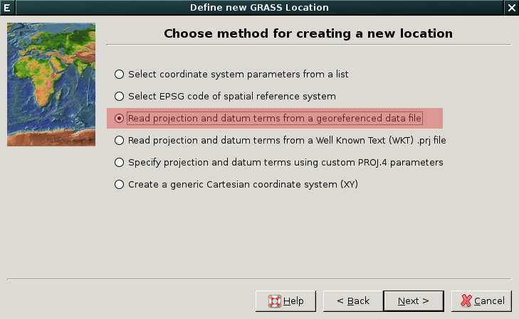

            Vytvoření lokace pro data SRTM (krok 2)

.. figure:: images/wxgui-loc-srtm-2.png

            Vytvoření lokace pro data SRTM (krok 3)

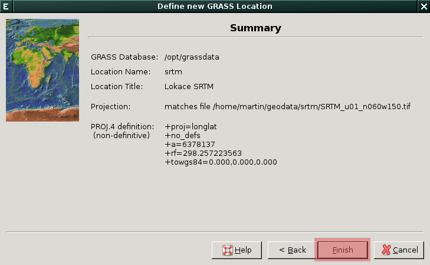

            Vytvoření lokace pro data SRTM (krok 4)

Volitelně můžeme data na základě kterých byla lokace vytvořena i
naimportovat (do mapsetu *PERMANENT*).

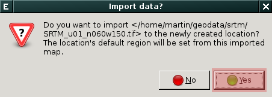

            Vytvoření lokace pro data SRTM (import dat, krok 1)

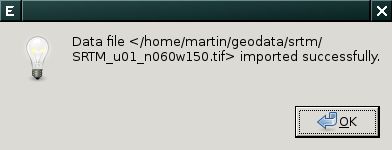

            Vytvoření lokace pro data SRTM (import dat, krok 2)

.. _lokace-etrs89:

Vytvoření lokace na základě EPSG kódu
^^^^^^^^^^^^^^^^^^^^^^^^^^^^^^^^^^^^^

.. figure:: images/wxgui-loc-epsg-0.png

            Vytvoření lokace na základě EPSG kódu (krok 1)

.. figure:: images/wxgui-loc-epsg-1.png

            Vytvoření lokace na základě EPSG kódu (krok 2)

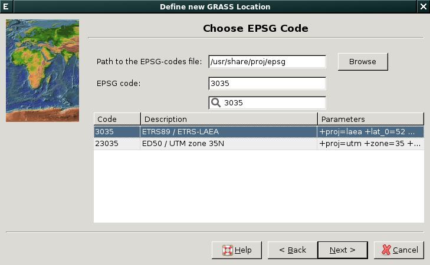

            Vytvoření lokace na základě EPSG kódu (krok 3)

.. figure:: images/wxgui-loc-epsg-3.png

            Vytvoření lokace na základě EPSG kódu (krok 4)

.. admonition:: Příklad vytvoření lokace pří startu systému GRASS z příkazové řádky

   .. code-block:: bash

                   grass70 -c EPSG:3035 /opt/grassdata/eu-dem

.. _lokace-xy:

Vytvoření lokace pro souřadnicově nepřipojená data
^^^^^^^^^^^^^^^^^^^^^^^^^^^^^^^^^^^^^^^^^^^^^^^^^^

.. figure:: images/wxgui-loc-xy-0.png

            Vytvoření lokace pro XY (krok 1)

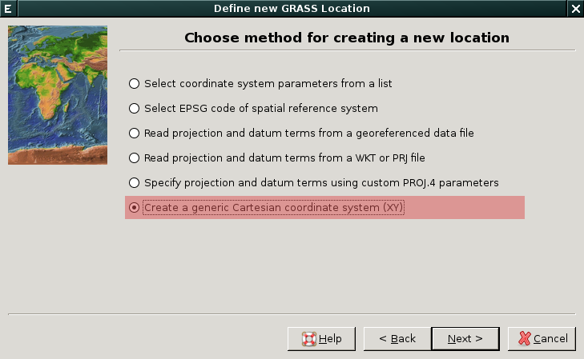

            Vytvoření lokace pro XY (krok 2)

.. figure:: images/wxgui-loc-xy-2.png

            Vytvoření lokace pro XY (krok 3)

Vytvoření nového mapsetu v rámci lokace
=======================================

Nový mapset v rámci již existující lokace můžeme vytvořit dvěma
způsoby:

* z uvítací obrazovky systému GRASS anebo

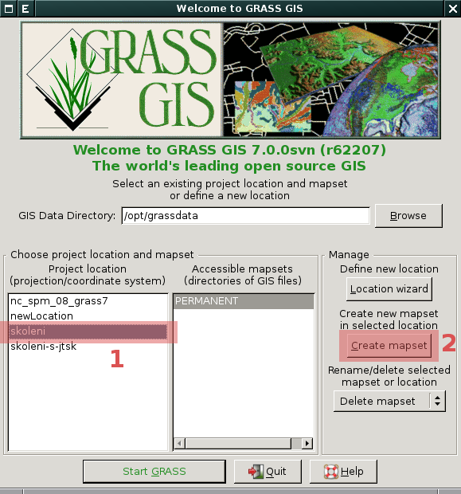

            Vytvoření nového mapsetu :fignote:`(2)` v rámci vybrané
            lokace :fignote:`(1)`.

* z menu *Správce vrstev* :menuselection:`Settings --> GRASS working
  environment --> Create new mapset`.

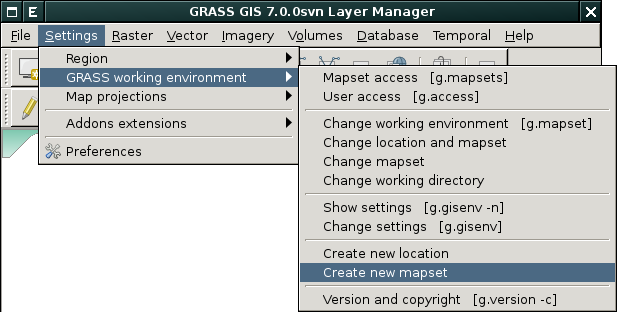

            Vytvoření nového mapsetu v rámci aktuální lokace z menu
            *Správce vrstev*.

V následující dialogu zvolíme jeho název.

.. figure:: images/wxgui-new-mapset-dialog.png
            :class: small

Po vytvoření nového mapsetu se do něj systém GRASS automaticky přepne.

.. figure:: images/wxgui-new-mapset-dialog-1.png
            :class: small
