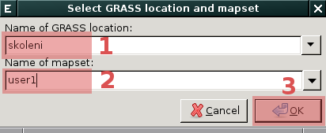
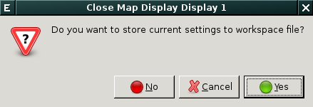

.. _transformace:

Práce s geodaty v různých souřadnicových systémech
--------------------------------------------------

V případě, že chcete do aktuální lokace importovat geodata jejichž
souřadnicový systém se liší od souřadnicového systému aktuální lokace
(viz :item:`Projection match` na obr. níže) je třeba několik kroků:

.. figure:: images/import-no-proj.png

Postup
======
   
#. vytvořit novou lokaci s souřadnicovým systémem vstupních geodat
#. do této nové lokaci se přepnout a geodata tam naimportovat
#. dále se vrátit opět do původní lokace a do této naimportovaná
   geodata transformovat

Tvorba nové lokace
^^^^^^^^^^^^^^^^^^

Z menu *Strávce vrstev* spusťte z menu :menuselection:`Settings -->
GRASS working environment --> Create new location` průvodce tvorby
lokace, novou lokaci můžete :ref:`vytvořit více způsoby
<tvorba-lokace>`, nejrychlejší je v tomto připadě :ref:`tvorba na
základě vstupních geodat <lokace-srtm>`. Po vytvoření nové lokace se
objeví dialog, který umožňuje se do této lokace přepnout.

.. figure:: images/new-loc-switch.png
            :class: small
           
.. figure:: images/new-loc-switch-confirm.png
            :class: small
           
Import dat do nové lokace
^^^^^^^^^^^^^^^^^^^^^^^^^

Geodata do nově vytvořené lokace :ref:`naimportuje standardní cestou
<import-vector>`, položka :item:`Projection match` by měla obsahovat
již hodnotu ``Yes``.

.. figure:: images/import-osm.png

Po importu dat se vrátíme do původní lokace :menuselection:`Settings
--> GRASS working environment --> Change location and mapset`.

Aktuální nastavení lokace můžeme volitelně uložit do souboru s
projektem (tzv. *workspace file*).

                    
Transformace dat do cílové lokace
^^^^^^^^^^^^^^^^^^^^^^^^^^^^^^^^^
