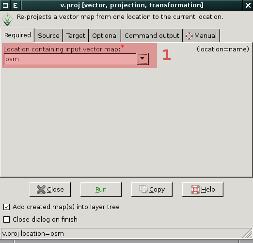
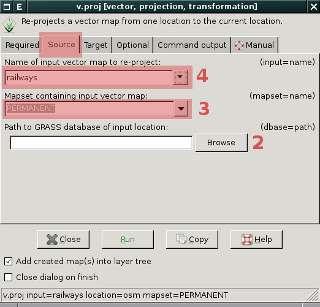

.. _transformace:

Geodata v různých souřadnicových systémech
------------------------------------------

V případě, že chcete do aktuální lokace importovat geodata jejichž
souřadnicový systém se liší od souřadnicového systému aktuální lokace
(viz :item:`Projection match` na obr. níže) je třeba několik kroků:

.. figure:: images/import-no-proj.png

Postup
======
   
#. :ref:`vytvořit novou lokaci <transformace-lokace>` se souřadnicovým
   systémem vstupních geodat
#. do této nové lokaci se přepnout a geodata tam :ref:`naimportovat
   <transformace-import>`
#. dále se vrátit opět do původní lokace a do této naimportovaná
   geodata :ref:`transformovat <transformace-data>`

.. _transformace-lokace:
   
Vytvoření nové lokace
^^^^^^^^^^^^^^^^^^^^^

Z menu :menuselection:`Settings --> GRASS working environment -->
Create new location` spusťte průvodce tvorby lokace, novou lokaci
můžete :ref:`vytvořit více způsoby <tvorba-lokace>`, nejrychlejší je v
tomto případě :ref:`tvorba na základě vstupních geodat
<lokace-srtm>`. Po vytvoření nové lokace se objeví dialog, který
umožňuje se do této lokace přepnout.

.. figure:: images/new-loc-switch.png
            :class: small
           
.. figure:: images/new-loc-switch-confirm.png
            :class: small

.. _transformace-import:
                    
Import geodat do nové lokace
^^^^^^^^^^^^^^^^^^^^^^^^^^^^

Geodata do nově vytvořené lokace :ref:`naimportuje standardní cestou
<import-vector>`, položka :item:`Projection match` by měla obsahovat
již hodnotu ``Yes``.

.. figure:: images/import-osm.png

.. _loc-switch:
            
Po importu dat se vrátíme do původní lokace :menuselection:`Settings
--> GRASS working environment --> Change location and mapset`.

.. figure:: images/change-loc-map.png
            :class: small

Aktuální nastavení lokace můžeme volitelně uložit do souboru s
projektem (tzv. *workspace file*).

.. figure:: images/loc-switch-save.png
            :class: small

Poté se objeví dialog, který potvrzuje, že aktuální lokace je opět ta
cílová.

.. figure:: images/loc-switch-back.png
            :class: small

.. _transformace-data:
                    
Transformace dat do cílové lokace
^^^^^^^^^^^^^^^^^^^^^^^^^^^^^^^^^

Transformovat **rastrová data** umožňuje modul :grasscmd:`r.proj`
dostupný z menu :menuselection:`Raster --> Develop raster map -->
Reproject raster map from different GRASS location`, podobně pro
**vektorová data** existuje :grasscmd:`v.proj` (:menuselection:`Vector
--> Develop vector map --> Reproject vector map from different GRASS
location`).

Následuje příklad pro transformaci vektorových dat.

   
            V dialogu modulu :grasscmd:`v.proj` nejprve vybereme
            lokaci se vstupními daty :fignote:`(1)`.

            Dále v záložce :item:`Source` vybereme mapset, ve kterém
            jsou vstupní data uložena :fignote:`(2)`, vybereme vstupní
            vektorovou mapu :fignote:`(3)`. Pokud by lokace byly
            umístěny v odlišných adresářích, je potřeba definovat
            adresář se vstupní lokací :fignote:`(4)`.

.. raw:: latex

   \clearpage

.. figure:: images/v-proj-2.png
	    :scale-latex: 50

            Případně můžeme v záložce :item:`Target` zvolit název pro
            výstupní mapu :fignote:`(5)`. Transformaci spustíme
            :fignote:`(6)`.

Po úspěšné transformaci se vytvořená vrstva automaticky přidá do
*správce vrstev* a zobrazí v mapovém okně.

.. figure:: images/proj-result.png
            :class: large
	    :scale-latex: 90

               
