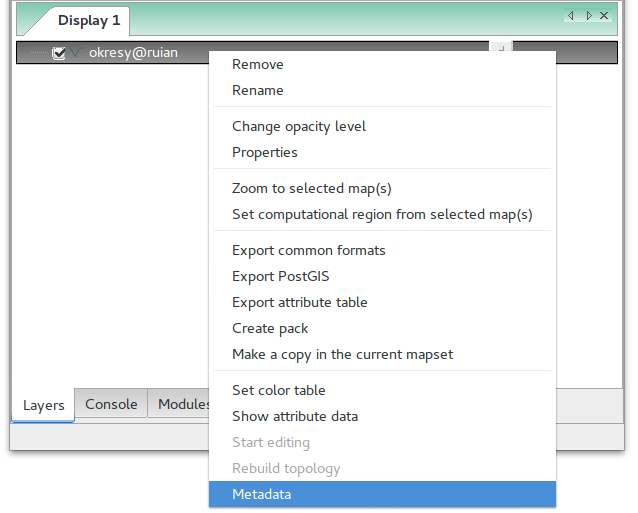
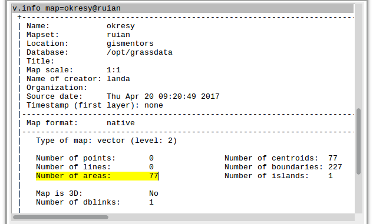
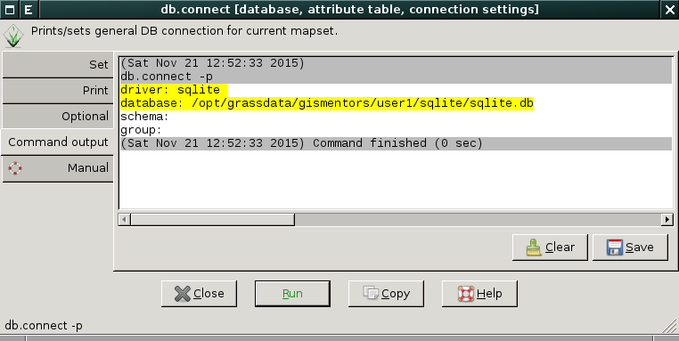

.. index::
   single: vektorová data

===============
 Vektorová data
===============

Vektorová data jsou v systému GRASS uložena v podobě
tzv. *vektorových map*.

* Vektorová data reprezentují nejčastěji diskrétní fenomény

Ve 2D GIS rozlišujeme tři základní *typy geoprvků*, které označujeme
jako *jednoduché* (simple features):

* bodové (*point*)
* liniové (*linestring*)
* plošné (*polygon*)

GRASS je nicméně striktně **topologický GIS**, který s jednoduchými
geoprvky nepracuje. Vektorová data ukládá v topologickém formátu, v
případě :ref:`importu vektorových dat <import-vector>` z
netopologických formátů jako je např. :wikipedia-en:`Esri Shapefile`
data převádí do topologické formy automaticky.

.. note::

   *Topologie* sleduje prostorové vztahy mezi objekty (návaznost
   linií, sousednost ploch atd.), viz :wikipedia-en:`prostorová
   topologie <Geospatial_topology>`.

Vstupní vektorová data často obsahují nejrůznější topologické chyby,
jako např. překrývající se polygony. Importní nástroj systému GRASS
:grasscmd:`v.in.ogr` se snaží tyto chyby automaticky opravit. V
některých případech to však není možné a je dále na uživateli, aby
data opravil sám. Opravám případných topologických chyb se věnuje
podrobněji :ref:`navazující kapitola <oprava-topologie>`.

.. note::

   Nativní vektorový formát systému GRASS umožňuje na rozdíl od jiných
   formátů jako je např. :wikipedia-en:`Esri Shapefile` uložit v
   jednou souboru (vektorové mapě) rozdílné typy geoprvků najednou. V
   jedné vektorové mapě tedy mohou být uloženy bodové, liniové i
   plošné geoprvky zároveň, viz :ref:`kapitola o editaci vektorových
   dat <editace-vektorovych-dat>`.

.. index::
   pair: metadata; vektorová data
   single: v.info

Metadata
========

Základní metadata o vektorové mapě vypisuje modul :grasscmd:`v.info`
dostupný z menu :menuselection:`Vector --> Reports and statistics -->
Basic vector metadata` anebo z kontextového menu vektorové mapy ve
*správci vrstev*.

                 
            Spuštění nástroje pro výpis metadat vektorových map z kontextového
            menu správce vrsvev.
            

                 
	    Příklad výpisu metadat vektorové mapy
	    :map:`obce_polygony`.

.. index::
   pair: vektorová data; topologie
   single: topologie

Topologický model
=================

Topologický model systému GRASS liniové a plošné elementy (bodové
geoprvky nejsou součástí topologie) rozkládá dále na tzv. *topologické
elementy*:

* uzel (*node*),
  
  * každá linie či hraniční linie musí začínat a končit v uzlu
  * linie se musí křížit vždy v uzlu
  * izolované uzly nejsou podporovány
  
* linie (*line*),
* hraniční linie (*boundary*) a
* reprezentační bod plochy (*centroid*).

Hraniční linie je liniový element, který na rozdíl od elementu
označovaného jako linie, může tvořit hranici plochy. Plošný
topologický element *area* je tvořen jednou či více hraničními liniemi
a případně i jedním *centroidem*. Izolovaná plocha nebo souvislá
množina ploch formuje plošný element označovaný jako ostrov (*isle*).

Příklad
-------

Na obrázku níže je zobrazen:

* jeden bodový geoprvek
* jeden liniový geoprvek
* dva plošné geoprvky, z toho jeden z nich obsahuje otvor

.. figure:: images/grass7-topo.png
   :class: large
   :scale-latex: 85
              
Tato kompozice bude v topologické modelu systému GRASS vyjádřena
následující topologickými elementy:

* pěti uzly :fignote:`n1-5`
* jednou linií :fignote:`2`
* čtyřmi hraničními liniemi :fignote:`3,4,6,8`
* dvěma centroidy :fignote:`5,7`

.. index::
   single: atributy
   single: popisná data
   see: popisná data; atributy
   single: PostgreSQL
   single: SQLite
   single: db.connect

Atributová data
===============

Atributová data jsou uložena v libovolném formátu podporovaném jedním
z databázových ovladačů systému GRASS.

Pro verzi GRASS 7 je výchozí formát :grasscmd:`SQLite <grass-sqlite>`.

.. notegrass6::

   Ve verzi GRASS 6 je výchozím formátem pro atributová data :grasscmd:`DBF <grass-dbf>`.

Volitelně lze atributová data ukládat do databáze :grasscmd:`PostgreSQL
<grass-pg>`, :grasscmd:`MySQL <grass-mysql>` či do jiné databáze
pomocí rozhraní :grasscmd:`ODBC <grass-odbc>`.

Výchozí nastavení formátu pro uložení atributových dat můžete změnit
pomocí modulu :grasscmd:`db.connect` (:menuselection:`Database -->
Manage databases --> Connect`). Aktuální nastavení vypisuje přepínač
:option:`-p`.

   Výchozí nastavení připojení atributových dat v GRASS - databáze
   SQLite.

.. notecmd:: Nastavení databáze PostgreSQL pro uložení atributových dat

   .. code-block:: bash
                   
                   db.connect driver=pg database=grass

.. note::

   Změna nastavení formátu uložení atributových dat se projeví až u nově
   vytvořených vektorových map.

.. raw:: latex

   \newpage

.. noteadvanced::

   K jedné vektorové mapě lze přiřadit více atributových tabulek. Tato
   problematika je ale nad rámec tohoto školení a je probírána v
   navazující :skoleni:`školení pro pokročilé uživatele
   <grass-gis-pokrocily>`.

   .. figure:: images/multi-layers.png
      :class: middle
      :scale-latex: 90
