Zobrazení geodat v mapovém okně
-------------------------------

.. index::
   single: správce vrstev
   single: mapové okno
   single: g.gui

Po spuštění systému GRASS se objeví *správce vrstev* (Layer Manager) a
*mapové okno* (Map Display).

.. tip::

   Pokud GUI (grafické uživatelské rozhraní) z nějaké důvodu spadne,
   lze ho z příkazové řádky nastartovat znovu pomocí příkazu
   :grasscmd:`g.gui`.

   .. code-block:: bash

      g.gui

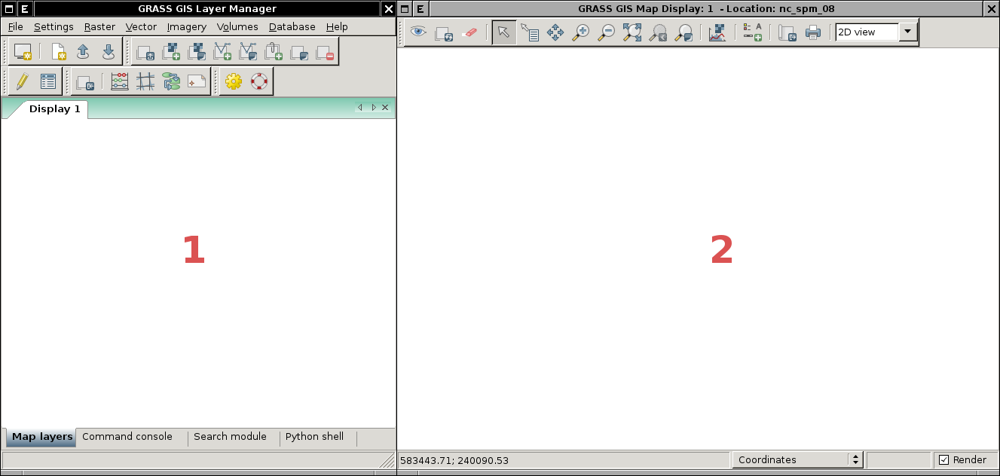

            Základní komponenty GUI systému GRASS - správce vrstev
            :fignote:`(1)` a mapové okno :fignote:`(2)`.

Rastrová či vektorová data lze do *stromu vrstev* (viz záložka :item:`Map
layers`) přidávat z menu :menuselection:`File --> Map display`, nástrojové lišty či
přímo z příkazové řádky *správce vrstev*, viz :ref:`níže <zobrazeni-dat-raster>`.

.. raw:: latex

   \newpage

.. note::

   Pokud se v mapovém okně nezobrazují žádná data, je nutné nastavit
   pohled na aktuálně vybranou mapu.

   .. figure:: images/map-display-full-zoom.png
               :class: middle

               Nastavení pohledu mapového okna na vybranou mapovou vrstvu.

   Automatické nastavení pohledu při přidání nové mapové vrstvy lze
   nastavit v :menuselection:`Settings --> Preferences`.

   .. figure:: images/wxgui-settings-autozoom.png

               Nastavení automatické změny pohledu při přidání nové mapové vrstvy.

.. noteadvanced::

   Geodata lze vykreslovat z příkazové řádky či skriptů do
   nejrůznějších formátů od PNG, GIF až po SVG či PDF pomocí modulu
   :grasscmd:`d.mon` v kombinaci s :grasscmd:`d.rast` a
   :grasscmd:`d.vect`. Tyto techniky jsou součástí navazujícího `školení
   pro pokročilé uživatele
   <http://www.gismentors.eu/skoleni/grass-gis.html#pokrocily>`_.

   .. only:: html
             
      .. figure:: images/gif-example.gif
         :class: middle
              
         Příklad vykreslení série prostorových analýz do formátu
         GIF

.. index::
   pair: zobrazení dat; rastrová data
   single: d.rast

.. _zobrazeni-dat-raster:
               
Rastrová data
=============

Rastrová data (tzv. *rastrovou mapu*) lze přidat čtyřmi různými způsoby:

* z nástrojové lišty

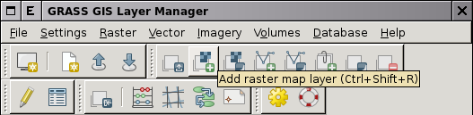
            
            Přidání rastrové mapy z nástrojové lišty správce vrstev.

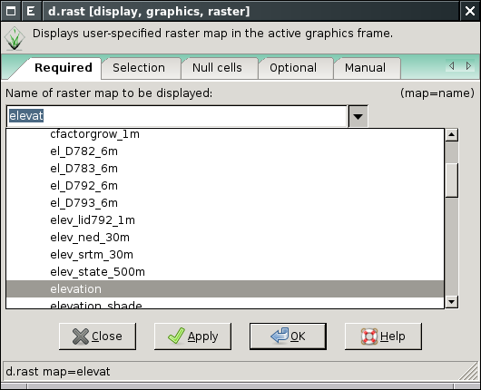

            Volba rastrové mapy.

* z menu :menuselection:`File --> Map display --> Add raster`

* pomocí klávesové zkratky :kbd:`Ctrl+Shift+R`

.. raw:: latex
           
   \newpage
  
* z příkazové řádky (``Command console``) správce vrstev příkazem :grasscmd:`d.rast`

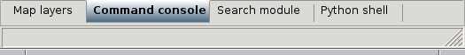

            Příkazová řádka správce vrstev.

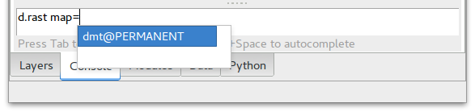

            Přidání rastrové mapy z příkazové řádky správce vrstev.

Ostatní mapové vrstvy, které mají rastrový charakter jsou dostupné z
nástrojové lišty nebo z příkazové řádky správce vrstev.

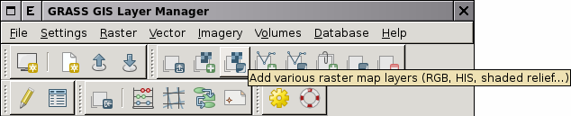
                 
            Přidání ostatních rastrových dat z nástrojové lišty správce vrstev.

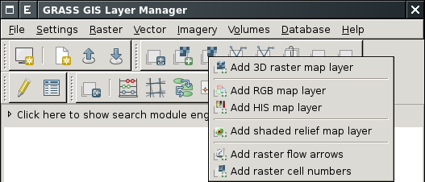

            Menu pro přidání rastrových dat.

.. raw:: latex

   \newpage
   
Jde o následující typy rastrových dat:

* 3D rastrová data
* :wikipedia:`RGB` barevná syntéza - příkaz :grasscmd:`d.rgb`
* :wikipedia:`HIS <HSL>` barevná syntéza - příkaz :grasscmd:`d.his`
* :wikipedia-en:`stínovaný reliéf <Shapeded relief>` - příkaz :grasscmd:`d.shadedmap`
* rastrová mapa, zobrazení směru - příkaz :grasscmd:`d.rast.arrow`
* rastrová mapa, zobrazení hodnot buněk - příkaz :grasscmd:`d.rast.num`

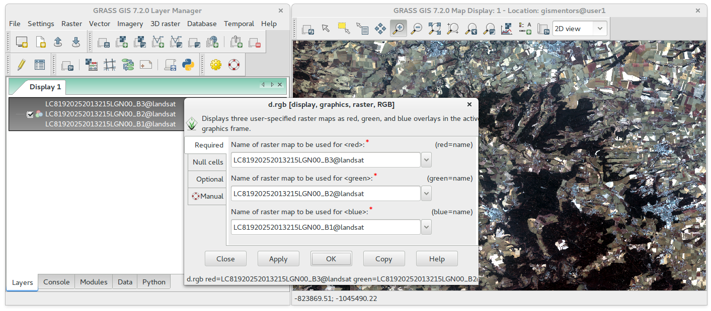
                 
            Příklad zobrazení barevné syntézy kanálů :wikipedia:`Landsat 8 ETM <Landsat>`
            z mapsetu `landsat` ve skutečných barvách.

.. index::
   pair: zobrazení dat; vektorová data
   single: d.vect

Vektorová data
==============

Podobně lze přidat vektorová data (tzv. *vektorovou mapu*):

* z nástrojové lišty:

.. figure:: images/wxgui-toolbar-vector.png

            Přidání vektorové mapy z nástrojové lišty správce vrstev.

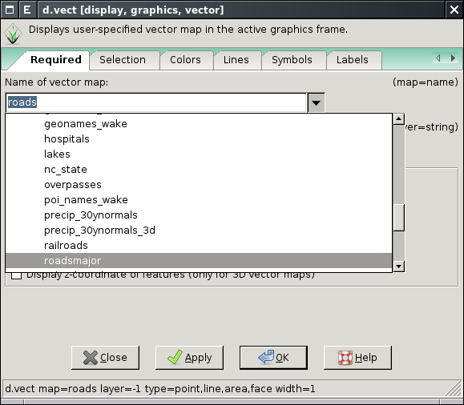
                 
            Volba vektorové mapy.

* z menu :menuselection:`File --> Map display --> Add vector`

* pomocí klávesové zkratky :kbd:`Ctrl+Shift+V`

* z příkazové řádky (``Command console``) správce vrstev příkazem :grasscmd:`d.vect`

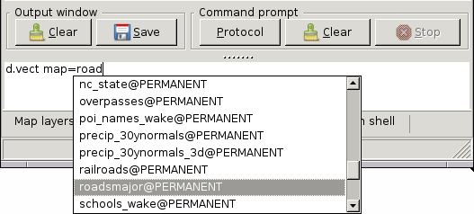

            Přidání vektorové mapy z příkazové řádky správce vrstev.

Ostatní mapové vrstvy, které mají vektorový charakter jsou dostupné z
nástrojové lišty nebo z příkazové řádky správce vrstev.

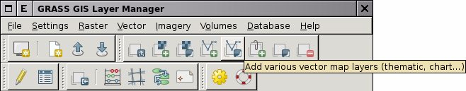

            Přidání ostatních vektorových dat z nástrojové lišty správce vrstev.

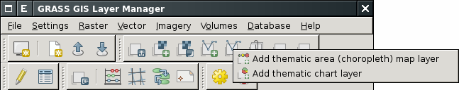

            Menu pro přidání vektorových dat.

Jde o následující typy vektorových dat:

* tématické zobrazení plošných vektorových dat - příkaz :grasscmd:`d.thematic.area`
* zobrazení grafů - :grasscmd:`d.vect.chart`
