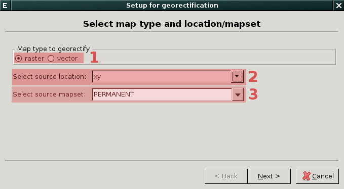
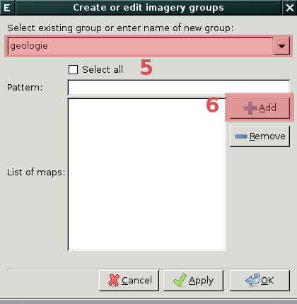
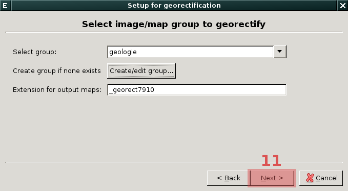
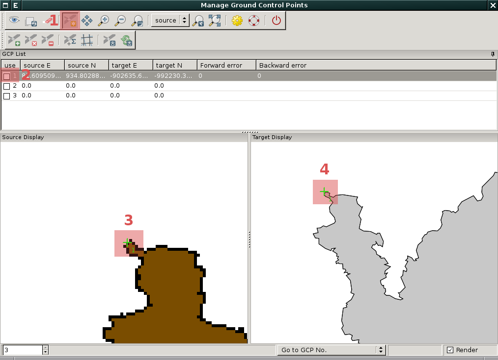
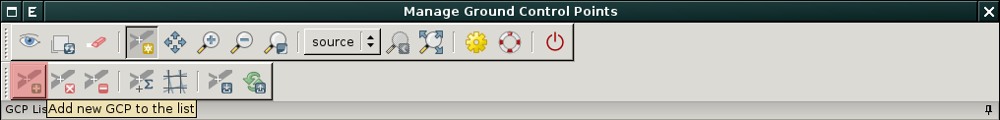
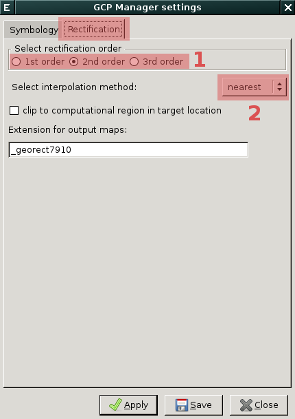

Georeferencování
----------------

Souřadnicové připojení geodat (tzv. georeferencování) umožňuje v
systému GRASS nástroj :grasscmd:`GCP Manager <wxGUI.gcp>` dostupný z menu *správce
vrstev* :menuselection:`File --> Georectify` anebo přímo z nástrojé
lišty.

.. figure:: images/lmgr-georectify.png

Nástroj je dále dostupný z příkazové řádky jako modul
:grasscmd:`g.gui.gcp`.

Tento nástroj umožňuje souřadnicově připojit jak rastrová tak
vektorová data.

Postup
======

Na vstupu tedy máme souřadnicově nepřipojená rastrová či vektorová
data. Pokud jsou tato data k dispozici v některém z externích formátu
jako je např. GeoTIFF či Esri Shapefile musíme je do systému GRASS
nejprve naimportovat. Pro tento účel jsem nejprve :ref:`vytvořit
lokaci s matematickým souřadnicovým systémem <lokace-xy>`. Do této
lokace data :ref:`naimportujeme <import>` a poté se :ref:`vrátíme zpět
do lokace <loc-switch>`, do které chceme data georeferencovat.

Následně na to spustíme *GCP Manager* a v průvodci postupně vybereme:

            Nejprve zvolíme typ dat, které chceme souřadnicově
            připojit - buď rastrová anebo vektorová data
            :fignote:`(1)`, dále zvolíme lokaci :fignote:`(2)` a
            mapset :fignote:`(3)`, ve které jsou tato data uložena

.. figure:: images/georect-1.png

            Dále vytvoříme skupinu, která bude obsahovat data určená
            pro souřadnicové připojení :fignote:`(4)`

            Zvolíme název skupiny :fignote:`(5)` a přidáme do ni
            rastrové či vektorové mapy :fignote:`(6)`. Pokud do
            skupiny přidáme více map najednou, tak budou všechny tyto
            mapy souřadnicově připojeny na základě stejných
            identických bodů
   
.. figure:: images/georect-3.png
            :class: small

            Zvolíme typ dat :fignote:`(7)`, který budeme to skupiny
            přidávat - rastrová či vektorová data, dále zvolíme
            mapset :fignote:`(8)`, ze které bude tato data volit a
            nakonec zvolíme data :fignote:`(9)`
              
.. figure:: images/georect-4.png
            :class: small

            Vytvoření skupiny potvrdíme :fignote:`(10)`
           

            Přejdeme na poslední dialog :fignote:`(11)`

.. figure:: images/georect-6.png

            Tam zvolíme z cílové (aktuální lokace) rastrovou či
            vektorovou mapu :fignote:`(12)`, kterou chceme použít jako
            referenci pro souřadnicové připojení a průvodce ukončíme
            :fignote:`(13)`

Následně na to se objeví okno *GCP Manageru* s rastrovou či vektorovou
mapou určenou k souřadnicovému připojení vlevo a referenční rastrovou
či vektorovou mapu vpravo. Začneme volit identické body *(Ground
Control Points)* nejprve ve zdrojové lokaci (vlevo) a poté v cílové
lokaci (vpravo).

Výběr identických bodů probíhá následovně:
                    

            Z nástrojové lišty vybere nástroj definice identických
            bodů :fignote:`(1)`, zvolíme číslo identického bodu, který
            chceme definovat :fignote:`(2)` a zvolíme jeho pozici
            nejprve ve zdrojové :fignote:`(3)` a poté v cílové lokaci
            :fignote:`(4)`

.. figure:: images/georect-9.png
            :class: large

            Takto postupně zvolíme první tři identické body.

Další identické body můžeme přidat z nástrojové lišty.
   

.. figure:: images/georect-10.png
            :class: large

            Pokud nejsou identické body aktivovány, tak je nepjrpve
            aktivujeme :fignote:`(1)` a poté nastavíme vlastnosti
            souřadnicového připojení :fignote:`(2)`

V dialogu nastavení:

            V záložce :item:`Rectification` nastavíme stupeň
            polynomické interpolace :fignote:`(1)` a metodu pro
            převzorkování rastru :fignote:`(2)` - obecně lze říci, že
            pro kategorizovaná data (např. geologická mapa) je vhodná
            metoda nejbližšího souseda (nearest), pro data jako je
            digitální model reliefu naopak lineární interpolace
            (linear) či kubická konvoluce (cubic)

Před vlastním souřadnicovým připojení můžeme spočít pro identické bodu
tzv. RMS chybu a na jejím základě vyřadit nebo naopak přidat nové
identické body.

.. note::
   
   Střední kvadratická (RMS) chyba by neměla přesáhnout
   polovinu rozlišení hodnoty cílové lokace.

.. figure:: images/georect-12.png
            :class: large

Vlastní výpočet spustíme pomocí funkce ``Georecify`` dostupnou z
nástrojové lišty.

.. figure:: images/georect-13.png
            :class: large

Souřadnicově připojená rastrová či vektorovou mapu přidáme do správce vrstev.

.. figure:: images/georect-14.png
            :class: large
           
A zobrazíme společně s dalšími mapovými vrstvami v mapovém okně.

.. figure:: images/georect-15.png
            :class: large
                    
                  

                    

                                
