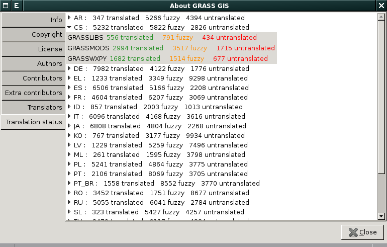
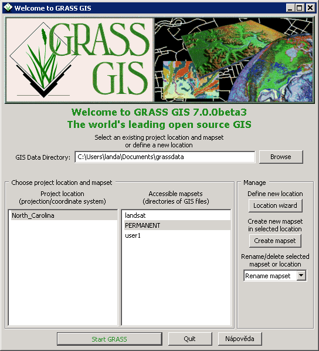

.. index::
   pair: lokalizace; překlad

.. raw:: latex

   \newpage

Lokalizace
----------

GRASS GIS je lokalizován alespoň částečně do více než 20
jazyků. Statistiku pro jednotlivé jazyky získáte z menu
:menuselection:`Help --> About GRASS GIS` v záložce :item:`Translation
status`.

   Stav lokalizace do češtiny.

.. noteadvanced::
   
   "Fuzzy" označuje překlad, který již neodpovídá původní zprávě
   programu a musí být aktualizován.

.. _volba-lokalizace:

Volba lokalizace
================

GRASS nastartuje automaticky v lokalizaci odpovídající danému
operačnímu systému.

.. figure:: ../instalace/images/wingrass-9.png
	    :scale-latex: 50

	    GRASS lokalizovaný do češtiny pro MS Windows.

Lokalizaci je možné změnit v nastavení :abbr:`GUI (Grafické
uživatelské rozhraní)` systému GRASS :menuselection:`Settings -->
Preferences` v záložce :item:`Appearance` [#f1]_.

.. figure:: images/grass-change-lang.png

	    Změna lokalizace uživatelského rozhraní systému GRASS na
	    angličtinu.

Systém GRASS po uložení nastavení a opětovném spuštění (změna jazyka
se tedy neprojeví ihned) již nastartuje ve zvolené lokalizaci.

                 
   Příklad uvítací obrazovky systému GRASS v angličtině.

.. raw:: latex

   \newpage
   
.. figure:: images/grass-welcome-jap.png
   :scale-latex: 55
              
   Příklad uvítací obrazovky systému GRASS v japonštině.

.. rubric:: `Poznámky pod čarou`
	    :class: secnotoc

.. [#f1] V české lokalizaci jde o :menuselection:`Nastavení -->
         Vlastnosti`, záložka :item:`Vzhled`.

