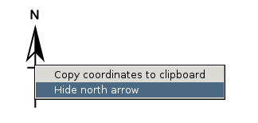
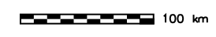
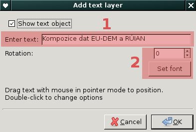
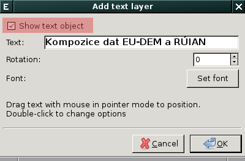

.. _mapove-elementy:

Mapové elementy
---------------

Do mapové okna lze přidat základní mapové elementy jako je legenda,
směrová růžice, měřítko či textový popis. Tato funkcionalita je
dostupná z nástrojové lišky mapového okna.

.. figure:: images/add-map-element.png
            :class: large
	    :scale-latex: 55

.. note::

   Mapové okno není určeno pro tvorbu plnohodnotných mapových
   výstupů. K tomuto účelu je určen :grasscmd:`Cartographic Composer
   <wxGUI.psmap>`, více v kapitole :ref:`mapové výstupy
   <mapove-vystupy>`.

.. _map-legend:
   
Legenda
=======

Legendu pro rastrová data lze do mapového okna přidat z jeho nástroje
lišty:

.. figure:: images/add-legend.png
   :class: large
   :scale-latex: 55

.. figure:: images/add-legend-0.png
   :class: large
   :scale-latex: 65

   Pokud je ve *správci vrstev* aktuálně vybraná rastrová mapa, tak se
   automaticky legenda zobrazí pro ni.

.. raw:: latex

   \newpage

V opačném případě se zobrazí dialog pro výběr rastrové mapy, pro
kterou si přejete legendu zobrazit.

.. figure:: images/add-legend-1.png
            :class: large
	    :scale-latex: 80

            Vybereme rastrovou mapu pro kterou chceme legendu zobrazit
            :fignote:`(1)` a nastavení potvrdíme :fignote:`(2)`

Legendu můžete v mapovém okně **skrýt** buď z nástorové lišty anebo
z kontextového menu legendy (pravé tlačítko myši nad legendou):
                     
.. figure:: images/remove-legend.png

Z tohoto menu lze také **změnit velikost** legendy i její orientaci.

.. figure:: images/resize-legend-0.png
   
.. figure:: images/resize-legend-1.png
   :class: small
           
   Příklad změněné orientace legendy

**Vlatnosti legendy** můžeme změnit z dialogu modulu
:grasscmd:`d.legend` dostupného pomocí dvojkliku nad legendou
umístěnou v mapovém okně.

.. figure:: images/legend-prop-flip.png
   :class: middle
   :scale-latex: 55

   Přiklad změny legendy - otočení škály

.. figure:: images/legend-flip.png
   :class: small

   Výsledek otočení škály legendy

.. note::

   Legendu v současnosti lze definonat pouze pro rastrová data,
   legenda pro vektorové mapy není modulem :grasscmd:`d.legend`
   podporována. Tato funkcionalita je plánovana pro další verze systému
   GRASS. Legendu pro vektorové mapy lze nicméně definovat v aplikaci
   :grasscmd:`Cartographic Composer <wxGUI.psmap>`, více v kapitole
   :ref:`mapové výstupy <mapove-vystupy>`.

.. tip::

   Pokud se popisky legenda nezobrazují korektně, je potřeba změnit
   font legendy.

   .. figure:: images/legend-broken.png
      :class: small
      :scale-latex: 40

   Písmo změníme z dialogu nastavení dostupného z menu
   :menuselection:`Settings --> Preferences` anebo z nástrojové lišty
   *správce vrstev*

   .. figure:: images/lmgr-settings.png

   .. figure:: images/settings-font.png            
      :class: middle
      :scale-latex: 70

      V záložce :item:`Map display` zvolíme vhodný font

   .. figure:: images/font-dialog.png
      :class: small
           
      Kromě fontu :fignote:`(1)` změníme kodóvání na UTF-8
      :fignote:`(2)`

   .. figure:: images/map-render.png
      :class: large
      :scale-latex: 80

      Obsah mapové okna překreslíme
   
   .. figure:: images/legend-ok.png
      :class: small
      :scale-latex: 40

      Výsledek

.. raw:: latex

   \newpage

Směrová růžice
==============

Směrovou růžici lze do mapového okna přidat z jeho nástroje lišty:

.. figure:: images/add-narrow.png
   :class: large

Poté se do mapové okna umístí výchozí směrová růžice:

.. figure:: images/narrow.png
            :class: small

**Podobu směrové růřice** lze změnit z dialogu modulu
:grasscmd:`d.northarrow` dostupného pomocí dvojkliku nad směrovou
růžicí umístěnou v mapovém okně.

.. figure:: images/narrow-prop.png
   :class: middle
        
   Přiklad změny stylu směrové růžice

.. figure:: images/narrow-1.png
   :class: small

   Výsledek změny stylu směrové růžice

Směrovou růžici můžete v mapovém okně **skrýt** buď z nástorové lišty
anebo z kontextového menu směrové růžice (pravé tlačítko myši nad
směrovou růžicí):
                     

           
Měřítko
=======

Měřítko lze do mapového okna přidat z jeho nástroje lišty:

.. figure:: images/add-scalebar.png
   :class: large

Poté se do mapové okna umístí výchozí měřitko:

.. figure:: images/scalebar.png
   :class: small

**Podobu měřítka** lze změnit z dialogu modulu :grasscmd:`d.barscale`
dostupného pomocí dvojkliku nad měřítkem umístěnou v mapovém okně.

.. figure:: images/scalebar-prop.png
   :class: middle
        
   Příklad změny stylu měřítka

   Výsledek změny stylu měřítka

Měřítko můžete v mapovém okně **skrýt** buď z nástorové lišty anebo z
kontextového menu měřítka (pravé tlačítko myši nad měřítkem):
                     
.. figure:: images/remove-scalebar.png
            :class: small
            
Textový popisek
===============

Textový popisek lze do mapového okna přidat z jeho nástroje lišty:

.. figure:: images/add-text.png
   :class: large

V následující dialogu uvedeme text a případně můžeme změnit i
vlastnosti textového objektu.
      

        
   Po nastavení textu :fignote:`(1)` můžeme nastavit rotaci
   či styl písma :fignote:`(2)`

.. figure:: images/text-example.png
   :class: large
               
   Příklad textového popisku v mapovém okně
            
Popisek lze **skrýt** opět pomocí výše uvedeného dialogu, který je
dostupný pomocí dvojkliku nad daným textovým objektem v mapovém okně.

