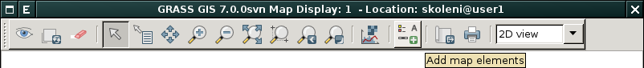
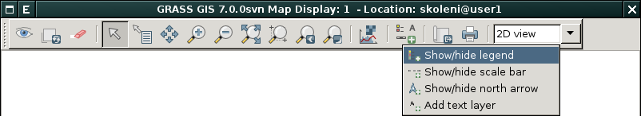
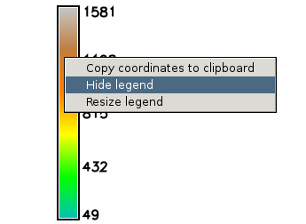
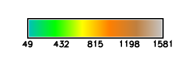
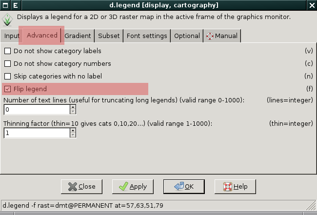
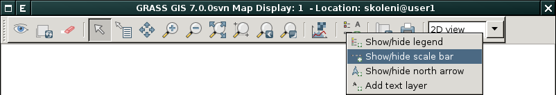

.. _mapove-elementy:

Mapové elementy
---------------

Do mapové okna lze přidat základní mapové elementy jako je legenda,
směrová růžice, měřítko či textový popis. Tato funkcionalita je
dostupná z nástrojové lišky mapového okna.

           
.. note::

   Mapové okno není určeno pro tvorbu plnohodnotných mapových
   výstupů. K tomuto účelu je určen :grasscmd:`Cartographic Composer
   <wxGUI.psmap>`, více v kapitole :ref:`mapové výstupy
   <mapove-vystupy>`.

Legenda
=======

Legendu pro rastrová data lze do mapového okna přidat z jeho nástroje
lišty:

           
Pokud je ve *správci vrstev* aktuálně vybraná rastrová mapa, tak se
automaticky legenda zobrazí pro ni.

.. figure:: images/add-legend-0.png
            :class: large
           
V opačném případě se zobrazí dialog pro výběr rastrové mapy, pro
kterou si přejete legendu zobrazit.

.. figure:: images/add-legend-1.png
            :class: large

            Vybereme rastrovou mapu pro kterou chceme legendu zobrazit
            :fignote:`(1)` a nastavení potvrdíme :fignote:`(2)`

Legendu může z mapové okna **odstranit** buď z nástorové lišty anebo z
kontexového menu legendy (pravé tlačítko myši nad legendou):
                     

Z tohoto menu lze také **změnit velikost** legendy i její orientaci.

.. figure:: images/resize-legend-0.png
            

           
           Příklad změněné orientace legendy

**Vlatnosti legendy můžeme změnit** z dialogu modulu
:grasscmd:`d.legend` dostupného pomocí dvojkliku nad legendou
umístěnou v mapovém okně.

        
   Přiklad změny legendy - otočení škály

.. figure:: images/legend-flip.png
   :class: small

   Výsledek otočení škály legendy

.. note::

   Legendu v současnosti lze definonat pouze pro rastrová data,
   legenda pro vektorové mapy není modulem :grasscmd:`d.legend`
   podporována. Tato funkcionalita je plánovana pro další verze systému
   GRASS. Legendu pro vektorové mapy lze nicméně definovat v aplikaci
   :grasscmd:`Cartographic Composer <wxGUI.psmap>`, více v kapitole
   :ref:`mapové výstupy <mapove-vystupy>`.

Směrová růžice
==============

Směrovou růžici lze do mapového okna přidat z jeho nástroje lišty:

.. figure:: images/add-narrow.png
   :class: large

Měřítko
=======

Měřítko lze do mapového okna přidat z jeho nástroje lišty:

Textový popisek
===============

Textový popisek lze do mapového okna přidat z jeho nástroje lišty:

.. figure:: images/add-text.png
   :class: large

