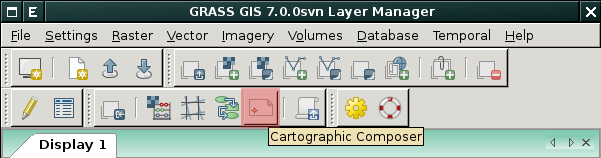

.. _mapove-vystupy:

Tvorba mapových výstupů
-----------------------

Pro tvorbu kvalitních mapových výstupů je určen grafický nástroj
:grasscmd:`Cartographic Composer <wxGUI.psmap>` dostupný z menu
:menuselection:`File --> Cartographic Composer` anebo z nástrojové
lišty *správce vrstev*.

.. note::
   
   Jde o vlastní aplikaci, která nesouvisí s aktuální obsahem mapového
   okna. Všechny vrstvy, které chceme, aby byly součástí mapového výstupu,
   je třeba přidat do aplikace ručně.

Příklady
========

.. youtube:: ZMwuC14omyA

   Definice mapového rámce, přidání rastrových a vektorových dat

.. youtube:: s0gYrGuzzpo

   Načtení kompozice ze souboru, přidání textového popisku, měřítka,
   legendy pro rastrová a vektorová data

.. youtube:: XKXtwoMh6Kk

   Přidání směrové růžice
   
.. youtube:: 8o5cRyH3hb8

   Přidání legendy

