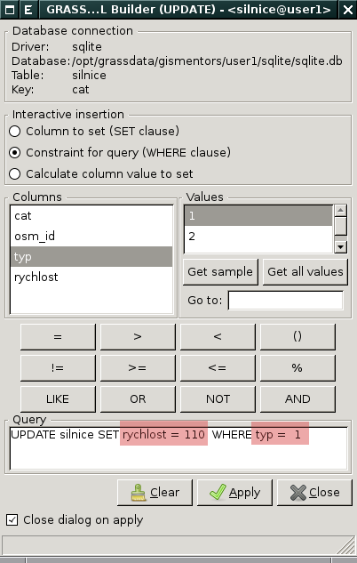
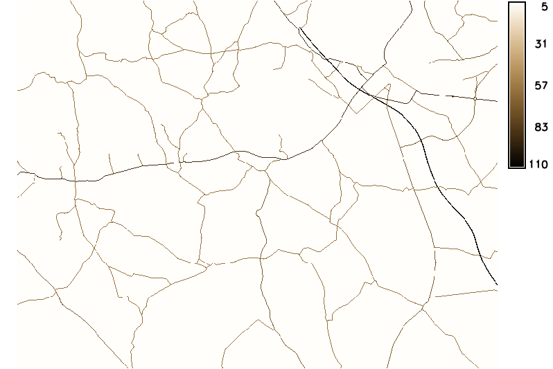
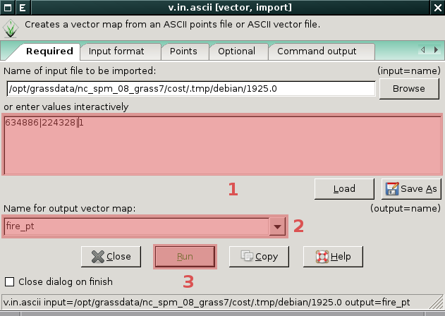
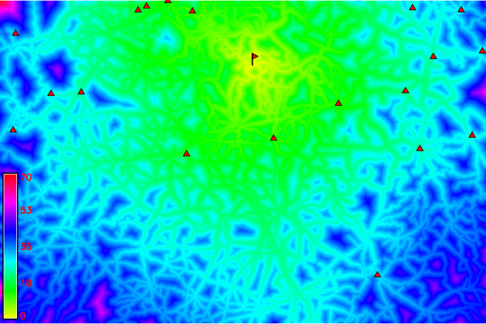
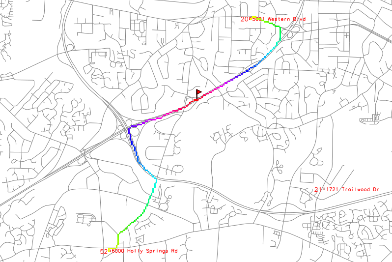
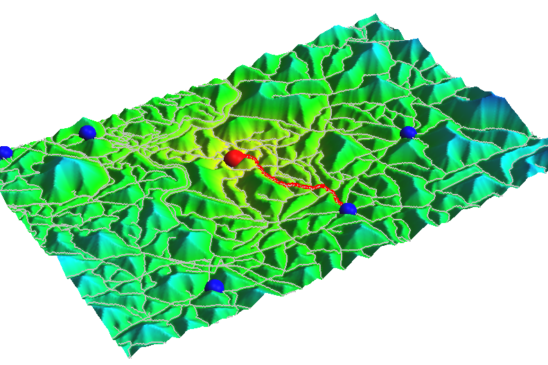

.. index::
   single: analýza nákladů
   pair: rastrová data; analýza nákladů
   single: r.cost
   single: r.drain

Rastrová analýza nákladů
------------------------

Nejprve si v aktuálním mapsetu :ref:`vytvoříme kopii
<kopie-vektorove-mapy>` vektorové mapy :map:`silnice`. Přidáme
:ref:`nový atribut <pridani-noveho-atributu>` ``rychlost``, do něhož
uložíme průměrnou rychlost v následující podobě:

.. only:: latex
          
   .. tabularcolumns:: |p{3cm}|p{1.5cm}|p{4cm}|
                       
.. only:: html
                                 
   .. cssclass:: border

+----------------------+----------------+---------------------+
| Silnice              | Typ            | Rychlost (km/h)     |
+======================+================+=====================+
| Dálnice              | 1              | 110                 |
+----------------------+----------------+---------------------+
| Rychlostní silnice   | 2              | 100                 |
+----------------------+----------------+---------------------+
| Silnice 1.třídy      | 3              | 90                  |
+----------------------+----------------+---------------------+
| Silnice 2.třídy      | 4              | 70                  |
+----------------------+----------------+---------------------+
| Silnice 3.třídy      | 5              | 60                  |
+----------------------+----------------+---------------------+

   Příklad uložení atributu rychlosti pro dálnice (``typ = 1``)     

.. raw:: latex

   \newpage

.. notecmd:: Nastavení atributu rychlosti

   .. code-block:: bash

      v.db.addcolumn map=silnice column="rychlost integer"
      v.db.update map=silnice column=rychlost value=110 where="typ=1"
      v.db.update map=silnice column=rychlost value=100 where="typ=2"
      v.db.update map=silnice column=rychlost value=90  where="typ=3"
      v.db.update map=silnice column=rychlost value=70  where="typ=4"
      v.db.update map=silnice column=rychlost value=60  where="typ=5"             
      
Dále převedeme modulem :grasscmd:`v.to.rast` (:menuselection:`File -->
Map type conversions --> Vector to raster`) vektorovou mapu
:map:`silnice` do rastrové reprezentace. Před konverzí je nutné
nastavit :ref:`výpočetní region <region>`, např. :ref:`interaktivně
<nastaveni-regionu-mapove-okno>` z mapového okna:

.. code-block:: bash

                g.region res=25
                v.to.rast input=silnice output=silnice use=attr attrcolumn=rychlost

.. notegrass6::

   Místo parametru :option:`attrcolumn` použijte :option:`column`.
 
Pomocí modulu :grasscmd:`r.null` (:menuselection:`Raster --> Develop
raster map --> Manage NULL values`) přiřadíme hodnotě 'NULL' (žádná
data) rychlost pohybu '5'. Vzniklé rastrové mapě přiřadíme tabulku
barev 'sepia', viz kapitola :doc:`tabulka barev <tabulka-barev>`.

.. code-block:: bash

                r.null map=silnice null=5
                r.colors -n map=silnice color=sepia

            Rasterizovaná síť silnic s atributem průměrné rychlosti

Modulem :grasscmd:`v.in.ascii` vytvoříme vektorovou mapu s ohniskem
požáru (souřadnice v S-JTSK -754063, -981284).

            
            Vytvoření mapy s ohniskem požáru - definujeme souřadnice
            ohniska požáru :fignote:`(1)` a název výsledné vektorové mapy
            :fignote:`(2)`

.. notecmd:: Vytvoření vektorové mapy s ohniskem požáru
             
   .. code-block:: bash

      echo "-754063|-981284|1" | v.in.ascii input=- output=pozar
            
.. raw:: latex

   \newpage

Rastrovou mapu časové náročnosti vytvoříme pomocí modulu
:grasscmd:`r.mapcalc`, viz kapitola :ref:`rastrová algebra
<rastrova-algebra>`.

.. code-block:: bash

                r.mapcalc expr="silnice_cas = 1.0/silnice"

Pomocí modulu :grasscmd:`r.cost` (:menuselection:`Raster --> Terrain
analysis --> Cost surface`) vypočteme rastrovou mapu nákladů pohybu.

.. code-block:: bash

                r.cost -k input=silnice_cas output=silnice_naklady start_points=pozar

           
   Analýza nákladů pohybu v terénu, ohnisko požáru a požární stanice

Dojezdovost pro jednotlivé požární stanice k ohnisku požáru vypočteme
z rastru nákladu pomocí modulu :grasscmd:`v.what.rast`
(:menuselection:`Vector --> Update attributes --> Sample raster maps
at point locations`). Nejprve si v aktuálním mapsetu :ref:`vytvoříme
kopii <kopie-vektorove-mapy>` vektorové mapy
:map:`pozarni_stanice`. Přidáme :ref:`nový atribut
<pridani-noveho-atributu>` ``dojezdovost``, do něhož uložíme hodnotu
dojezdovosti pro danou požární stanici.

.. notecmd:: Přidání atributu dojezdovosti

   .. code-block:: bash

      v.db.addcolumn map=pozarni_stanice column="dojezdovost double precision"

.. code-block:: bash

   v.what.rast map=pozarni_stanice raster=silnice_naklady column=dojezdovost

.. figure:: images/grass-streets-nearest.png
   :scale-latex: 70
		      
   Nalezení požární stanice s nejmenší hodnotou dojezdovosti,
   tj. požární stanice s kategorií '89'

Souřadnice požární stanice s kategorií '89' poskytne modul
:grasscmd:`v.out.ascii` (:menuselection:`File --> Export vector map
--> ASCII points or GRASS ASCII vector export`).

.. code-block:: bash
                
   v.out.ascii input=pozarni_stanice cats=89                                       
   -750649.82535985|-992867.12907965|89          
   
Nejkratší (spádovou) cestu vypočteme modulem :grasscmd:`r.drain`
(:menuselection:`Raster --> Terrain analysis --> Least cost route or
flow`).

.. code-block:: bash

                r.drain -n input=silnice_naklady output=cesta start_coor=-750649.82535985,-992867.12907965

.. notegrass6:: 

   Místo parametru :option:`start_coor` použijte :option:`coor`.

   Výsledek, nejkratší cesta k požáru
            

        
   Vizualizace rastrové mapy nákladů včetně nejkratší spádové cesty ve
   3D
