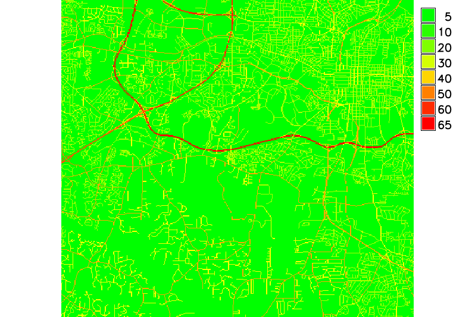

Rastrové analýza nákladů
------------------------

.. todo::

   Přepsat na zakladě vlastního datasetu.

Pro další analýzu nejprve převedeme síti komunikací do rastrové
reprezentace (:grasscmd:`v.to.rast`, před konverzí je nutné nastavit
:ref:`výpočetní region <region>` pomocí :grasscmd:`g.region`):

.. code-block:: bash

                g.region swwake_30m -p
                v.to.rast input=streets_wake output=streets_speed use=attr attrcolumn=SPEED

.. notegrass6::

   Místo parametru :option:`attrcolumn` použijte :option:`column`.
 
Hodnotě 'NULL' (žádná data) přiřadíme rychlost pohybu '5' -
:grasscmd:`r.null`. Rastrové vrstvě přiřadíme tabulku barev 'gyr'
(green-yellow-red) pomocí modulu :grasscmd:`r.colors`.

.. code-block:: bash

                r.null map=streets_speed null=5
                r.colors map=streets_speed color=gyr

            Rasterizovaná síť silnic s parametrem dovolené rychlosti}}

Vytvoříme vektorovou mapu s ohniskem požáru (souřadnice 34886, 224328) - :grasscmd:`v.in.ascii`.

.. code-block:: bash

                echo "634886|224328|1" | v.in.ascii input=- output=fire_pt

.. figure:: images/wxgui-v-in-ascii.png
            
            Vytvoření mapy ohniska požáru - v.in.ascii

Rastr časové náročnosti vytvoříme pomocí :grasscmd:`r.mapcalc`, viz :ref:`rastrova-algebra`.

.. code-block:: bash

                r.mapcalc "streets_travtime = 1./streets_speed"

Pomocí :grasscmd:`r.cost` vypočteme rastrovou mapu nákladů pohybu a
data zobrazíme (:grasscmd:`d.rast`, :grasscmd:`d.vect`).

.. code-block:: bash

                r.cost -k input=streets_travtime output=streets_cost start_points=fire_pt
                d.rast map=streets_cost
                d.vect map=firestations color=red size=10 icon=basic/pushpin display=shape,attr attrcolumn=LOCATION
                d.vect map=fire_pt color=red icon=basic/marker size=20

.. figure:: images/grass-streets-cost.png

            Analýza nákladů pohybu v terénu, ohnisko požáru + požární stanice

Náklady pro jednotlivé požární stanice můžeme určit pomocí modulu
:option:`r.what` s parametrem :option:`points`.

.. code-block:: bash

                r.what map=streets_cost points=firestations

.. notegrass6::

   Modul :grasscmd:`r.what` nemá parametr :option:`points`, tj, ``v.out.ascii input=firestations fs=' ' | r.what input=streets_cost``

Nejkratší (spádovou) cestu vypočteme modulem :grasscmd:`r.drain`.

.. code-block:: bash

                r.drain -n input=streets_cost output=route_20Western start_coor=635940,225912
                r.drain -n input=streets_cost output=route_52Holly start_coor=633178,221353

.. notegrass6:: 

   Místo parametru :option:`start_coor` použijte :option:`coor`.

Data zobrazíme (:grasscmd:`d.rast` a :grasscmd:`d.vect`).

.. code-block:: bash

                d.vect map=streets_wake color=grey
                d.vect map=fire_pt fcolor=red icon=basic/marker size=20
                d.vect map=firestations display=shape,cat,attr color=red icon=basic/box size=4 xref=right lsize=10 lcolor=red attrcol=LOCATION
                d.rast map=route_20Western
                d.rast map=route_52Holly

.. figure:: images/grass-streets-path.png

            Výsledek, nejkratší cesta k požáru

.. figure:: images/grass-streets-path-3d.png

            Vizualizace rastrové vrstvy nákladů ve 3D
