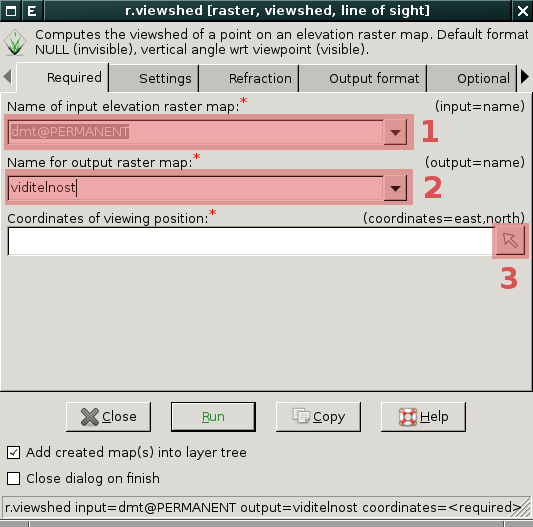
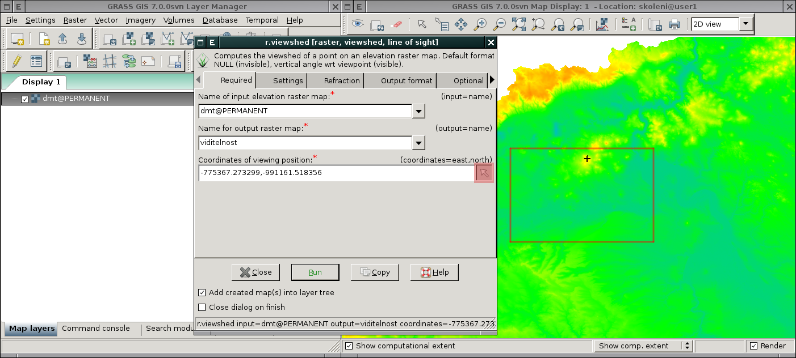

.. raw:: latex
	 
   \newpage

.. index::
   single: analýza povrchu
   single: r.slope.aspect

Analýzy povrchu
---------------

Základní topografické analýzy povrchu poskytuje modul
:grasscmd:`r.slope.aspect` (:menuselection:`Raster --> Terrain
analysis --> Slope and aspect`).

.. figure:: images/r-slope-aspect-0.png
                           
            V dialogu nejprve zvolíme vstupní rastrovou mapu s
            povrchem :fignote:`(1)` a poté v záložce :fignote:`(2)`
            požadovaný výstup

.. important::

   Jako ostatní moduly pro zpracování rastrových dat i tento modul
   pracuje v aktuálním výpočetním regionu. Proto je vhodné před
   výpočtem tento :ref:`region nastavit podle vstupní rastrové mapy
   <nastaveni-regionu>`.

.. index::
   pair: analýza povrchu; míra svahu
   see: analýza povrchu; r.slope.aspect

Míra svahu
==========

.. figure:: images/r-slope-aspect-s.png
   :scale-latex: 60

.. figure:: images/slope.png
   :class: middle
   :scale-latex: 70

   Výsledná mapa míry svahu ve stupních                 

.. raw:: latex

   \newpage

.. index::
   pair: analýza povrchu; orientace svahu
   pair: expozice; orientace svahu
   see: analýza povrchu; r.slope.aspect

.. _aspect:

Orientace svahu
===============

Orientaci (expozici) svahu opět počítá modul
:grasscmd:`r.slope.aspect` v kombinaci s parametrem :option:`aspect`.

.. figure:: images/r-slope-aspect-a.png

.. figure:: images/aspect_diagram.png
            :class: small
        
            Azimut orientace svahu
   
.. figure:: images/aspect.png
            :class: middle
           
            Výsledná mapa orientace svahu            

.. tip::

   Postup jak orientaci svahu reklasifikovat je prezentováno v
   kapitole :ref:`reklasifikace <r-recode>`.

   .. figure:: images/aspect-reclass.png
               :class: middle
           
               Výsledek reklasifikace mapy orientace svahu

.. index::
   pair: analýza povrchu; viditelnost
   pair: viewshed; viditelnost
   single: r.viewshed
   see: analýza povrchu; r.viewshed

Analýza viditelnosti
====================

Klíčový modul pro výpočet analýzy viditelnosti je modul
:grasscmd:`r.viewshed` (:menuselection:`Raster --> Terrain analysis
--> Visibility`).

            Zvolíme vstupní rastrovou mapu :fignote:`(1)` s povrchem,
            název výstupní mapy viditelnosti :fignote:`(2)` a
            souřadnice observačního bodu a to buď manuálně či
            interaktivně z mapového okna :fignote:`(3)`

.. tip::

   Výpočet omezíme na menší území, např. :ref:`interaktivním
   nastavením výpočetního regionu <nastaveni-regionu-mapove-okno>`
   přímo z mapového okna.
          

   Observační bod je v mapovém okně označen černým křížkem,
   obdélník červené barvy zobrazuje hranice výpočetní regionu

.. figure:: images/viewshed-legend.png
   :class: middle
   :scale-latex: 50

   Výsledek analýzy viditelnosti z observačního bodu včetně legendy
   zobrazující velikost úhlu, pod kterým je místo z daného
   observačního bodu vidět
