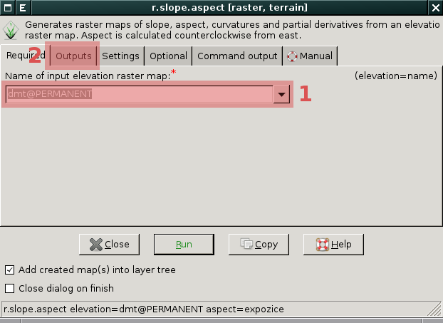
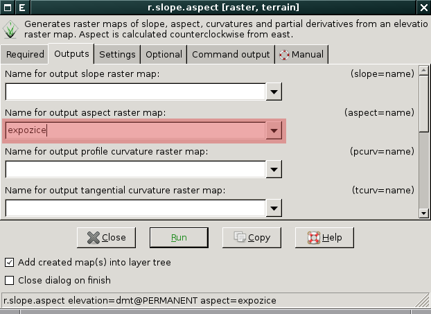

Analýzy povrchu
---------------

Základní topografické analýzy povrchu poskytuje modul
:grasscmd:`r.slope.aspect`, který je dostupný z menu *správce vrstev*
:menuselection:`Raster --> Terrain analysis --> Slope and aspect`.

                           
            V dialogu nejprve zvolíme vstupní rastrovou mapu s
            povrchem :fignote:`(1)` a poté v záložce :fignote:`(2)`
            požadovaný výstup

.. important::

   Jako ostatní moduly pro zpraování rastrových dat i tento modul
   pracuje v aktálním výpočetním regionu. Proto je vhodné před
   výpočtem tento :ref:`region nastavit podle vstupní rastrové mapy
   <nastaveni-regionu>`.

Míra svahu
==========

.. figure:: images/r-slope-aspect-s.png

.. figure:: images/slope.png
            :class: middle
           
            Výsledná mapa míry svahu ve stupních                 
.. _aspect:

Orientace svahu
===============

Orientaci (expozici) svahu opět počítá modul
:grasscmd:`r.slope.aspect` v kombinaci s parameterem :option:`aspect`.

.. figure:: images/aspect_diagram.png
            :class: small
        
            Azimut orientace svahu
   
.. figure:: images/aspect.png
            :class: middle
           
            Výsledná mapa orientace svahu            

.. tip::

   Postup jak orientaci svahu reklasifikovat je prezentováno v
   kapitole :ref:`reklasifikace <r-recode>`.

   .. figure:: images/aspect-reclass.png
               :class: middle
           
               Výsledek reklasifikace mapy orientace svahu

Analýza viditelnosti
====================
