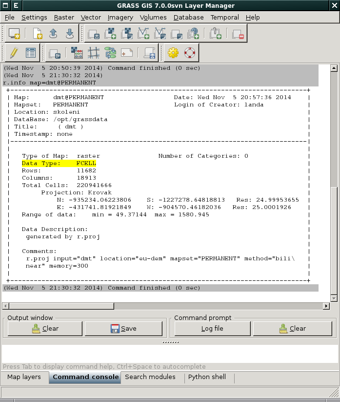
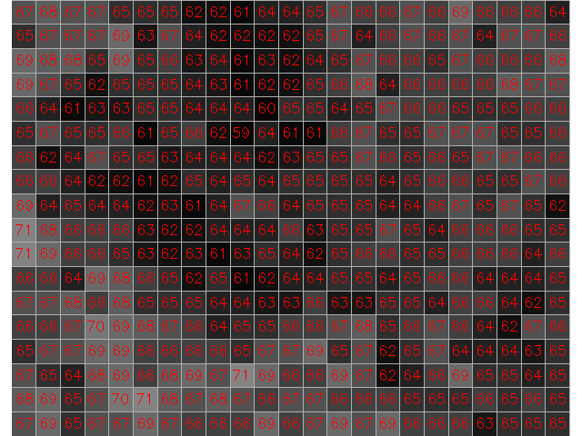

.. index::
   single: rastrová data

Rastrová data
-------------

Rastrová data jsou v systému GRASS uložena v podobě tzv. *rastrových
map*. Jde o:

* reprezentaci v podobě pravidelné mřížky hodnot (GRASS nepodporuje
  nepravidelné mřížky)
* je ideální pro reprezentaci spojitých jevů jako nadmořská výška, teplota povrchu a pod.
* elementem mřížky je buňka či tzv. *pixel*, jehož tvar může být buď
  čtvercový nebo obdélníkový
* velikost pixelu je dána *prostorovým rozlišením*
* k hodnotě buňky lze přiřadit textový popisek (tzv. *label*) -
  :ref:`příklad <prirazeni-stitku>`

.. index::
   pair: metadata; rastrová data
   single: r.info

.. _raster-metadata:

Metadata
========

Základní metadata o rastrových datech vypisuje modul
:grasscmd:`r.info` dostupný z menu :menuselection:`Raster --> Reports
and statistics --> Basic raster metadata` anebo z kontextového menu
rastrové mapy ve *správci vrstev*.

.. figure:: images/lmgr-r-info.png
   :scale-latex: 65

   Spuštění nástroje pro výpis metadat rastrových map z kontextového
   menu správce vrsvev.

	    Příklad výpisu metadat rastrové mapy :map:`dmt`.

.. raw:: latex

   \newpage

.. index::
   pair: rastrová data; datové typy
   pair: data s plovoucí desetinnou čárkou; datové typy

.. _raster-types:
                 
Typy rastrových map
===================

GRASS rozlišuje tři typy rastrových map podle datové typu buňky:

* ``CELL`` (celé číslo, :wikipedia-en:`integer <Integer (computer
  science)>`)

   Celočíselné hodnoty rastrové mřížky.
   
* ``FCELL`` (hodnoty s plovoucí desetinnou čárkou,
  :wikipedia-en:`float <Single-precision floating-point format>`)
* ``DCELL`` (hodnoty s plovoucí desetinnou čárkou s dvojnásobnou
  přesností, :wikipedia-en:`double precision`)

.. raw:: latex

   \newpage

.. figure:: images/rast-num-float.png
            
   Hodnoty s plovoucí desetinnou čárkou rastrové mřížky.

.. note::

   Kromě 2D rastrových dat GRASS podporuje i 3D rastrová data
   (tzv. *volumes*) a nad nimi postavené analýzy. Tato problematika je
   ale nad rámec tohoto školení a je probírána v navazující `školení
   pro pokročilé uživatele <http://www.gismentors.eu/skoleni/grass-gis.html#pokrocily>`_.
