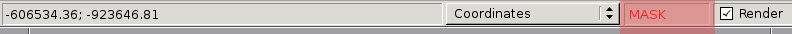
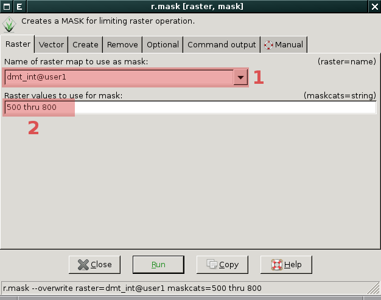
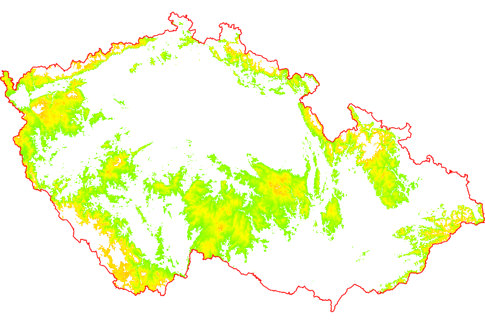
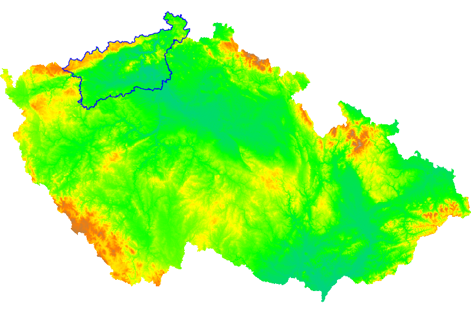
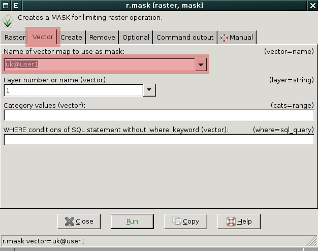
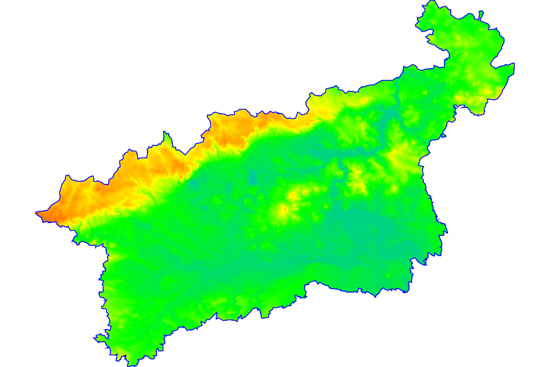

Nastavení masky
---------------

Pomocí masky lze definovat nepravidelnou oblast výpočtu. To souvisí s
:ref:`výpočetním regionem <region>`, který má obecně tvar
obdélníka. Masku lze vytvořit a odstranit pomocí modulu
:grasscmd:`r.mask` dostupného ze *správce vrstev* z menu
:menuselection:`Raster --> Mask`.

           
   To zda je maska aktivována zjistíte ze stavové lišty mapového okna
   
.. note::
   
   Pokud si přejete přepsat již existující masku musíte přidat přepínač
   :option:`--overwrite`.

   .. figure:: images/r-mask-overwrite.png

.. noteadvanced::

   Maska je v systému GRASS definovaná jako standardní rastrová mapa s
   názvem :map:`MASK`. Buňky s hodnotou no-data anebo 0 budou při
   výpočtu ignorovány, naopak nenulové hodnoty označují buňky jejichž
   hodnota nebude ve výpočtu ignorována.

   Pokud rastrovou mapu s tímto názvem odstraníte, bude tím
   deaktivována i maska.

Příklad nastavení masky na základě rastrové mapy
================================================

   Nejprve vybereme rastrovou mapu :fignote:`(1)` na základě, které
   chceme masku nastavit a posléze definujeme hodnoty z této mapy
   :fignote:`(2)`, které poslouží pro vytvoření masky - v tomto
   případě hodnoty 500 až 800.

.. note::

   Rastrová mapa na základě, které chcete definovat masku musí být
   celočíselná, viz :ref:`typ CELL <raster-types>`. Pokud tomu tak
   není, např. v našem případě je rastrová mapa :map:`dmt` typu FCELL,
   je potřeba na základě ni vytvořit mapu celočíselnou a tu potom
   použít pro vytvoření masky.

   Tuto operaci lze provést např. pomocí modulu :grasscmd:`r.mapcalc`,
   více v kapitole :ref:`rastrová algerba <rastrova-algebra>`.

   .. code-block:: bash

                   g.region rast=dmt
                   r.mapcalc expr="dmt_int = int(dmt)"

           
            Po aktivaci masky se zobrazí pouze části území, kde je
            nadmořská výška mezi 500 a 800 metry

.. note::

   Maska samozřejmě ovlivňuje veškéré výpočty nad rastrovými daty,
   např. modul :grasscmd:`r.univar` v tomto případě vypíše
   :ref:`základní statistiku <r-univar>` pouze pro uzemí s nadmořskou
   výškou mezi 500 a 800 metry.

   .. figure:: images/r-univar-masked.png

Příklad nastavení masky na základě vektorové mapy
=================================================

Na tomto místě si ukážeme postup vytvoření masky na základě hranice
Ústeckého kraje. Vektorová mapa kraje vznikla na základě jednoduchého
:ref:`atributového dotazu <atributove-dotazy>`.

   Digitální model terénu a hranice Ústeckého kraje

Masku nastavíme standardně pomocí modulu :grasscmd:`r.mask` s volbou
:option:`vector`.

   Výsledek vytvoření masky podle hranice Ústeckého kraje

Odstranění masky
================

Odstranit masku lze přepínačem :option:`-r` modulu :grasscmd:`r.mask`.

.. figure:: images/r-mask-remove.png

.. noteadvanced::

   Jelikož je maska standardní rastrovou mapu, lze ji deaktivovat
   jejím pouhým odstraněním.

   .. code-block:: bash

                   g.remove type=rast name=MASK
