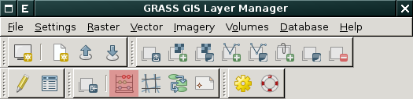
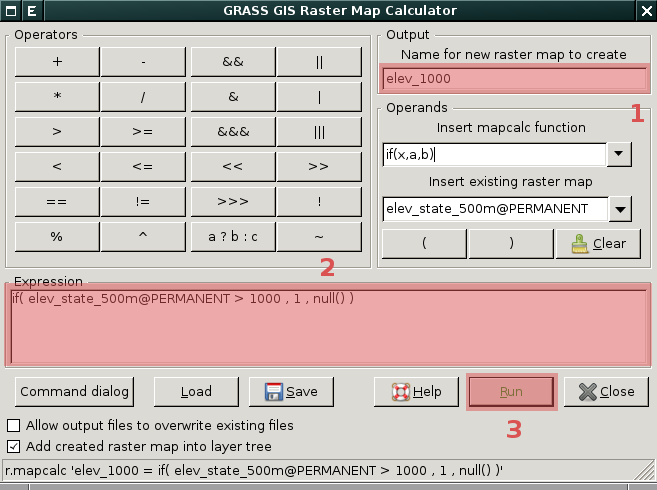
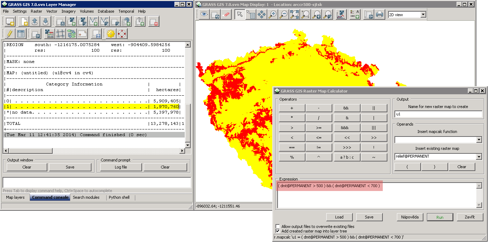

.. _rastrova-algebra:

Rastrová algebra
----------------

Základním nástrojem pro rastrovou algebru je v systému GRASS modul
:grasscmd:`r.mapcalc`.

Rastrový kalkulátor je dostupný z menu :menuselection:`Raster -->
Raster Map Calculator` anebo z nástrojové lišty *správce vrstev*.

            Spuštění rastrového kalkulátoru

Postup:

#. zadání výstupní rastrové mapy
#. zadání výrazu pro :grasscmd:`r.mapcalc`
#. spuštění modul pro výpočet

            Dialog rastrového kalkulátoru

            Příklad určení výměry území s nadmořskou výšku mezi 500 a 700 metry

.. youtube:: zADAJD3sytI

             Příklad výběru oblasti s nadmořskou výškou větší než 1000m

.. notecmd:: použití 

   Modul :grassCmd:`r.mapcalc` lze spustit z příkazové řádky podobně jako
   ostatní moduly systému GRASS.

   Výraz pro výpočet může být předán jako parametr :option:`expression`, např.

   .. code-block:: bash

                   r.mapcalc exp="elev_1000 = if(elev_state_500m > 1000, 1, null())"

    Výrazy lze uložit do souboru (na každý řádek jeden výraz) a soubor
    předat jako parametr :option:`file`.

    .. code-block:: bash

                    r.mapcalc file=vyrazy.txt

    V tomto případě :grasscmd:`r.mapcalc` vykoná příkazy sekvenčně,
    tak jak jsou uloženy v souboru.
