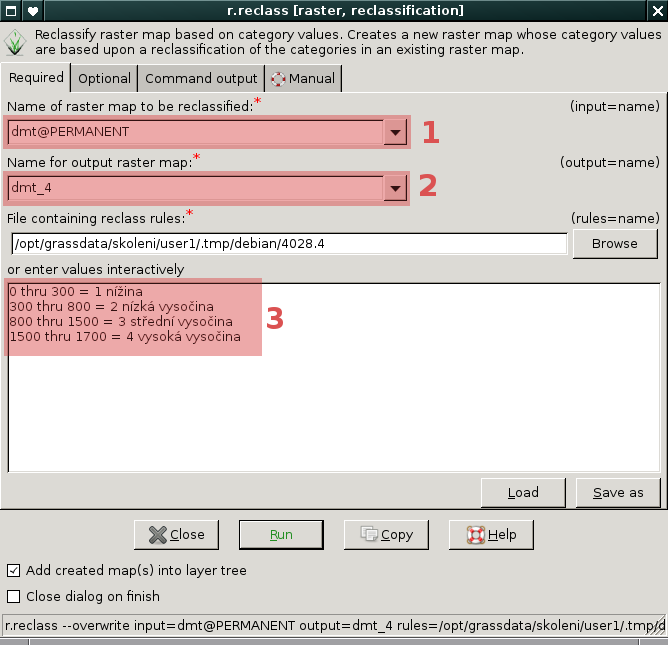
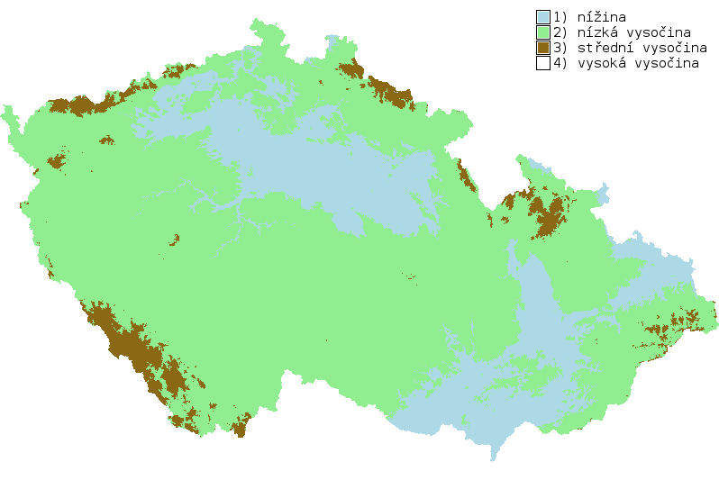

Reklasifikace rastrových dat
----------------------------

Reklasifikaci rastrové mapy vzniká nová rastrová mapa na základě
jejich původních hodnot. Tento proces provádí v systému GRASS modul
:grasscmd:`r.reclass` dostupný z menu *správce vrstev*
:menuselection:`Raster --> Change category values and labels -->
Reclassify`.

.. important::

   Reklasifikovat lze pouze celočíselné rastrové mapy (:ref:`typ CELL
   <raster-types>`). Pokud je reklasikována rastrová mapa s hodnotami s
   plovoucí desetinnou čárkou, jsou její hodnoty převedeny automaticky
   na celé číslo.

   Pokud je potřeba reklasifikovat rastrová data s plovoucí desetinnou
   čárkou, tak je potřeba namísto :grasscmd:`r.reclass` modul
   :grasscmd:`r.recode`, viz :ref:`příklad níže <r-recode>`

.. note::

   Reklasifikací nevzniká fyzicky nová rastrová mapa nýbrž je zapsána
   pouze reklasifikační tabulka. To má za následek to, že nelze
   podkladovou mapu přejmenovat či odstranit.

Příklad
=======

Rastrovou mapu digitálního modelu terému reklasifikuje do čtyř typů
podle níže uvedené reklasifikační tabulky:

.. table::
   :class: border

   +------------+----------------+---------------------+
   | Min. výška | Max. výška     | Typ                 |
   +============+================+=====================+
   | 0          | 300            | 1 (nížina)          |
   +------------+----------------+---------------------+
   | 300        | 800            | 2 (nízká vysočina)  |
   +------------+----------------+---------------------+
   | 800        | 1500           | 3 (střední vysočina)|
   +------------+----------------+---------------------+
   | 1500       |                | 4 (vysoká vysočina) |
   +------------+----------------+---------------------+

Zápis reklasifikační tabulky pro modul :grasscmd:`r.reclass` vypadá
následovně:

::
   
   <od> thru <do> = hodnota

anebo včetně popisku
 
::
   
   <od> thru <do> = hodnota popisek

   V dialogu modulu :grasscmd:`r.reclass` tedy nejprve zadáme název
   rastrové mapy :fignote:`(1)`, kterou chceme reklasifikovat, název
   výstupní reklasifikované mapy :fignote:`(2)` a reklasifikační
   tabulku :fignote:`(3)`

Výsledku přiřadíme vhodnou :ref:`tabulku barev <raster-color-table>`,
např.
   
::
   
   1 173:216:230
   2 144:238:144
   3 139:105:20
   4 255:255:255
            
.. figure:: images/dmt-reclass-color-table.png

            Přiklad nastavení tabulky barev pomocí modulu :grasscmd:`r.colors`   

   Výsledná reklasifikovaná mapa včetně :ref:`legendy <map-legend>`

.. _r-recode:
   
Reklasifikace rastrových dat s plovoucí desetinnou čárkou
=========================================================

.. todo::
