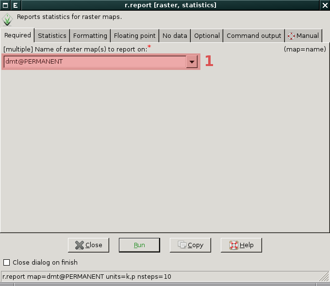

Základní statistiky rastrových dat
----------------------------------

Kromě :ref:`základních metadat <raster-metadata>` rastrových map
systém GRASS disponuje dalšími základními moduly pro výpis
statistických informací o rastrových datech. Jde o:

* :grasscmd:`r.report` pro přehledný výpis informací o rastorové mapě
* :grasscmd:`r.univar` pro základní statistiku  
* :grasscmd:`r.category` pro výpis informací o kategoriích
* :grasscmd:`r.stats` pro výpis vybraných statistik
    
Report
======

Základní informace o rastrových datech poskytuje modul
:grasscmd:`r.report` dostupný buď z menu *správce vrstev*
:menuselection:`Raster --> Repors and statistis --> Sum area by raster map and category`

.. figure:: images/lmgr-r-report.png

            Pokud je modul vyvolán z kontextového menu, je automaticky
            spuštěn s parametrem ``units=h,c,p`` (tj. výměra v
            hekratech, počet buněk a percentuální pokrytí)

Příklad pro rastrovou mapu typu FCELL/DCELL
^^^^^^^^^^^^^^^^^^^^^^^^^^^^^^^^^^^^^^^^^^^
   
Příklad výpisu statistiky pro rastrovou vrstvu :map:`dmt`

* výměra v kilometrech čtverečních
* percentuální pokrytí
* rozděleno do 10 tříd    

   Nejprve vybereme rastrovou mapu :fignote:`(1)` pro kterou si
   přejeme vypsat report
   
.. figure:: images/r-report-1.png

   Dále zvolíme informace, které si přejeme vypsat :fignote:`(2)`

.. figure:: images/r-report-2.png

   Zvolíme počet tříd, do kterých se mají data s plovoucí desetinnou
   čárkou rozdělit :fignote:`(3)` a modul spustíme :fignote:`(4)`

.. figure:: images/r-report-3.png

   Výsledný report, např. území s nadmořskou výškou do 202.5 metrů
   pokrývá necelé tři procenta území ČR

.. important::

   Jak již bylo uvedeno v kapitole :ref:`výpočetní region <region>`
   drtivá většina modulů pro zpracování rastrových dat pracuje vždy v
   aktuální výpočetním regionu! Pokud např. změníme prostorové
   rozlišení na 100m, změní se i report rastrové mapy
   :map:`dmt`. Modul nejprve data převzorkuje metou
   :wikipedia-en:`nejbližšího souseda <Nearest neighbor
   interpolation>` do mřížky s velikostí buňky 100x100m a teprve nad
   těmito daty vypočítá udáje pro report.

   .. code-block:: bash

      g.region rast=dmt res=1000

   .. figure:: images/r-report-4.png

      Pro takto převzorkovaná data bude např. území s nadmořskou
      výškou do 202.5 metrů pokrývat místo původních 2,85% nově 2,83%.

.. _r-univar:

Základní statistika
===================

Základní statistiku o rastrových datech poskytuje modul
:grasscmd:`r.univar` dostupný buď z menu *správce vrstev*
:menuselection:`Raster --> Repors and statistics --> Univariate raster
statistics`.

.. figure:: images/lmgr-r-univar.png

.. figure:: images/r-univar-out.png

   Příklad statistiky pro rastrovou mapu :map:`dmt` (s výpočetním
   regionem nastaveným na tuto mapu)

Informace o kategoriích
=======================

.. todo::

   Potřebujeme nějakou kategorizovanou mapu (třeba výsledek klasifikace)

Pokročilá statistika
====================

Modul :grasscmd:`r.stats` je základní modul poskytující statistiku
rastrových dat, jde nicméně o modul určený především pro pokročilé
uživatele, kteří si píší vlastní skripty. Modul je dostupný z menu
*správce vrstev* :menuselection:`Raster --> Repors and statistics -->
General statistics`.

.. notecmd:: výpisu statistiky rastrové mapy

   Výpis počtu buněk na základě 10 intervalů seřazených sestupně (znak
   `*` označuje no-data)

   .. code-block:: bash

                   r.stats -c input=dmt nsteps=10 sort=desc

::
   
      * 94752766
      355.686188-508.843563 43213697
      202.528812-355.686188 34747630
      508.843563-662.000938 28140420
      662.000938-815.158314 8635189
      49.371437-202.528812 6291794
      815.158314-968.315689 3363937
      968.315689-1121.473064 1231565
      1121.473064-1274.63044 447183
      1274.63044-1427.787815 104742
      1427.787815-1580.94519 12743
