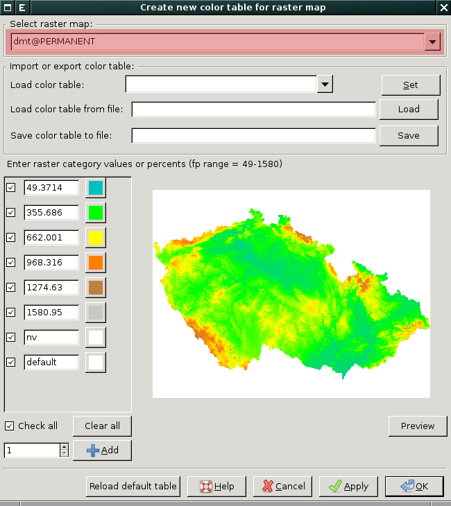
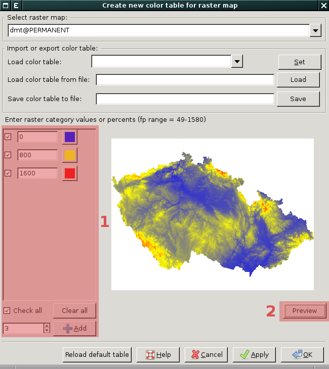
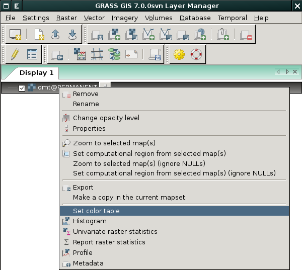
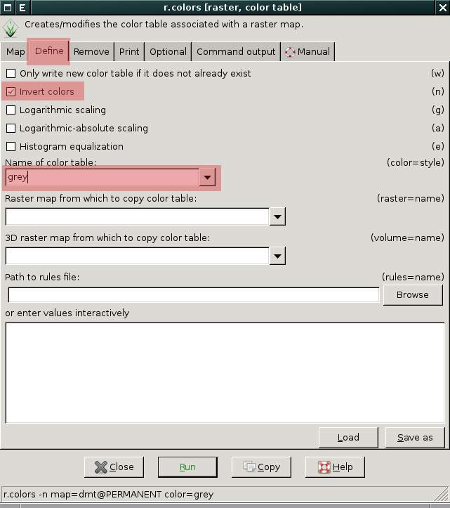
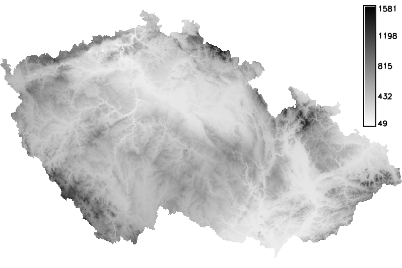

.. _raster-color-table:

Tabulka barev
-------------

Tabulka barev je zápis pravidel pro barevnou interpretaci rastrových
hodnot. Podobu tabulky barev pro zvolenou rastrovou mapu zobrazuje
nástroj dostupný z menu *správce vrstev* :menuselection:`Raster -->
Manage colors --> Manage color rules interactively`.

            Příklad tabulky barev pro rastrovou mapu :map:`dmt`

.. noteadvanced::
   
   Podobu tabuky barev pro zvolenou rastrovou mapu vypisuje modul
   :grasscmd:`r.colors.out` dostupný z menu *správce vrstev*
   :menuselection:`Raster --> Manage colors --> Export color table`.

   .. figure:: images/r-colors-out-dmt.png

            Tabulka barev pro rastrovou mapu :map:`dmt`, barvy jsou v
            notaci RGB, tabulka např. definuje, že buňka s hodnotou
            355.686 se vykreslí zeleně (0:255:0)

Tento nástroj umožňuje tabulku barev navíc **interaktivně měnit**
včetně náhledu na data.

   Příklad interaktivně změněné tabulky barev :fignote:`(1)` pouze v
   náhledu :fignote:`(2)`

Nástoj umožňuje použít navíc některou z předdefinovaných tabulek
barev.

.. figure:: images/color-table-dmt-defined-0.png

            Příklad pro výběr tabulky barev odstínů šedi
            :fignote:`(1)`, tabulka barev se nastaví pro náhled po
            stisknutí tlačítka :fignote:`(2)`

.. figure:: images/color-table-dmt-defined-1.png

            Příklad pro výběr tabulky barev odstínů šedi. Tabulka
            barev je aplikována pouze pro náhled, pokud ji chceme
            nastavit, stiskneme tlačítko :fignote:`(1)`. Návrat k
            výchozí tabulce barev poskytuje :fignote:`(2)`

Tabulku barev lza dále načíst anebo uložit do souboru.

.. figure:: images/color-table-file.png
            
Pokročilé nastavení tabulky barev
=================================

Kromě interaktivního nástroje samozřejmě v systému GRASS existuje
modul, který umožňuje nastavit tabulku barev neinteraktivně, jde o
:grasscmd:`r.colors`. Tento modul je dostupný buď z menu *správce
vrstev* :menuselection:`Raster --> Manage colors --> Color tables`
anebo z kontextového menu rastrové mapy.

Modul umožňuje definovat tabulku barev manuálně, použít předefinovanou
či již přižazenou jiné rastrové mapě.

   Přiklad nastavení tabulky barev odstínů šedi v opačném pořadí

           
   DMT v inverzních odstínech šedi

   

