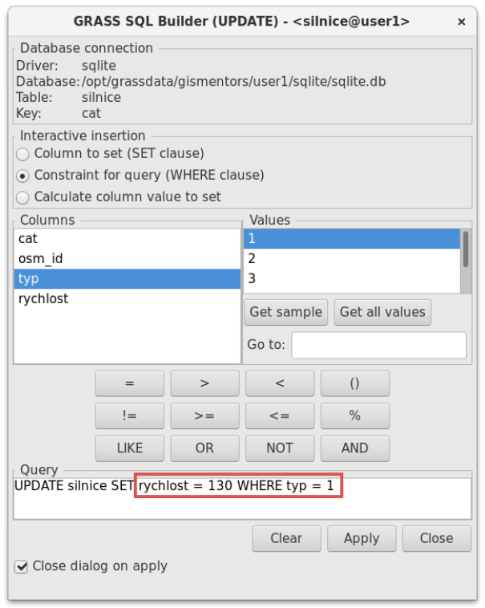
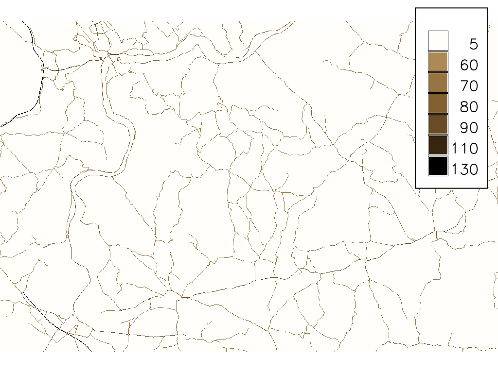
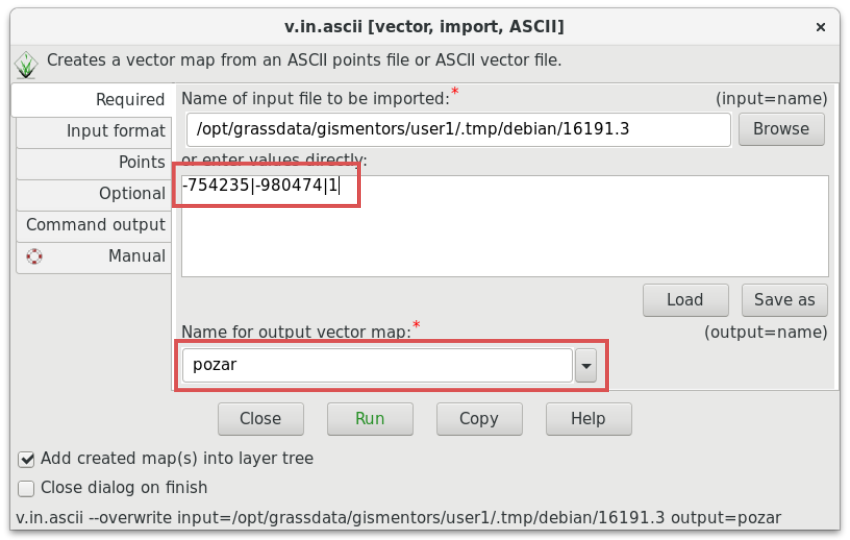
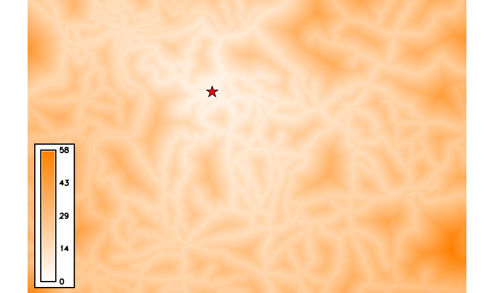
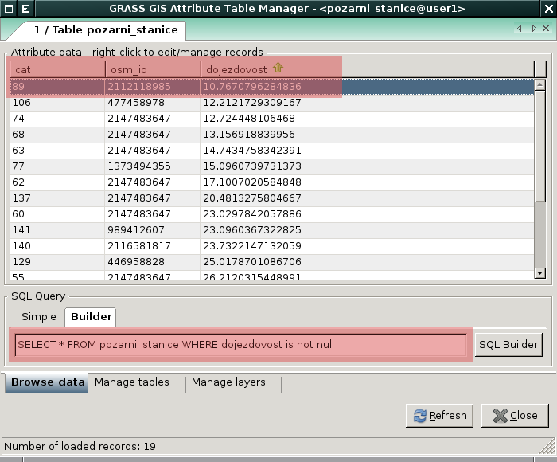
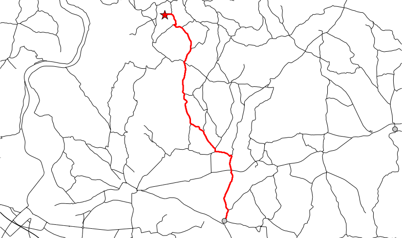
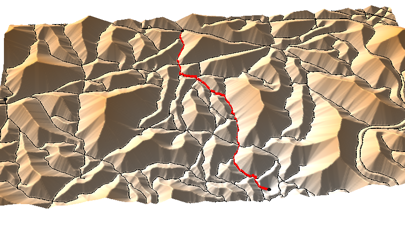

.. index::
   single: analýza nákladů
   pair: rastrová data; analýza nákladů
   single: r.cost
   single: r.drain

Rastrová analýza nákladů
------------------------

Nejprve si v aktuálním mapsetu :ref:`vytvoříme kopii
<kopie-vektorove-mapy>` vektorové mapy :map:`silnice`.

.. note::

   Tento krok je potřeba, jelikož budeme modifikovat atributovou
   tabulku vektorové mapy. A jak již bylo uvedeno v kapitole
   :doc:`../intro/struktura-dat` systém GRASS umožňuje editovat pouze
   datové elementy z aktuálního mapsetu.

:ref:`Přidáme nový atribut <pridani-noveho-atributu>` ``rychlost``, do
něhož uložíme průměrnou rychlost dle následující tabulky:

.. only:: latex
          
   .. tabularcolumns:: |p{3cm}|p{1.5cm}|p{4cm}|
                       
.. only:: html
                                 
   .. cssclass:: border

+----------------------+----------------+---------------------+
| Silnice              | Typ            | Rychlost (km/h)     |
+======================+================+=====================+
| Dálnice              | 1              | 130                 |
+----------------------+----------------+---------------------+
| Rychlostní silnice   | 2              | 110                 |
+----------------------+----------------+---------------------+
| Silnice 1.třídy      | 3              | 90                  |
+----------------------+----------------+---------------------+
| Silnice 2.třídy      | 4              | 70                  |
+----------------------+----------------+---------------------+
| Silnice 3.třídy      | 5              | 60                  |
+----------------------+----------------+---------------------+

Editaci hodnot atributů umožňuje :ref:`Field Calculator
<field-calculator>`.

   Příklad určení atributu rychlosti pro dálnice (``typ = 1``).     

.. noteadvanced::
   
   .. notecmd:: Nastavení atributu rychlosti

      .. code-block:: bash
                      
         v.db.addcolumn map=silnice column="rychlost integer"
         v.db.update map=silnice column=rychlost value=130 where="typ=1"
         v.db.update map=silnice column=rychlost value=110 where="typ=2"
         v.db.update map=silnice column=rychlost value=90  where="typ=3"
         v.db.update map=silnice column=rychlost value=70  where="typ=4"
         v.db.update map=silnice column=rychlost value=60  where="typ=5"             
      
Dále převedeme modulem :grasscmd:`v.to.rast` (:menuselection:`File -->
Map type conversions --> Vector to raster`) vektorovou mapu
:map:`silnice` do rastrové reprezentace. Před konverzí je nutné
nastavit :doc:`výpočetní region <../intro/region>`, např. interaktivně
z mapového okna nebo z příkazové řádky:

.. code-block:: bash

   g.region align=dmt n=-974156 s=-994356 w=-766980 e=-736680

.. code-block:: bash
                
   v.to.rast input=silnice output=silnice use=attr attrcolumn=rychlost

.. raw:: latex

   \newpage

..
   Pomocí modulu :grasscmd:`r.null` (:menuselection:`Raster --> Develop
   raster map --> Manage NULL values`) přiřadíme hodnotě 'NULL' (žádná
   data) rychlost pohybu '5'.

V místech mimo silnice (hodnota 0) přiřadíme pomocí nástroje
:grasscmd:`r.mapcalc` (viz kapitola :doc:`rastrova-algebra`) rychlost
pohybu '5'. Vzniklé rastrové mapě přiřadíme tabulku barev 'sepia', viz
kapitola :doc:`tabulka-barev`.

.. code-block:: bash

                r.mapcalc expression='rychlost = if(silnice == 0, 5, silnice)'
                r.colors -n map=rychlost color=sepia

            Rasterizovaná síť silnic s atributem průměrné rychlosti.

Modulem :grasscmd:`v.in.ascii` vytvoříme vektorovou mapu s ohniskem
požáru. Souřadnice bodu (-754235,-980474) zadáme v notaci ``X|Y|cat``,
kategorii zvolíme libovolně, např. 1. Ve výsledku bude tedy zápis bodu
vypadat následovně: ``-754235|-980474|1``.

                 
            Vytvoření mapy s ohniskem požáru - definujeme souřadnice
            ohniska požáru a název výsledné vektorové mapy.

Rastrovou mapu časové náročnosti vytvoříme pomocí modulu
:grasscmd:`r.mapcalc`, viz kapitola :doc:`rastrova-algebra`. Uvažujeme
prostorové rozlišení 25m a výpočet časové náročnosti pro překonání
buňky v minutách.

.. code-block:: bash

   r.mapcalc expression="rychlost_cas = 25.0 / ((1000 * rychlost) / 60.0)"

.. warning:: Pozor na dělení celých čísel, výsledkem je v mapové
             algebře systému GRASS vždy celé číslo. Proto je v
             čitateli použito číslo s plovoucí desetinnou čárkou
             (25.0).
             
Pomocí modulu :grasscmd:`r.cost` (:menuselection:`Raster --> Terrain
analysis --> Cost surface`) vypočteme rastrovou mapu nákladů pohybu,
tzv. frikční povrch.

.. code-block:: bash

   r.cost -k input=rychlost_cas output=cas_naklady start_points=pozar

              
   Analýza nákladů pohybu v terénu, ohnisko požáru a požární stanice
   (tabulka barev "oranges").

Dojezdovost pro jednotlivé požární stanice k ohnisku požáru vypočteme
z rastru nákladu pomocí modulu :grasscmd:`v.what.rast`
(:menuselection:`Vector --> Update attributes --> Sample raster maps
at point locations`). Nejprve si v aktuálním mapsetu :ref:`vytvoříme
kopii <kopie-vektorove-mapy>` vektorové mapy
:map:`pozarni_stanice`. Přidáme :ref:`nový atribut
<pridani-noveho-atributu>` ``dojezdovost``, do něhož uložíme hodnotu
dojezdovosti pro danou požární stanici.

.. noteadvanced::
   
   .. notecmd:: Přidání atributu dojezdovosti

      .. code-block:: bash

         g.copy vector=pozarni_stanice@osm,pozarni_stanice
         v.db.addcolumn map=pozarni_stanice column="dojezdovost double precision"

.. code-block:: bash

   v.what.rast map=pozarni_stanice raster=cas_naklady column=dojezdovost

.. raw:: latex

      \newpage
      

		      
   Nalezení požární stanice s nejmenší hodnotou dojezdovosti.

Souřadnice požární stanice s kategorií '89' poskytne modul
:grasscmd:`v.out.ascii` (:menuselection:`File --> Export vector map
--> ASCII points or GRASS ASCII vector export`).

.. code-block:: bash
                
   v.out.ascii input=pozarni_stanice cats=89

::
   
   -750649.82535985|-992867.12907965|89          
   
Nejkratší (spádovou) cestu vypočteme modulem :grasscmd:`r.drain`
(:menuselection:`Raster --> Terrain analysis --> Least cost route or
flow`).

.. code-block:: bash

   r.drain -n input=cas_naklady output=cesta start_coordinates=-750649,-992867

   Výsledek, nejkratší cesta k požáru.
            

        
   Vizualizace rastrové mapy nákladů včetně nejkratší spádové cesty ve
   3D.
