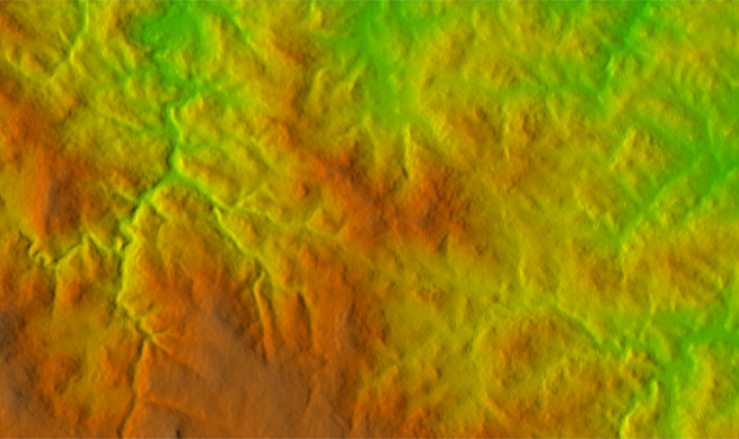

.. index::
   pair: analýza povrchu, topografické analýzy
   single: r.slope.aspect

Topografické analýzy
--------------------

Základní topografické analýzy povrchu poskytuje modul
:grasscmd:`r.slope.aspect` (:menuselection:`Raster --> Terrain
analysis --> Slope and aspect`).

.. figure:: images/r-slope-aspect-0.png
                           
            V dialogu nejprve zvolíme vstupní rastrovou mapu s
            digitálním modelem terénu :fignote:`(1)` a poté v záložce
            :item:`Output` :fignote:`(2)` požadovaný výstup.

.. important::

   Podobně jako ostatní moduly pro zpracování rastrových dat i tento
   modul pracuje v aktuálním výpočetním regionu. Proto je nutné před
   výpočtem tento :ref:`region nastavit podle vstupní rastrové mapy
   <nastaveni-regionu>`. Modul :grasscmd:`r.slope.aspect` má přeci
   jenom jednu specialitu, nepřejímá prostorové rozlišení z
   výpočetního regionu, ale ze vstupní rastrové vrstvy!

.. index::
   pair: analýza povrchu; sklon svahu
   see: analýza povrchu; r.slope.aspect

Sklon svahu
===========

.. figure:: images/r-slope-aspect-s.png
   :scale-latex: 60

   Výpočet sklonu svahu, parametr :option:`slope`.
   
.. figure:: images/slope.png
   :class: middle
   :scale-latex: 65

   Výsledná mapa sklonu svahu ve stupních.                

.. index::
   pair: analýza povrchu; orientace svahu
   pair: expozice; orientace svahu
   see: analýza povrchu; r.slope.aspect

.. _aspect:

Orientace svahu
===============

.. figure:: images/r-slope-aspect-a.png
   :scale-latex: 50
                 
   Výpočet orientace svahu, parametr :option:`aspect`.

.. raw:: latex
                     
   \newpage

.. figure:: images/aspect.png
   :class: middle
   :scale-latex: 70
                
   Výsledná mapa orientace svahu (azimut ve stupních, viz diagram níže).

.. figure:: images/aspect_diagram.png
   :class: small
        
   Azimut orientace svahu.

            
.. tip::

   Postup reklasifikace orientace svahu je uveden v kapitole
   :ref:`Reklasifikace rastrových dat <r-recode>`.

   .. figure:: images/aspect-reclass.png
      :class: middle
      :scale-latex: 70
                       
      Výsledek reklasifikace mapy orientace svahu.

.. raw:: latex

   \newpage

Stínovaný reliéf
================

Stínovaný reliéf může být vytvořen pomocí modulu
:grasscmd:`r.relief`. Podobně jako u ostatních modulů pro zpracování
rastrových dat je třeba před výpočtem nastavit :ref:`výpočetní region
<nastaveni-regionu>`.

.. code-block:: bash

   r.relief input=dmt output=shaded

Ve výše uvedeném příkladě bude stínovaný reliéf vytvořen ve výchozím
nastavení, tj. světelný zdroj s azimutem 270° a výškou 30°.

.. figure:: images/shaded-detail.png
   :class: middle
           
   Stínovaný reliéf ve výchozím nastavení.

Příklad jiného nastavení níže.

.. code-block:: bash

   r.relief input=dmt output=shaded azimuth=90 altitude=60

.. figure:: images/shaded-comp.png
   :class: middle
           
   Porovnání stínovaný reliéfu v různém nastavení (azimut 270/90° a
   výška 30/60° světelného zdroje).

.. _display-shade:
   
Takto vytvořený stínovaný reliéf lze vizualizovat v tabulce barev
převzaté z rastrové mapy digitálního modelu terénu. Pro tento účel
lze využít dva nástroje :grasscmd:`d.shade` a
:grasscmd:`r.shade`. První uvedený nástroj slouží pro zobrazení
výsledku v mapovém okně, viz kapitola :ref:`Zobrazení geodat v mapovém
okně <d-rast-various>`. Druhý modul, :grasscmd:`r.shade` výsledek
zapisuje v podobě nově vytvořené rastrové mapy.

Příklad zobrazení stínovaného reliéfu pomocí modulu :grasscmd:`d.shade`.

.. code-block:: bash

   d.shade shade=shaded color=dmt

           
   Stínovaný reliéf zobrazený pomocí modulu :grasscmd:`d.shade`.

.. note:: Místo stíhovaného reliéfu lze použít mapu orientace svahu
   vytvořené pomocí modulu :grasscmd:`r.slope.aspect`.

   .. code-block:: bash

      d.shade shade=aspect color=dmt
                   
   .. figure:: images/shaded-aspect.png
      :class: middle
              
      Mapa orientace svahu zobrazená pomocí modulu :grasscmd:`d.shade`.

.. index::
   pair: analýza povrchu; viditelnost
   pair: viewshed; viditelnost
   single: r.viewshed
   see: analýza povrchu; r.viewshed

Sky-view faktor
===============

Sky-view faktor (SVF) je vizualizační technika, která pro daný bod
zobrazuje poměr viditelné oblohy. V systému GRASS umožňuje SVF
vypočítat modul :grasscmdaddons:`r.skyview` (jedná se o Addons modul,
který je třeba doinstalovat, viz kapitola :ref:`addons-install`).

Výpočet probíhá podobně jako u ostatních modulů pro zpracování
rastrových dat na území :ref:`výpočetního regionu <region>`.

.. code-block:: bash
   
   r.skyview input=dmt output=svf

.. figure:: images/svf.png
   :class: middle
   
   Sky-view faktor pro zájmové území. Hodnoty od 0 do 1. Čím vyšší
   hodnota (světlejší barva) tím otevřenější terén.
   
Analýza viditelnosti
====================

Klíčový modul pro výpočet analýzy viditelnosti je modul
:grasscmd:`r.viewshed` (:menuselection:`Raster --> Terrain analysis
--> Visibility`).

.. figure:: images/r-viewshed-0.png

            Zvolíme vstupní rastrovou mapu :fignote:`(1)` s povrchem,
            název výstupní mapy viditelnosti :fignote:`(2)` a
            souřadnice observačního bodu a to buď manuálně či
            interaktivně z mapového okna :fignote:`(3)`.

.. tip::

   Výpočet omezíme na menší území, např. :ref:`interaktivním
   nastavením výpočetního regionu <nastaveni-regionu-mapove-okno>`
   přímo z mapového okna.
          
.. figure:: images/r-viewshed-1.png
   :class: large

   Observační bod je v mapovém okně označen černým křížkem,
   obdélník červené barvy zobrazuje hranice výpočetní regionu.

.. raw:: latex

   \newpage

.. figure:: images/viewshed-legend.png
   :class: middle
   :scale-latex: 70

   Výsledek analýzy viditelnosti z observačního bodu včetně legendy
   zobrazující velikost úhlu, pod kterým je místo z daného
   observačního bodu vidět.
