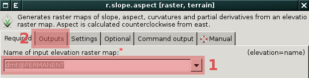
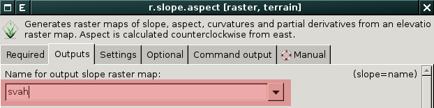
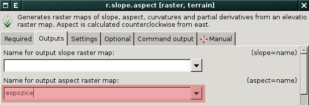
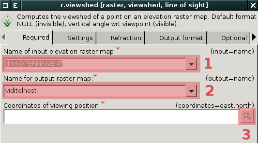
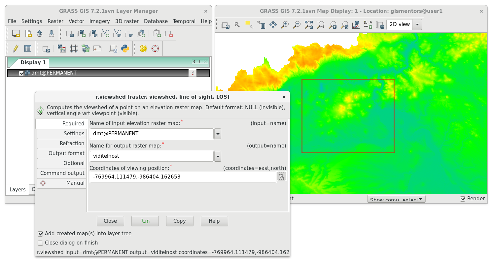
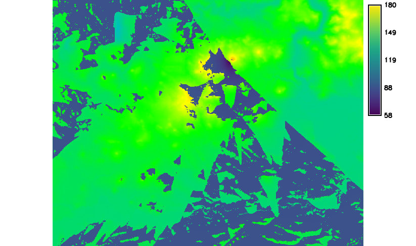

.. index::
   pair: analýza povrchu, topografické analýzy
   single: r.slope.aspect

Topografické analýzy
--------------------

Základní topografické analýzy povrchu poskytuje modul
:grasscmd:`r.slope.aspect` (:menuselection:`Raster --> Terrain
analysis --> Slope and aspect`).

                           
            V dialogu nejprve zvolíme vstupní rastrovou mapu s
            digitálním modelem terénu :fignote:`(1)` a poté v záložce
            :item:`Output` :fignote:`(2)` požadovaný výstup.

.. important::

   Podobně jako ostatní moduly pro zpracování rastrových dat i tento
   modul pracuje v aktuálním výpočetním regionu. Proto je nutné před
   výpočtem tento :ref:`region nastavit podle vstupní rastrové mapy
   <nastaveni-regionu>`. Modul :grasscmd:`r.slope.aspect` má přeci
   jenom jednu specialitu, nepřejímá prostorové rozlišení z
   výpočetního regionu, ale ze vstupní rastrové vrstvy!

.. index::
   pair: analýza povrchu; sklon svahu
   see: analýza povrchu; r.slope.aspect

Sklon svahu
===========

   Výpočet sklonu svahu, parametr :option:`slope`.
   
.. figure:: images/slope.png
   :class: middle
   :scale-latex: 65

   Výsledná mapa sklonu svahu ve stupních.                

.. index::
   pair: analýza povrchu; orientace svahu
   pair: expozice; orientace svahu
   see: analýza povrchu; r.slope.aspect

.. _aspect:

Orientace svahu
===============

                 
   Výpočet orientace svahu, parametr :option:`aspect`.

.. raw:: latex
                     
   \newpage

.. figure:: images/aspect.png
   :class: middle
   :scale-latex: 70
                
   Výsledná mapa orientace svahu (azimut ve stupních, viz diagram níže).

.. figure:: images/aspect_diagram.png
   :class: small
        
   Azimut orientace svahu.

            
.. tip::

   Postup reklasifikace orientace svahu je uveden v kapitole
   :ref:`Reklasifikace rastrových dat <r-recode>`.

   .. figure:: images/aspect-reclass.png
      :class: middle
      :scale-latex: 70
                       
      Výsledek reklasifikace mapy orientace svahu.

.. raw:: latex

   \newpage

.. index::
   pair: analýza povrchu; viditelnost
   pair: viewshed; viditelnost
   single: r.viewshed
   see: analýza povrchu; r.viewshed

Analýza viditelnosti
====================

Klíčový modul pro výpočet analýzy viditelnosti je modul
:grasscmd:`r.viewshed` (:menuselection:`Raster --> Terrain analysis
--> Visibility`).

            Zvolíme vstupní rastrovou mapu :fignote:`(1)` s povrchem,
            název výstupní mapy viditelnosti :fignote:`(2)` a
            souřadnice observačního bodu a to buď manuálně či
            interaktivně z mapového okna :fignote:`(3)`.

.. tip::

   Výpočet omezíme na menší území, např. :ref:`interaktivním
   nastavením výpočetního regionu <nastaveni-regionu-mapove-okno>`
   přímo z mapového okna.
          

   Observační bod je v mapovém okně označen černým křížkem,
   obdélník červené barvy zobrazuje hranice výpočetní regionu.

.. raw:: latex

   \newpage

   Výsledek analýzy viditelnosti z observačního bodu včetně legendy
   zobrazující velikost úhlu, pod kterým je místo z daného
   observačního bodu vidět.
