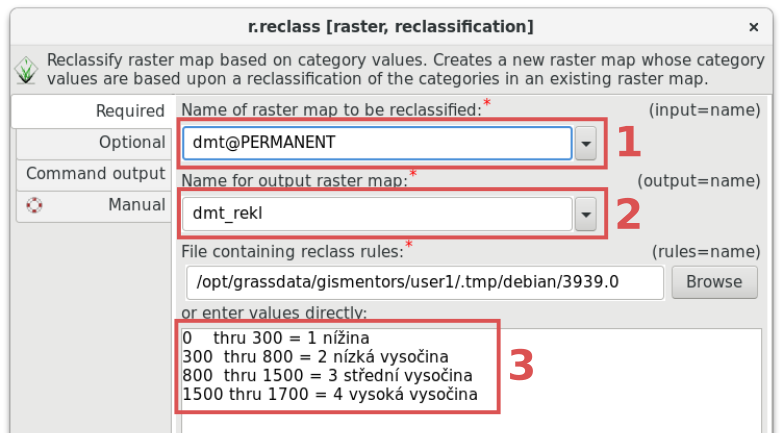
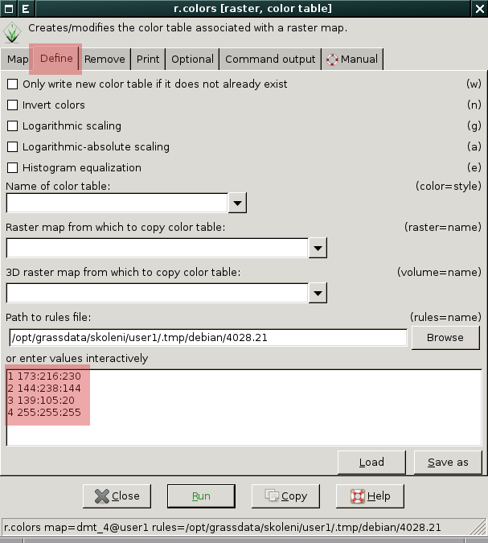
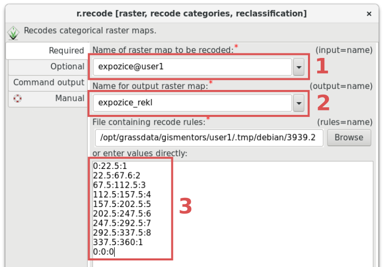

.. index::
   pair: rastrová data; reklasifikace

Reklasifikace rastrových dat
----------------------------

Reklasifikací rastrové mapy vzniká nová rastrová mapa na základě
jejich původních hodnot. Tento proces provádí v~systému GRASS modul
:grasscmd:`r.reclass` (:menuselection:`Raster --> Change category
values and labels --> Reclassify`).

.. important::

   Reklasifikovat lze pouze celočíselné rastrové mapy (:ref:`typ CELL
   <raster-types>`). Pokud má vstupní rastrová mapa hodnoty s plovoucí
   desetinnou čárkou, jsou tyto hodnoty před klasifikací převedeny
   nejprve na celé číslo.

   V případě reklasifikace rastrové mapy s hodnotami s plovoucí
   desetinnou čárkou je třeba namísto :grasscmd:`r.reclass` použít
   modul :grasscmd:`r.recode`, viz :ref:`příklad níže <r-recode>`.

.. note::

   Reklasifikací nevzniká fyzicky nová rastrová mapa, nýbrž je zapsána
   pouze reklasifikační tabulka. To má za následek to, že nelze, pokud
   existuje reklasifikovaná mapa, její podkladovou mapu přejmenovat či
   odstranit.

.. index::
  single: r.reclass
  see: reklasifikace; r.reclass

Příklad reklasifikace DMT
=========================

Rastrovou mapu digitálního modelu terénu reklasifikujeme do čtyř typů
podle níže uvedené reklasifikační tabulky:

.. only:: latex
          
   .. tabularcolumns:: |p{2cm}|p{4cm}|p{4cm}|
                       
.. only:: html
                                 
   .. cssclass:: border

+------------+----------------+---------------------+
| Min. výška | Max. výška     | Typ                 |
+============+================+=====================+
| 0          | 300            | 1 (nížina)          |
+------------+----------------+---------------------+
| 300        | 800            | 2 (nízká vysočina)  |
+------------+----------------+---------------------+
| 800        | 1500           | 3 (střední vysočina)|
+------------+----------------+---------------------+
| 1500       |                | 4 (vysoká vysočina) |
+------------+----------------+---------------------+

Zápis reklasifikační tabulky pro modul :grasscmd:`r.reclass` vypadá
následovně:

::
   
   <od> thru <do> = hodnota

anebo včetně popisku
 
::
   
   <od> thru <do> = hodnota popisek

.. raw:: latex
            
   \newpage

Dle tabulky výše může vypadat zápis následovně:
   
::

   0    thru 300 = 1 nížina
   300  thru 800 = 2 nízká vysočina
   800  thru 1500 = 3 střední vysočina
   1500 thru 1700 = 4 vysoká vysočina

   V dialogu modulu :grasscmd:`r.reclass` nejprve zadáme název
   rastrové mapy :fignote:`(1)`, kterou chceme reklasifikovat, název
   výstupní reklasifikované mapy :fignote:`(2)` a reklasifikační
   tabulku :fignote:`(3)`.

Výsledku přiřadíme vhodnou :doc:`tabulku barev <tabulka-barev>`,
např.
   
::
   
   1 173:216:230
   2 144:238:144
   3 139:105:20
   4 255:255:255

            Příklad nastavení tabulky barev pomocí modulu :grasscmd:`r.colors`.   

.. figure:: images/dmt-reclass-legend.png
   :class: large
   :scale-latex: 75

   Výsledná reklasifikovaná mapa včetně :ref:`legendy <map-legend>`.

.. index::
   pair: data s plovoucí desetinnou čárkou; reklasifikace
   single: r.recode
   see: reklasifikace; r.recode

.. _r-recode:
   
Reklasifikace rastrových dat s plovoucí desetinnou čárkou
=========================================================

Našim cílem bude reklasifikovat :ref:`mapu orientace svahu <aspect>`
do následujících tříd:

.. only:: latex
          
   .. tabularcolumns:: |p{2cm}|p{2cm}|p{4cm}|
                       
.. only:: html
                                 
   .. cssclass:: border
   
+------------+----------------+---------------------+
| Od         | Do             | Orientace svahu     |
+============+================+=====================+
| 0          | 0              | 0 (rovina)          |
+------------+----------------+---------------------+
| 0          | 22.5           | 1 (východ)          |
+------------+----------------+---------------------+
| 22.5       | 67.5           | 2 (jihovýchod)      |
+------------+----------------+---------------------+
| 67.5       | 112.5          | 3 (jih)             |
+------------+----------------+---------------------+
| 112.5      | 157.5          | 4 (jihozápad)       |
+------------+----------------+---------------------+
| 157.5      | 202.5          | 5 (západ)           |
+------------+----------------+---------------------+
| 202.5      | 247.5          | 6 (severozápad)     |
+------------+----------------+---------------------+
| 247.5      | 292.5          | 7 (sever)           |
+------------+----------------+---------------------+
| 292.5      | 337.5          | 8 (severovýchod)    |
+------------+----------------+---------------------+
| 337.5      | 360.0          | 1 (východ)          |
+------------+----------------+---------------------+

V zápisu pro reklasifikační tabulku :grasscmd:`r.recode` budou pravidla vypadat následovně:
   
::
   
   0:22.5:1
   22.5:67.6:2
   67.5:112.5:3
   112.5:157.5:4
   157.5:202.5:5
   202.5:247.5:6
   247.5:292.5:7
   292.5:337.5:8
   337.5:360:1
   0:0:0

	    
            V dialogu :grasscmd:`r.recode` nejprve zvolíme vstupní
            rastrovou mapu :fignote:`(1)`, kterou chceme
            reklasifikovat, poté název výstupní reklasifikované mapy
            :fignote:`(2)` a reklasifikační tabulku :fignote:`(3)`.

.. raw:: latex

   \newpage

.. index::
   single: r.category
   
.. _prirazeni-stitku:
                     
.. tip::
                     
   Nakonec můžeme ještě přiřadit jednotlivým kategoriím štítky a to
   pomocí modulu :grasscmd:`r.category` (:menuselection:`Raster -->
   Report and statistics --> Manage category information`).

   Příklad přiřazení štítků:

   ::

      0:Rovina
      1:V
      2:JV
      3:J
      4:JZ
      5:Z
      6:SZ
      7:S
      8:SV

   .. figure:: images/r-category-set-0.png
	       :scale-latex: 55

               V záložce :item:`Optional` zvolíme nejprve oddělovač ``:``.

   .. raw:: latex

      \newpage
   
   .. figure:: images/r-category-set-1.png
	       :scale-latex: 55

               A poté přiřadíme popisky z textového pole v záložce :item:`Define`.

.. figure:: images/aspect-reclass.png
   :class: large
   :scale-latex: 65

   Výsledek reklasifikace mapy orientace svahu.
            
