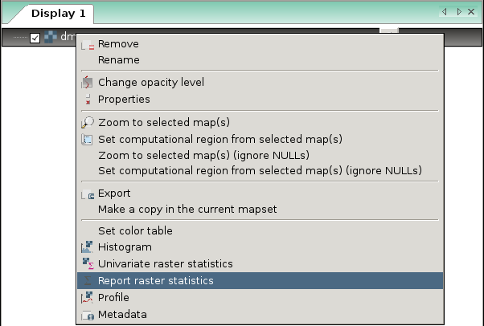
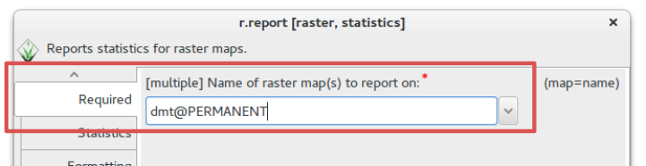
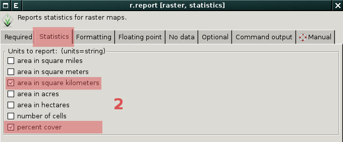
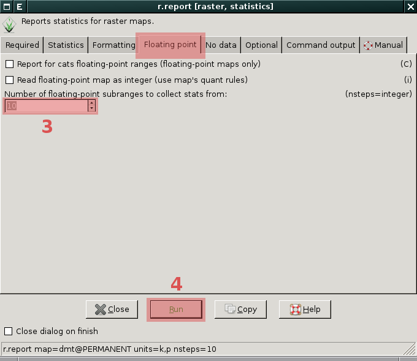
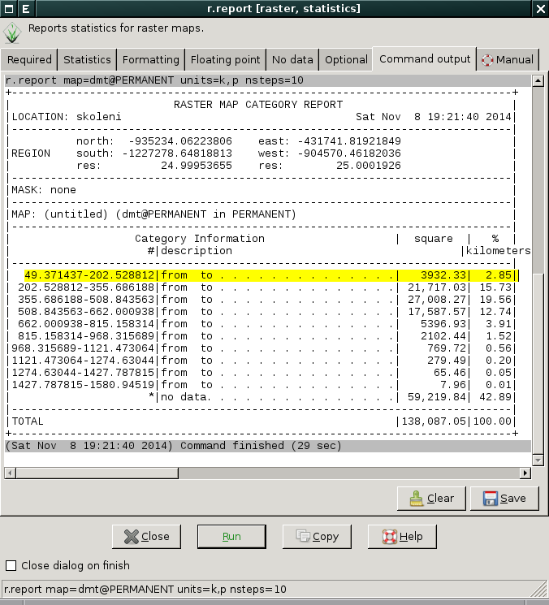
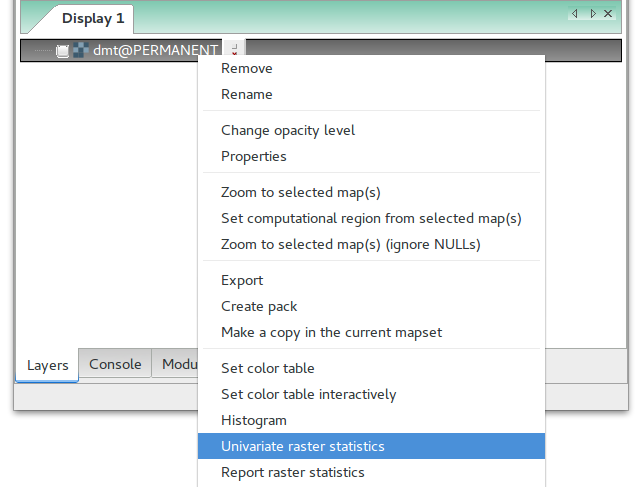
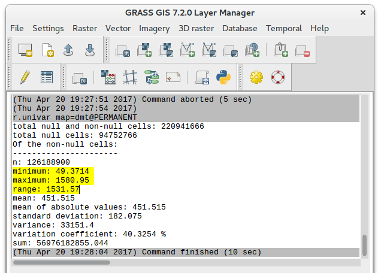

.. index::
   pair: rastrová data; statistika

Základní statistiky rastrových dat
----------------------------------

Kromě výpisu :ref:`základních metadat <raster-metadata>` rastrových
dat systém GRASS disponuje dalšími moduly pro výpis statistických
informací:

* :ref:`r.report <r-report>` pro přehledný výpis informací o rastrové mapě,
* :ref:`r.univar <r-univar>` pro základní statistiku a
* :ref:`r.stats <r-stats>` pro výpis vybraných statistik (určeno
  především pro pokročilé uživatele a jejich skripty).

.. index::
   single: r.report

.. _r-report:

Report
======

Základní informace o rastrových datech poskytuje modul
:grasscmd:`r.report` dostupný buď z menu :menuselection:`Raster -->
Reports and statistics --> Sum area by raster map and category` anebo
z kontextového menu *správce vrstev*.

            Pokud je modul vyvolán z kontextového menu, je automaticky
            spuštěn s parametrem ``units=h,c,p`` (tj. výměra v
            hektarech, počet buněk a procentuální pokrytí).

Příklad pro rastrovou mapu s hodnotami s plovoucí desetinnou čárkou
^^^^^^^^^^^^^^^^^^^^^^^^^^^^^^^^^^^^^^^^^^^^^^^^^^^^^^^^^^^^^^^^^^^
   
Příklad výpisu statistiky pro rastrovou vrstvu :map:`dmt`:

* výměra v kilometrech čtverečních
* procentuální pokrytí
* rozděleno do 10 tříd    

   Nejprve vybereme rastrovou mapu, pro kterou si přejeme vypsat
   report.
   

   Dále zvolíme informace, které si přejeme vypsat.

   Zvolíme počet tříd, do kterých se mají data s plovoucí desetinnou
   čárkou rozdělit a modul spustíme.

            
   Výsledný report, např. území s nadmořskou výškou do 202.5 metrů
   pokrývá necelé tři procenta území ČR.

.. important::

   Jak již bylo uvedeno v kapitole :doc:`../intro/region` drtivá
   většina modulů pro zpracování rastrových dat pracuje vždy v
   aktuální výpočetním regionu. Modul :grasscmd:`r.report` není
   vyjímkou. To stejné platí pro další prezentované moduly. Pokud
   např. změníme prostorové rozlišení výpočetního regionu na 1km,
   změní se i report rastrové mapy :map:`dmt`. Modul nejprve data
   převzorkuje metodou :wikipedia-en:`nejbližšího souseda <Nearest
   neighbor interpolation>` do mřížky s velikostí buňky 1x1km a teprve
   nad těmito daty vypočítá údaje pro report.

   .. code-block:: bash

      g.region rast=dmt res=1000

   .. figure:: images/r-report-4.png
      :scale-latex: 50

      Pro takto převzorkovaná data bude např. území s nadmořskou
      výškou do 202.5 metrů pokrývat místo původních 2,85% nově 2,83%.

.. index::
   single: r.univar

.. _r-univar:

Základní statistika
===================

Základní statistiku rastrových dat poskytuje modul
:grasscmd:`r.univar` dostupný buď z menu :menuselection:`Raster -->
Repors and statistics --> Univariate raster statistics` anebo z
kontextového menu *správce vrstev*.

   Základní statistika rastrových dat dostupná z kontextového menu správce vrstev.

   Příklad statistiky pro rastrovou mapu :map:`dmt` (s výpočetním
   regionem nastaveným na tuto mapu).

.. index::
   single: r.stats

.. _r-stats:
   
Pokročilá statistika
====================

Modul :grasscmd:`r.stats` je nizkoúrovňový modul poskytující
statistiku rastrových dat. Modul je určený především pro pokročilé
uživatele, kteří si píší vlastní skripty. Modul je dostupný z menu
:menuselection:`Raster --> Repors and statistics --> General
statistics`.

.. notecmd:: Výpis statistiky rastrové mapy

   Výpis počtu buněk na základě 10 intervalů seřazených sestupně (znak
   ``*`` označuje no-data, tj. rastrové bunky bez hodnoty)

   .. code-block:: bash

      r.stats -c input=dmt nsteps=10 sort=desc

   ::
   
      * 94752766
      355.686188-508.843563 43213697
      202.528812-355.686188 34747630
      508.843563-662.000938 28140420
      662.000938-815.158314 8635189
      49.371437-202.528812 6291794
      815.158314-968.315689 3363937
      968.315689-1121.473064 1231565
      1121.473064-1274.63044 447183
      1274.63044-1427.787815 104742
      1427.787815-1580.94519 12743

Kromě skriptů můžete tento modul využít například pro export
statistiky rastrové mapy do tabulkové procesoru (např. LibreOffice
Calc či MS Excel) a to přes výměnný formát :wikipedia:`CSV` (parametr
:option:`separator=comma`).

.. code-block:: bash

   r.stats -acp input=dmt separator=comma output=elev_stat.csv

.. figure:: images/libreoffice-stats.png
   :scale-latex: 60
              
   Soubor ``elev_stat.csv`` poté můžete načíst do Vašeho oblíbeného
   tabulkového procesoru.

.. raw:: latex

   \newpage
   
