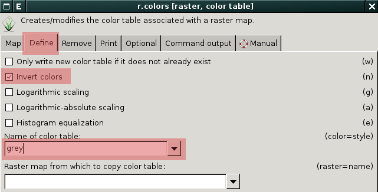
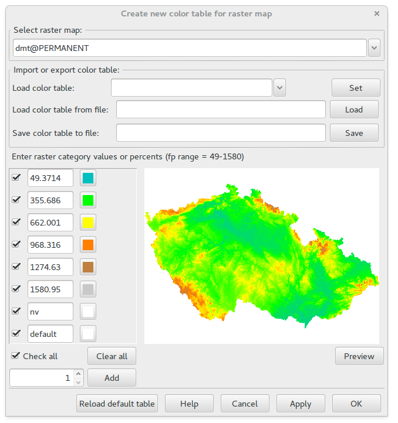
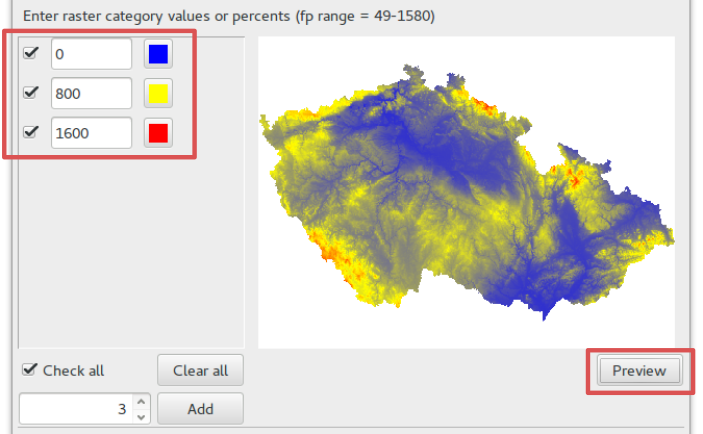
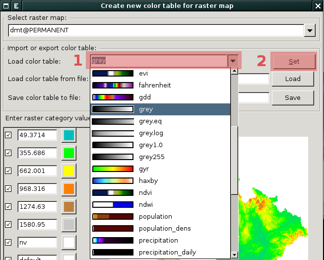
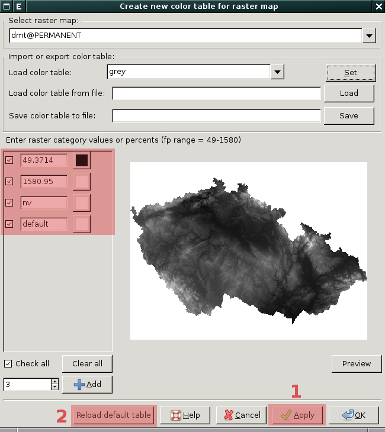

.. index::
   pair: rastrová data; tabulka barev
   single: r.colors
   see: tabulka barev; r.colors

Tabulka barev
-------------

Tabulka barev představuje zápis pravidel pro barevnou interpretaci
rastrových hodnot.

Nastavit tabulku barev umožňuje modul :grasscmd:`r.colors`, který je
dostupný buď z menu :menuselection:`Raster --> Manage colors --> Color
tables` anebo z kontextového menu rastrové mapy.

.. figure:: images/lmgr-r-colors.png
   :scale-latex: 50
              
   Nastavení tabulky barev z kontextového menu správce vrstev.

Modul umožňuje definovat tabulku barev manuálně, použít předefinovanou
či již přiřazenou jiné rastrové mapě.

              
   Příklad nastavení tabulky barev odstínů šedi v opačném pořadí.

.. figure:: images/dmt-grey-i.png
   :class: middle
   :scale-latex: 65
              
   DMT v inverzních odstínech šedi.

Podrobné nastavení tabulky barev
^^^^^^^^^^^^^^^^^^^^^^^^^^^^^^^^

Podobu tabulky barev pro zvolenou rastrovou mapu zobrazuje nástroj
dostupný z menu :menuselection:`Raster --> Manage colors --> Manage
color rules interactively` anebo z~kontextového menu rastrové mapy.

.. figure:: images/lmgr-r-colors-inter.png
   :scale-latex: 50
              
   Interaktivní nastavení tabulky barev z kontextového menu správce vrstev.

   Příklad tabulky barev pro rastrovou mapu :map:`dmt`.

.. raw:: latex

   \newpage
               
.. noteadvanced::
   
   Podobu tabulky barev pro zvolenou rastrovou mapu vypisuje modul
   :grasscmd:`r.colors.out` (:menuselection:`Raster --> Manage colors
   --> Export color table`).

   .. figure:: images/r-colors-out-dmt.png

            Tabulka barev pro rastrovou mapu :map:`dmt`, barvy jsou v
            notaci RGB, tabulka např. definuje, že buňka s~hodnotou
            355.686 se vykreslí zeleně (0:255:0).

Tento nástroj umožňuje tabulku barev navíc *interaktivně měnit*
včetně náhledu na data.

   Příklad interaktivně změněné tabulky barev pouze v náhledu.

Nástroj umožňuje použít některou z předdefinovaných tabulek
barev.

            Příklad pro výběr tabulky barev odstínů šedi, tabulka
            barev se nastaví pro náhled po stisknutí tlačítka
            :item:`Set`.

            Příklad pro výběr tabulky barev odstínů šedi. Tabulka
            barev je aplikována pouze pro náhled, pokud ji chceme
            nastavit, stiskneme tlačítko :item:`Apply`. Návrat k
            výchozí tabulce barev poskytuje :item:`Reload default
            table`.

.. raw:: latex
	 
   \newpage

.. tip:: Tabulku barev lze dále načíst anebo uložit do souboru.

   .. figure:: images/color-table-file.png

      Uložení a načtení tabulky barev do/z souboru.
