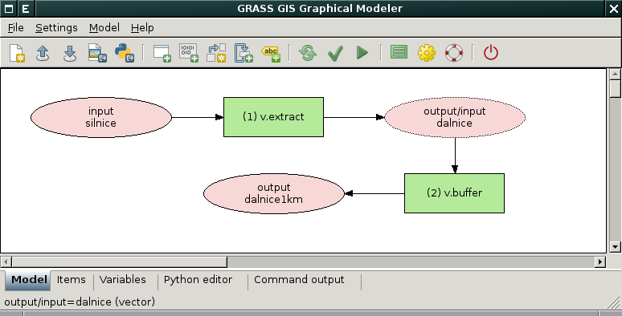

.. index::
   single: grafický modeler
   single: g.gui.gmodeler
   see: grafický modeler; g.gui.gmodeler

Grafický modeler
----------------

:grasscmd:`Grafický modeler <wxGUI.gmodeler>` je interaktivní nástroj,
který umožňuje grafickou formou modelovat geoprostorové analýzy v
systému GRASS.

Nástroj lze spustit z menu :menuselection:`File --> Graphical modeler`
nebo z nástrojové lišty *správce vrstev* |grass-modeler-main|
:sup:`Graphical Modeler`.

.. notecmd:: Spuštění grafického modeleru

   Grafický modeler je dostupný z příkazové řádky jako modul :grasscmd:`g.gui.gmodeler`.
   
   .. code-block:: bash

      g.gui.gmodeler

Do modelu přidáváme příkazy (moduly systému GRASS) z menu
:menuselection:`Model --> Add command` anebo z nástrojové lišty
|grass-module-add| :sup:`Add command (GRASS module) to
model`. Nástroje se řetězí automaticky na základě definovaných
vstupních a výstupních dat.

              
   Příklad modelu pro výpočet obalové zóny kolem dálnic.

Ukázky
======

.. youtube:: 0jkO-ih87mw

   Příklad modelu neřízené klasifikace družicových dat.

.. tip:: Další názorná videa jsou dostupná na stránkách wiki `projektu
         GRASS
         <http://grasswiki.osgeo.org/wiki/WxGUI_Graphical_Modeler#Video_tutorials>`_.
