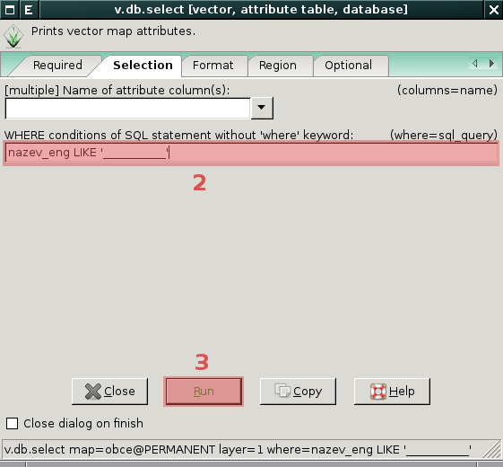
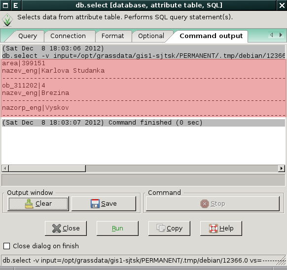

Atributová data
---------------
.. _editace-atributovych-dat:

Editace atributových dat
========================

Správce atributových dat umožňuje kromě :ref:`dotazování
<atributove-dotazy>` i atributová data *modifikovat*.

.. youtube:: UZswOcIyaX8

             Editace záznamů v atributové tabulce

.. notecmd:: Editace atributových dat

               Nabízejí se dva moduly:

             * :grasscmd:`db.execute` který umožňuje spustit jakýkoliv
               :abbr:`SQL (Structured Query Language)` příkaz typu
               ``UPDATE``, ``ALTER`` či ``DELETE``

               .. code-block:: bash
                               
                               db.execute sql="update urbanarea set UA_TYPE = 'UA (edited)' WHERE cat = 3"

             * anebo :grasscmd:`v.db.update` jako frontend pro vektorové mapy

               .. code-block:: bash
               
                               v.db.update map=urbanarea column=UA_TYPE value="UA (edited)" where="cat = 3"

Správce atributových dat umožňuje *přidávat* do atributové tabulky nové záznamy.

.. youtube:: mmPvMRBDxLg

             Přidání nového záznamu do atributové tabulky

.. notecmd:: Vložení nového záznamu do atributové tabulky

                .. code-block:: bash

                                db.execute sql="insert into urbanarea values (109, 109, 29306, 'Farmville', 'UA')"

Vybrané záznamy lze z atributové tabulky *odstranit*.

.. figure:: images/wxgui-dbmgr-delete.png

            Odstranění záznamů z atributové tabulky

.. notecmd:: Odstranění záznamů z atributové tabulky

                .. code-block:: bash

                                db.execute sql="delete from urbanarea where cat = 109"

.. warning::

   Při odstranění či přidání záznamů do atributové tabulky dochází k
   modifikaci pouze popisné složky geoprvků. Např. při odstranění
   záznamu z atributové tabulky zůstává asociovaná geometrická složka
   popisu geoprvku ve vektorové mapě zachována.

Numerické atributy mohou být také *vypočítány* na základě zvolené funkce.

.. figure:: images/wxgui-dbmgr-calculate.png
            :class: large

            Funkce pro výpočet numerických atributů

.. _pridani-noveho-atributu:
            
Příklad přidání nového atributu s výměrou a její výpočet (ve
čtverečních mapových jednotkách).

.. youtube:: qkXgQXF1QkA

             Přidání nového sloupce do atributové tabulky a výpočet plochy

.. notecmd:: Výpočet hodnoty atributu

             .. code-block:: bash

                             v.to.db map=urbanarea option=area columns=AREA

.. _field-calculator:
                
Field Calculator
================

*Field Calculator* je nástroj, který umožňuje sestavit :abbr:`SQL
(Structured Query Language)` UPDATE příkaz a pomocí něho modifikovat
atributová data.

.. youtube:: 44KmtnBJtgo

             Výpočet poměru obvodu a výměry plochy pomocí Field Calculatoru

.. _db-select:

Pokročilé dotazování
====================

Atributové dotazy na geoprvky umožňují dva moduly :ref:`v.db.select
<modul-v-db-select>` a :ref:`db.select <modul-db-select>`.

.. _modul-v-db-select:

Modul v.db.select
^^^^^^^^^^^^^^^^^

Modul :grasscmd:`v.db.select` umožňuje provádět dotazy pouze nad
atributovými daty připojenými k dané vektorové mapě. Je dostupný z
menu :menuselection:`Database --> Query --> Query vector attribute
data`. Pokud není zadána :option:`where` podmínka, tak modul vypíše
všechny záznamy z atributové tabulky.

.. figure:: images/v-db-select-0.png

            Atributový dotaz pomocí modulu :grasscmd:`v.db.select`
            (zadání vektorové mapy)

            Atributový dotaz pomocí modulu :grasscmd:`v.db.select`
            (volitelně zadání 'where' podmínky)

.. _modul-db-select:

Modul db.select
^^^^^^^^^^^^^^^

Modul :grasscmd:`db.select` umožňuje provádět :abbr:`SQL (Structured
Query Language)` dotazy (SELECT) nad *libovolnými* atributovými daty
dostupnými pomocí daného databázového ovladače. :abbr:`SQL (Structured
Query Language)` dotazy mohou být uloženy v souboru (parametr
:option:`input`) anebo definovány jako parametr :option:`sql`. Tento
modul je dostupný z menu :menuselection:`Database --> Query --> Query
any table`.

.. figure:: images/db-select-0-single.png
            
            Atributový dotaz pomocí modulu :grasscmd:`db.select`
            (zadání :abbr:`SQL (Structured Query Language)` dotazu)

.. figure:: images/db-select-1-single.png

            Atributový dotaz pomocí modulu :grasscmd:`db.select`
            (výsledek :abbr:`SQL (Structured Query Language)` dotazu)

.. notecmd:: Jednoduché atributové dotazu

             .. code-block:: bash

                             db.select sql="SELECT COUNT(*) FROM obce WHERE ob01/ob91-1 >= 1"

.. figure:: images/db-select-0-multi.png

            Vícenásobný atributový dotaz pomocí modulu
            :grasscmd:`db.select` (zadání :abbr:`SQL (Structured Query
            Language)` dotazů)

            Vícenásobný atributový dotaz pomocí modulu
            :grasscmd:`db.select` (výsledek :abbr:`SQL (Structured
            Query Language)` dotazů)

.. note::

   Pro ostatní :abbr:`SQL (Structured Query Language)` příkazy
   (``INSERT``, ``UPDATE``, ``DELETE``, ``ALTER`` a další) je určen
   modul :grasscmd:`db.execute`.
