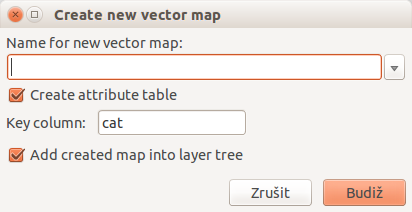
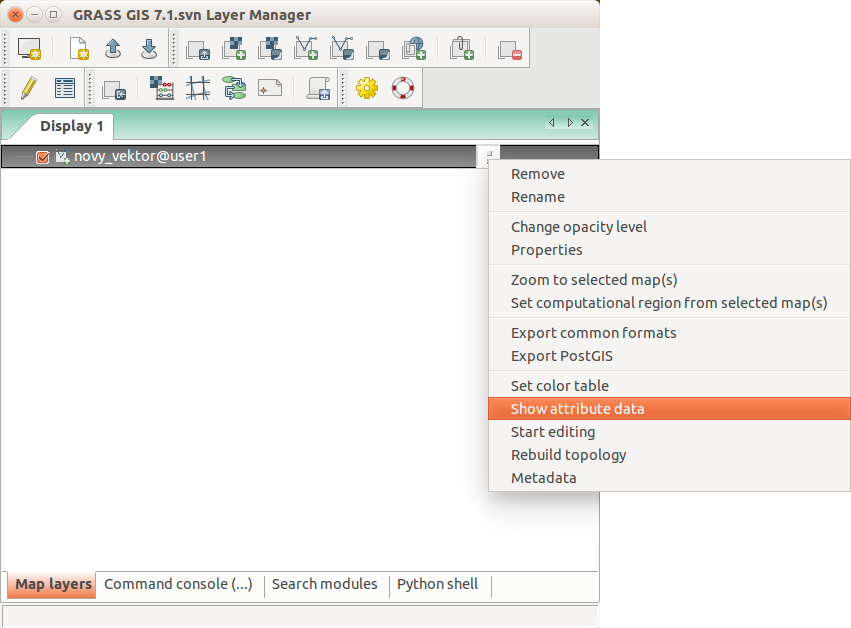
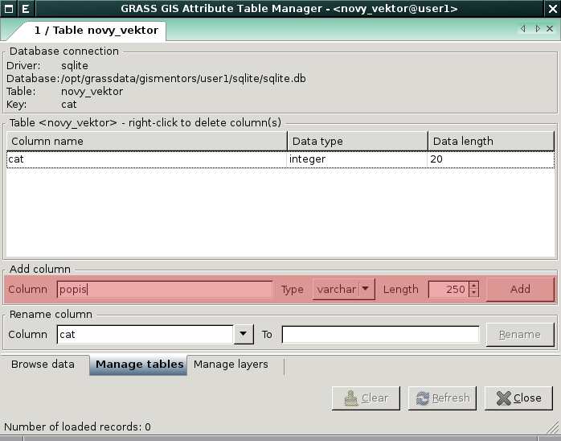
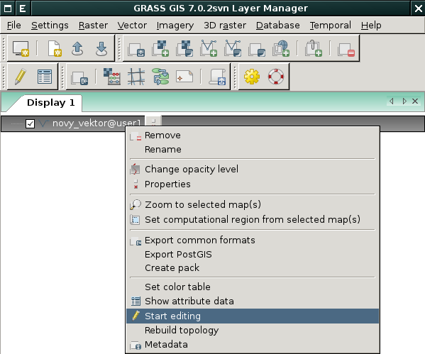
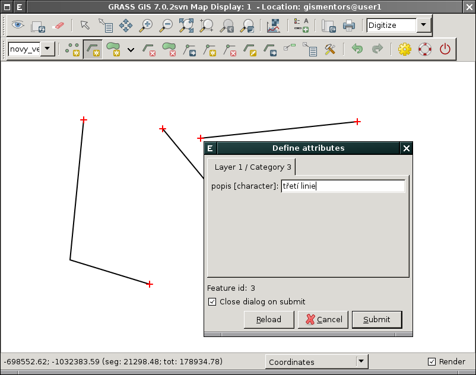
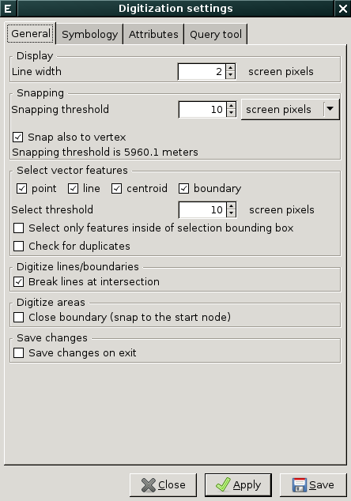

.. index::
   pair: vektorová data; editace
   single: v.edit
   single: g.gui.vdigit
   see: editace; topologie

Editace vektorových dat
-----------------------

Vytvoření nové vektorové mapy
=============================

Novou vektorovou mapu vytvoříme z menu  
:menuselection:`Vector --> Develop vector map --> Create new vector map`.

   Dialog pro vytvoření nové vektorové mapy.

.. noteadvanced::
      
   Klíč (*key column*) označuje v dialogovém okně název atributu,
   který bude sloužit pro definovaní vazby mezi geometrickou a
   atributovou částí popisu geoprvků, ve výchozím nastavení se jedná o
   atribut ``cat``.

.. notecmd:: Vytvoření prázdné vektorové mapy

    .. code-block:: bash 
    
        v.edit map=novy_vektor tool=create

Vytvoření a úprava atributové tabulky
~~~~~~~~~~~~~~~~~~~~~~~~~~~~~~~~~~~~~

Nástroj pro editaci atributové tabulky spustíme z kontextového menu vektorové mapy
:item:`Show attribute data`.

   Spuštění správce atributových dat.

.. raw:: latex

   \newpage

Přidávat či přejmenovávat atributy lze v záložce :item:`Manage
attributes`, více v sekci :ref:`editace atributových dat
<editace-atributovych-dat>`.

   
   Přidání nového atributu s názvem ``popis``.

.. raw:: latex

      \newpage
      
.. _editace-vektorovych-dat:

Editace vektorové mapy
======================

Existující vektorovou mapu můžeme začít editovat z kontextového menu 
:menuselection:`Start editing`.

     
   Editace vektorových dat z kontextového menu správce vrstev.
    
Nyní můžeme v mapovém okně zvolit nástroj kreslení linie (nebo kterýkoliv jiný)
a nakreslit požadovaný tvar.

.. note:: Mapové okno bude zobrazovat podkladové mapy, které v něm byly načteny
    dříve.

Po ukončení editace geoprvku (pravým tlačítkem) se objeví formulář pro vyplnění
atributů.

   Definice atributů pro nově vytvořený vektorový geoprvek.

.. note::
      
   Počáteční a koncové body (tzv. uzly) linií a hranic ploch se na
   sebe budou automaticky přichytávat (výchozí hodnota je `10px`).

   Uzly jsou vykresleny různou barvou, podle toho jsou-li
   přichyceny k dalšímu uzlu či nikoliv. Viz dialog
   `Digitization settings`, záložka :menuselection:`Symbology`.

Při editaci je každá plocha automaticky *zaplochována* centroidem. K
centroidu lze později navázat požadované atributy plochy. Hranice
plochy a jejich centroidy lze také editovat i zvlášť.

Mazání vybraných prvků je potřeba vždy potvrdit pravým tlačítkem myši.

V nastavení editace můžeme nastavit zobrazení editovaných prvků (šířka, barvy),
přichytávání, automatické přiřazování atributů novým prvkům a další.

        
   Nastavení editace.

.. noteadvanced:: Editovat vektorové prvky lze také v příkazové řádce pomocí modulu
    :grassCmd:`v.edit`.
